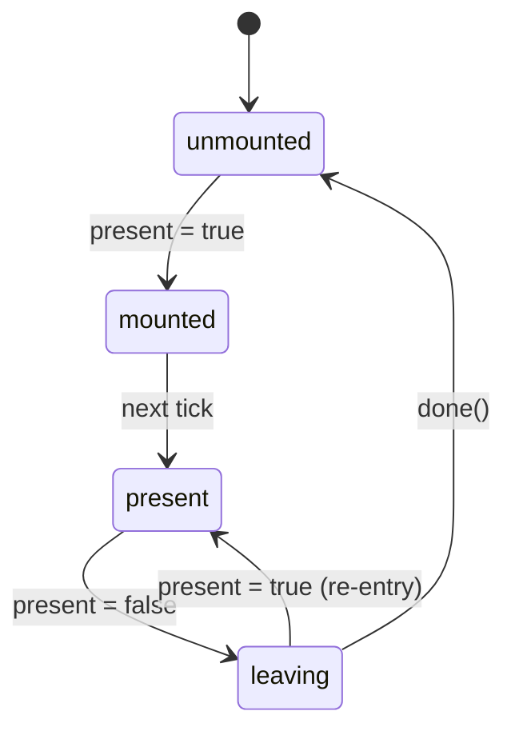

# Documentation Pages

Scope-specific mechanics for `apps/docs/**`. Covers page types, frontmatter, intro rules, adapter sections, page structure, examples, markdown directives, auto-generated API reference, skill levels, naming, and categories. Authoring conventions only — the headless contract and reactivity rules live in `PHILOSOPHY.md`.

## Cited PHILOSOPHY sections

- §2.1 Headless contract — applies to example files (utility classes are allowed in examples, forbidden in source)
- §3.5 Slot conventions (`v-bind="attrs"` double-fire hazard)
- §3.6 Boolean data attributes (data-driven examples)
- §5.5 Locale-first strings

## Page Types

| Type | Path | Label prefix |
|------|------|-------------|
| Component | `pages/components/{category}/{name}.md` | `C: Name` [intent:190] |
| Composable | `pages/composables/{category}/{name}.md` | `E: name` [intent:191] |
| Guide | `pages/guide/{category}/{name}.md` | — [intent:192] |

## Frontmatter

```yaml
---
title: Name - Brief SEO description
meta:
  - name: description
    content: 150-160 char description
  - name: keywords
    content: comma, separated, keywords
features:
  category: Component | Composable
  label: 'C: Dialog'              # or 'E: createSelection'
  github: /components/Dialog/     # source path under packages/0/src/
  renderless: false               # components only
  level: 2                        # see "Skill Levels" below
related:
  - /composables/selection/create-group
  - /components/forms/checkbox
---
```

- Required fields: title, meta (description + keywords), features, related. [intent:194, intent:245]
- `meta` entries use **2-space indent** (`  - name:`, not `- name:`). [intent:193]

## Page Intro

Every page has a **1-2 sentence intro** immediately after `<DocsPageFeatures>`. [intent:195] Intros are plain descriptions of what the composable or component does — never feature lists, never multiple paragraphs, never bullets. [intent:196]

Intros must be **user-facing**. Never mention internal composables (no "built on createInput and createNumeric" in an intro). [intent:197]

```markdown
<!-- Good — brief, user-facing -->
Manage feature flags and variations across your application.

<!-- Good — two short sentences when needed -->
Headless notification management with push, severity levels, and auto-dismiss toasts.
Adapter-based so it integrates with any notification backend.

<!-- Bad — verbose, clause-heavy -->
The `useBreakpoints` composable provides comprehensive responsive design capabilities
through reactive viewport dimension detection, automatically tracking window size changes
and exposing named breakpoint state via a configurable threshold system.

<!-- Bad — bullets as intro -->
- Reactive viewport tracking
- Named breakpoints
- SSR-safe

<!-- Bad — mentions internals -->
Thin orchestrator built on createInput, createNumeric, and createRules.
```

## Adapter Sections

Composables that accept an `adapter` option must have an **Adapters** section with: [intent:198]

1. What the adapter does (one sentence).
2. The adapter interface name.
3. Built-in implementations as a table.
4. A code example showing custom adapter usage.

Canonical adapter import path: `@vuetify/v0/{domain}/adapters/{name}`. [intent:199]

```markdown
## Adapters

Adapters let you swap the underlying implementation without changing your application code.

| Adapter | Import | Description |
|---------|--------|-------------|
| `Vuetify0LoggerAdapter` | `@vuetify/v0` | Console-based (default) |
| `PinoLoggerAdapter` | `@vuetify/v0/logger/adapters/pino` | Pino integration |
| `ConsolaLoggerAdapter` | `@vuetify/v0/logger/adapters/consola` | Consola integration |
```

## Component Page Structure [intent:200]

1. **H1 title** — component name
2. `<DocsPageFeatures :frontmatter />` — badges from frontmatter
3. `<DocsBrowserSupport>` — optional, for native API features
4. **Usage** — brief intro + code fence (not a live example)
5. **Anatomy** — Vue template tree in `` ```vue playground collapse `` ``
6. **Architecture** — optional Mermaid diagram
7. **Examples** — `::: example` blocks, each with 2+ files
8. **Recipes** — code fences or single-file `::: example` blocks
9. **Accessibility** — ARIA roles, keyboard interaction, screen reader behavior
10. **FAQ** — `::: faq` container with `???` questions
11. `<DocsApi />` — auto-generated API reference

## Section Content Rules

| Section | Component pages | Composable pages |
|---------|----------------|-----------------|
| **Usage** | `::: example` with basic.vue [intent:302] | `` ```ts collapse `` `` code fence [intent:302] |
| **Anatomy** | `` ```vue playground collapse `` `` | — |
| **Examples** | `::: example` with 2+ files [intent:304] | `::: example` with 2+ files [intent:304] |
| **Recipes** | Code fence or single-file `::: example` [intent:303] | Code fence or single-file `::: example` [intent:303] |

## Composable Page Structure [intent:201]

1. **H1 title** — composable name
2. `<DocsPageFeatures :frontmatter />`
3. **Intro** — 1-2 sentences (see Page Intro rules)
4. **Usage** — `` ```ts collapse `` `` block
5. **Architecture** — Mermaid diagram showing composable hierarchy
6. **Adapters** — if the composable accepts adapters
7. **Reactivity** — table of reactive properties/methods
8. **Examples** — `::: example` with live demos
9. **FAQ** — `::: faq` container
10. `<DocsApi />` — auto-generated API reference

## Examples

Example files live in `apps/docs/src/examples/{type}/{name}/`. [intent:202]

### Single file (no extension in path)

Single-file `::: example` paths have **no extension** — `.vue` is auto-appended. [intent:305]

```markdown
::: example
/components/dialog/basic
:::
```

### Collapsed

```markdown
::: example collapse
/components/dialog/basic
:::
```

### Multi-file with ordering

Multi-file example paths **must have extensions**. Order numbers are optional; the last `.vue` file is the rendered entry point. [intent:306]

```markdown
::: example
/composables/create-context/context.ts 1
/composables/create-context/Provider.vue 2
/composables/create-context/Consumer.vue 3
/composables/create-context/app.vue 4

### Title

Prose that explains what the example demonstrates, when a reader should reach
for it, what tradeoffs apply, and any related APIs. Not a one-liner.

| File | Role |
|------|------|
| `context.ts` | Creates the context |
| `Provider.vue` | Provides the context |
:::
```

### Examples prose depth

Prose inside `::: example` blocks under `## Examples` should be lengthened — multi-paragraph, explaining *what* it demonstrates, *when* to reach for it, tradeoffs, and related APIs — followed by a `| File | Role |` table. [intent:274, intent:275]

The same depth rule does **not** apply to `## Usage` or `## Recipes` blocks — those are deliberately terse. [intent:276]

### Example file conventions

- Use UnoCSS utility classes, no custom CSS. [intent:203]
- Import from `@vuetify/v0`. [intent:204]
- Keep examples minimal and focused — one concept per file. [intent:205]
- Example folders use kebab-case; supporting Vue components use PascalCase; supporting utilities use camelCase. [intent:307]
- No `index.vue` pattern. [intent:308]
- Never `v-bind="attrs"` on children of non-renderless components — causes double-fire. Only use slot `attrs` in `renderless` mode where there is no wrapper element. [intent:206, intent:207]
- Prefer `v-slot="{ attrs }"` shorthand over `<template #default="{ attrs }">`. [intent:272, intent:273]
- Reactivity primitive: `shallowRef` for primitive state (booleans, numbers, strings), `ref` only for objects/arrays. Same rule as source code — see PHILOSOPHY §4.1. Examples are read by every consumer and become the de facto template; if they reach for `ref('foo')`, downstream apps will too.

### Vue code fences

Any ``` ```vue ``` code fence containing component usage must wrap markup in `<template>...</template>`. Never show bare fragments. [intent:271]

## Markdown Directives

| Syntax | Purpose |
|--------|---------|
| `::: example` | Live interactive example |
| `::: code-group` | Tabbed code blocks |
| `::: faq` | FAQ section with `???` questions |
| `> [!TIP]` | Informational callout (empty tip surfaces a random tip from curated pool) [intent:340, intent:341] |
| `> [!WARNING]` | Cautionary callout |
| `> [!ERROR]` | Error/danger callout |
| `` ```vue Anatomy playground `` `` | Live anatomy preview |
| `` ```ts collapse `` `` | Collapsible code block |
| `` ```ts no-filename `` `` | Hide filename in code block |

## API Reference

Auto-generated at build time — no manual API tables. [intent:208]

- **Components**: `vue-component-meta` extracts props, events, slots from `defineProps` / `defineSlots` / `defineEmits`.
- **Composables**: `ts-morph` extracts functions, options, methods, properties from exports.
- Rendered by `<DocsApi />` at page bottom.
- Cached in `.cache/api-cache.json`.

ApiPopover on hover shows two links: "View API" and "View Docs". [intent:284]

## Skill Levels [intent:209]

Every page needs a `features.level` (1, 2, or 3), determined by the **highest prerequisite** across Vue knowledge, v0 knowledge, and web platform knowledge. [intent:210]

| Level | Label | Vue | v0 | Web Platform |
|-------|-------|-----|-----|-------------|
| **1** | Beginner | Templates, props, events, slots | None | Basic HTML/CSS/JS |
| **2** | Intermediate | Composition API, composables, provide/inject, v-model | Uses composables, follows examples | Common patterns (forms, modals, keyboard) |
| **3** | Advanced | effectScope, SSR/hydration, plugin authoring, advanced TS generics | Understands architecture (context, trinity, registry) | Specialized browser APIs (observers), ARIA |

### How to assign

Ask: **"What must the reader already know to use this page?"**

- **Level 1**: Orientation — "What is v0?" No v0 experience needed. Index pages, introduction, tooling, meta pages.
- **Level 2**: Consumption — "How do I use this in my app?" Reader uses composables and components. Most component and composable pages.
- **Level 3**: Extension — "How do I build on top of v0?" Reader understands internals or needs advanced Vue/browser knowledge. Foundation composables, registration primitives, observer composables.

### Edge cases

- A composable that **wraps** an advanced concept into a simple API stays Level 2 — the abstraction is the point. [intent:211]
- A composable that **exposes** advanced concepts (e.g., `createContext` exposes provide/inject, `createNested` exposes tree traversal) is Level 3. [intent:212]

## Naming Conventions

| Item | Convention | Example |
|------|-----------|---------|
| Doc file | kebab-case | `expansion-panel.md` [intent:213] |
| Example folder | kebab-case of component | `examples/components/checkbox/` [intent:214] |
| Example file | kebab-case | `basic.vue`, `file-picker.vue` [intent:215] |
| Category folders | kebab-case | `disclosure/`, `forms/`, `selection/` [intent:216] |

## Component Categories [intent:217]

| Category | Components |
|----------|-----------|
| `disclosure` | Dialog, ExpansionPanel, Popover, Tabs |
| `forms` | Checkbox, Switch, Radio, Slider, Select |
| `primitives` | Atom |
| `semantic` | Avatar, Pagination, Breadcrumbs |
| `providers` | (context providers) |

## Composable Categories [intent:218]

| Category | Composables |
|----------|------------|
| `foundation` | createContext, createTrinity, createPlugin |
| `registration` | createRegistry, createTokens |
| `selection` | createSelection, createSingle, createGroup, createStep |
| `forms` | createForm |
| `plugins` | useTheme, useLocale, useLogger, useFeatures, usePermissions |
| `system` | useBreakpoints, useMediaQuery, useStorage, useHydration |
| `utilities` | useEventListener, useHotkey, useClickOutside, useLazy |
| `reactivity` | useToggleScope, useProxyModel |
| `transformers` | toReactive, toArray |

## Auditing

When auditing docs or specs, read the rules file **line-by-line** and build a per-rule checklist first. Don't work from memory. [intent:267] Don't document "advanced" or "override" patterns without verifying they work in source. [intent:268]

## Nav emphasis

Internal nav links render a 5-level heatmap dot that reflects how recent the page's last git commit is. Levels bucket by age: 1 = ≤7d (fresh green), 2 = ≤30d, 3 = ≤90d, 4 = ≤180d, 5 = >180d (overripe brown). The badge calls `scoreToColor` from `@/composables/useFreshness` after mapping `emphasized` (1–5) → score (100, 75, 50, 25, 0), so it shares the avocado palette used on `/health`. Only level 1 is shown by default; enabling the global `devmode` feature shows all levels on every internal link. Manual `features.emphasized: true` still forces level 1. [intent:343]

## Random tips

Empty `> [!TIP]` callouts are filled from a curated random pool at render time. Tip bodies render through the same markdown pipeline as doc pages (`md.renderInline`). [intent:340, intent:341]

## Docs example reset

The multi-file toolbar exposes a reset button that remounts the preview. Single-file examples do not have it. [intent:342]

## Playground — the interactive browser editor

v0 ships a standalone playground at `apps/playground/` that lets consumers edit a Vue file and see the result live. Docs pages can deep-link into the playground: every `DocsExample` code pane exposes a "Open in Playground" action via `DocsCodeActions`, and every ``` ```vue playground ``` fence renders with the same action. The action calls `usePlayground(files)` (see `apps/docs/src/composables/usePlayground.ts`), which encodes the files into a URL and navigates to the deployed playground. [intent:344]

### When to enable playground linking

- **Always for stable components and composables.** Any feature promoted to `maturity.level: stable` should carry playground support so a reader can modify and re-run without leaving the browser.
- **For preview features** with non-trivial interaction surfaces — anything where "paste into a playground, tweak a prop, observe the result" is the fastest way to understand the API.
- **Skip** for `draft` features (no runtime yet), for pure-logic composables trivial enough to understand from the signature (`toArray`, `toValue`), and for introspection-only components (`DocsApi`, `DocsPageFeatures`).

### Docs-page linkage patterns

| Fence / directive | Playground enabled? | Usage |
|-------------------|--------------------|-------|
| ``` ```vue playground ``` | Yes | Anatomy fences; single-file live-editable |
| ``` ```vue playground collapse ``` | Yes | Anatomy fences, collapsed by default |
| `::: example` with multi-file | Yes | Full example transferred to playground |
| Bare ``` ```vue ``` | No | Quick illustrations; reader-only |
| `::: example collapse` with single-file | Yes | Copies the single file to playground |

The `DocsCodeActions` button is visible on hover over any playground-enabled block. Consumers clicking it land in `apps/playground/` with the code pre-populated.

### Authoring tip

Write examples so they are *immediately* runnable when dropped into the playground. That means:

- Include all necessary imports (`@vuetify/v0`, UnoCSS setup already present in the playground shell).
- No environment-dependent code (no `import.meta.env`, no `window.*` without an `IN_BROWSER` guard).
- No external fetches that require CORS or API keys.
- Keep examples self-contained — the playground has no state-management, no router, no server.

## Knip — unused-code detection for examples

The monorepo uses **knip** (see `knip.json`) to detect unreferenced files, exports, and dependencies across workspaces. The `apps/docs` workspace explicitly lists `src/examples/**/*.vue` as entry points, which means every file in that directory tree must either:

1. Be imported by a markdown page via `::: example` / `<DocsExample>`, or
2. Be listed in `knip.json`'s `ignore` array (only for multi-file example sub-files that aren't the entry), or
3. Be removed.

### Consequences for docs authors

- **Orphaned examples flag as knip warnings.** If a docs page is deleted but its example folder remains, `pnpm repo:check` fails. Always delete the example folder when deleting the page.
- **Multi-file example sub-files need the main entry to be imported somewhere.** The last `.vue` in the example list is the rendered entry; sub-files (`.ts`, earlier `.vue` files) only need to be referenced from the entry. Knip flags unreachable sub-files.
- **Renamed examples need the import updated.** If you rename `basic.vue` → `getting-started.vue`, update every page that imports it — otherwise knip flags the new file as unused and the old path as broken.
- **Examples added outside the standard conventions need `knip.json` entries.** The existing ignores cover `src/examples/guide/building-frameworks/my-ui/**`, `src/examples/composables/create-trinity/toasts.ts`, and `src/skillz/tours/**/index.ts`. Mimic those entries if a new example truly cannot be imported by a page.

### When knip flags docs-example churn

- Run `pnpm repo:check` locally before committing docs edits.
- The fix is almost always "add the import to the markdown page" or "delete the orphaned file." Don't silence knip warnings by padding `knip.json` — the `ignore` list is for exceptions, not for the common case.

## Mermaid charts in documentation

Docs pages render Mermaid charts via ``` ```mermaid ``` code fences. VitePress + the mermaid plugin parse them at build time and emit SVG. This is the canonical way to ship architecture diagrams in v0 docs.

### When to use Mermaid

- **Architecture diagrams** — composable hierarchies, plugin flow, data flow between a Root and its sub-components. Every composable page with `## Architecture` uses one. Example: `apps/docs/src/pages/components/primitives/presence.md`.
- **State machines** — Presence's `UNMOUNTED → MOUNTED → PRESENT → LEAVING` state diagram, slider interaction states, combobox open/closed/filtered states.
- **Flow of control** — plugin install/setup/persist/restore lifecycle, `useProxyModel` bidirectional sync, adapter lifecycle.
- **Decision trees** — when deciding between two patterns (e.g., the `Atom` primitive docs use Mermaid for polymorphic-rendering choice).

### When *not* to use Mermaid

- Small prose-level callouts — a two-sentence description beats a three-node diagram.
- Tables — if the information is a matrix of options, use a markdown table.
- Screenshots of UI — use `<DocsExample>` with a live example; Mermaid is for relationships, not screenshots.

### Syntax notes

- Open with triple-backtick + `mermaid`, optional quoted title: ``` ```mermaid "Presence State Machine" ``` — the `DocsMermaid` component uses the quoted string as an accessible label.
- Supported diagram types: `stateDiagram-v2`, `flowchart`, `sequenceDiagram`, `classDiagram`, `erDiagram`. Prefer `stateDiagram-v2` and `flowchart` — they render most predictably in the docs theme.
- Dark/light mode: the docs theme overrides Mermaid's default palette through CSS variables. Don't hardcode colors in diagrams; let the theme handle them.
- Keep diagrams under ~8 nodes. Larger diagrams become unreadable on mobile; split into multiple diagrams if needed.

```markdown

```

Real worked examples:
- `apps/docs/src/pages/components/primitives/presence.md:56` — state machine
- `apps/docs/src/pages/components/primitives/portal.md:55` — flow
- `apps/docs/src/pages/components/primitives/atom.md:128,198` — polymorphic rendering + decision tree
- `apps/docs/src/pages/components/forms/number-field.md:64` — component architecture

## Checklist

- [ ] Page path matches `{type}/{category}/{name}.md` with correct label prefix
- [ ] Frontmatter has title, meta (2-space indent), features (with level), related
- [ ] Intro is 1-2 sentences, user-facing, no internal composable names
- [ ] Component pages follow 11-section structure; composable pages follow 10-section structure
- [ ] Adapter composables have Adapters section with table and custom-adapter example
- [ ] Examples prose under `## Examples` is multi-paragraph, not one-liners
- [ ] Example folders/files use kebab-case; supporting Vue files use PascalCase
- [ ] Multi-file example paths have extensions; single-file paths don't
- [ ] `vue` code fences wrap markup in `<template>...</template>`
- [ ] `v-slot="{ attrs }"` shorthand preferred over `<template #default="{ attrs }">`
- [ ] Never `v-bind="attrs"` on children of non-renderless components
- [ ] No emoji/unicode for sort/direction UI
- [ ] `features.level` set correctly (1/2/3)
- [ ] Stable features expose playground-enabled fences/examples
- [ ] No orphaned example files after edits; `pnpm repo:check` clean
- [ ] Mermaid diagrams used for architecture/state/flow, not for content that belongs in tables
