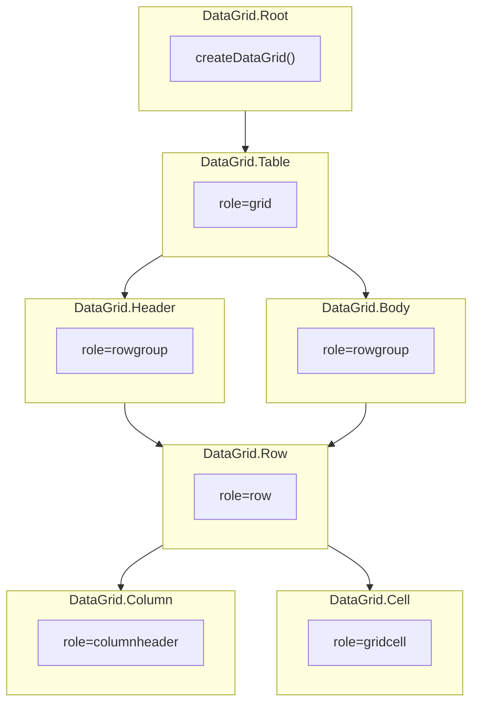

# DataGrid

<DocsPageFeatures :frontmatter />

Headless compound for tabular data with column layout, cell editing, row ordering, and row spanning.

## Usage

DataGrid provides a structural shell for tabular data. Register columns and rows on the Root context, then render header and body cells against that registry.

::: gn-example
/components/data-grid/basic
:::

## Anatomy

```vue Anatomy no-filename
<script setup lang="ts">
  import { DataGrid } from '@vuetify/v0'
</script>

<template>
  <DataGrid.Root>
    <DataGrid.Table>
      <DataGrid.Header>
        <DataGrid.Row>
          <DataGrid.Column />

          <DataGrid.Handle />
        </DataGrid.Row>
      </DataGrid.Header>

      <DataGrid.Body>
        <DataGrid.Row>
          <DataGrid.Cell />
        </DataGrid.Row>
      </DataGrid.Body>
    </DataGrid.Table>
  </DataGrid.Root>
</template>
```

## Architecture

DataGrid extends DataTable with four additional capabilities:

- **Layout** — Column pinning, sizing, resizing, and reordering via `context.layout`
- **Rows** — Manual row ordering via `context.rows.move()` and `context.rows.reset()`
- **Editing** — Cell editing state via `context.editing`
- **Spans** — Row spanning via `context.spans`

### Layout API

The `context.layout` API provides column sizing primitives:

- `layout.resize(columnId, delta)` — Resize a column by a percentage delta
- `layout.distribute(sizes)` — Set all column sizes at once (used by resizable rows)
- `layout.columns` — Reactive array of column layout state including `size`, `minSize`, `maxSize`



## Recipes

### Resizable columns

Set `resizable` on `DataGrid.Row` and place `DataGrid.Handle` between adjacent `DataGrid.Column` cells. The row composes [Splitter](/components/semantic/splitter) internally and syncs sizes to `context.layout`. Onboard columns in setup before the header row mounts so each panel's `defaultSize` is the registered size.

::: gn-example
/components/data-grid/resizable
:::

```vue
<template>
  <DataGrid.Row resizable>
    <DataGrid.Column column="name">Name</DataGrid.Column>
    <DataGrid.Handle />
    <DataGrid.Column column="email">Email</DataGrid.Column>
  </DataGrid.Row>
</template>
```

## Accessibility

DataGrid ships structural table roles. It is not a WAI-ARIA Grid APG widget — there is no roving tabindex, `aria-activedescendant`, or keyboard cell navigation.

- `DataGrid.Table` renders with `role="grid"` and `aria-rowcount`
- `DataGrid.Header` and `DataGrid.Body` render with `role="rowgroup"`
- `DataGrid.Row` renders with `role="row"`
- `DataGrid.Column` renders with `role="columnheader"`, `scope="col"`, and `aria-sort` on sortable columns
- `DataGrid.Cell` renders with `role="gridcell"` and `rowspan` for spanned cells

`DataGrid.Handle` (inside a `resizable` row) inherits Splitter's `role="separator"` semantics.

## FAQ

::: faq

??? When should I use DataGrid vs DataTable?

DataGrid adds column layout (pinning, sizing), cell editing, row ordering, and row spanning on top of DataTable. Use DataGrid when you need spreadsheet-like editing or row reordering; use DataTable for read-only tabular data.

??? How do I enable cell editing?

Pass an `editing` option to `DataGrid.Root` with an `onEdit` callback, then mark columns as `editable: true` when registering them with `context.columns.onboard()`.

??? How does row spanning work?

Pass a `rowSpanning` function to `DataGrid.Root` that returns the span count for each cell. Spanned cells are automatically hidden via `v-if` in `DataGrid.Cell`.

??? How do I pin columns?

Use `context.layout.pin(columnId, 'left' | 'right')` to pin columns, or set `pinned: 'left' | 'right'` when registering columns.

??? How do I enable column resizing?

Set `resizable` on `DataGrid.Row` and place `DataGrid.Handle` between `DataGrid.Column` cells. Do not compose raw `Splitter` primitives — the row already wraps `Splitter.Root` and each column already wraps `Splitter.Panel`.

```vue
<template>
  <DataGrid.Row resizable>
    <DataGrid.Column column="name">Name</DataGrid.Column>
    <DataGrid.Handle />
    <DataGrid.Column column="email">Email</DataGrid.Column>
  </DataGrid.Row>
</template>
```

:::

<DocsApi />
