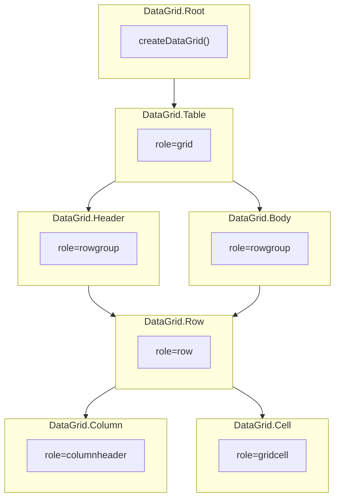

# DataGrid

Headless data grid compound with column layout, cell editing, row ordering, and row spanning. Built on createDataGrid.

<DocsPageFeatures :frontmatter />

## Usage

DataGrid provides a structural shell over the `createDataGrid` composable. It exposes layout, cell editing, row ordering, and row spanning capabilities on top of the inherited DataTable pipeline.

::: gn-example
/components/data-grid/basic
:::

## Anatomy

```vue Anatomy no-filename
<script setup lang="ts">
  import { DataGrid } from '@vuetify/v0'
</script>

<template>
  <DataGrid.Root v-slot="{ context }">
    <DataGrid.Table>
      <DataGrid.Header>
        <DataGrid.Row>
          <DataGrid.Column column="name">Name</DataGrid.Column>
          <DataGrid.Column column="email">Email</DataGrid.Column>
        </DataGrid.Row>
      </DataGrid.Header>

      <DataGrid.Body>
        <DataGrid.Row v-for="item in context.items.value" :key="item.id" :id="item.id">
          <DataGrid.Cell column="name">{{ item.name }}</DataGrid.Cell>
          <DataGrid.Cell column="email">{{ item.email }}</DataGrid.Cell>
        </DataGrid.Row>
      </DataGrid.Body>
    </DataGrid.Table>
  </DataGrid.Root>
</template>
```

## Architecture

DataGrid extends DataTable with four additional capabilities:

- **Layout** — Column pinning, sizing, and reordering via `context.layout`
- **Rows** — Manual row ordering via `context.rows.move()` and `context.rows.reset()`
- **Editing** — Cell editing state via `context.editing`
- **Spans** — Row spanning via `context.spans`



## Accessibility

DataGrid implements the [WAI-ARIA Grid pattern](https://www.w3.org/WAI/ARIA/apg/patterns/grid/):

- `DataGrid.Table` renders with `role="grid"`
- `DataGrid.Header` and `DataGrid.Body` render with `role="rowgroup"`
- `DataGrid.Row` renders with `role="row"`
- `DataGrid.Column` renders with `role="columnheader"` and `aria-sort` for sorted columns
- `DataGrid.Cell` renders with `role="gridcell"` and appropriate `rowspan` for spanned cells

## FAQ

::: faq

??? When should I use DataGrid vs DataTable?

DataGrid adds column layout (pinning, sizing), cell editing, row ordering, and row spanning on top of DataTable. Use DataGrid when you need spreadsheet-like editing or row reordering; use DataTable for read-only tabular data.

??? How do I enable cell editing?

Pass an `editing` option to `DataGrid.Root` with an `onEdit` callback, then mark columns as `editable: true` when registering them with `context.columns.onboard()`.

??? How does row spanning work?

Pass a `rowSpanning` function to `DataGrid.Root` that returns the span count for each cell. Spanned cells are automatically hidden via `v-if` in `DataGrid.Cell`.

??? How do I pin columns?

Use `context.layout.pin(columnId, 'left' | 'right')` to pin columns, or set `pinned: 'left' | 'right'` when registering columns.

:::

<DocsApi />
