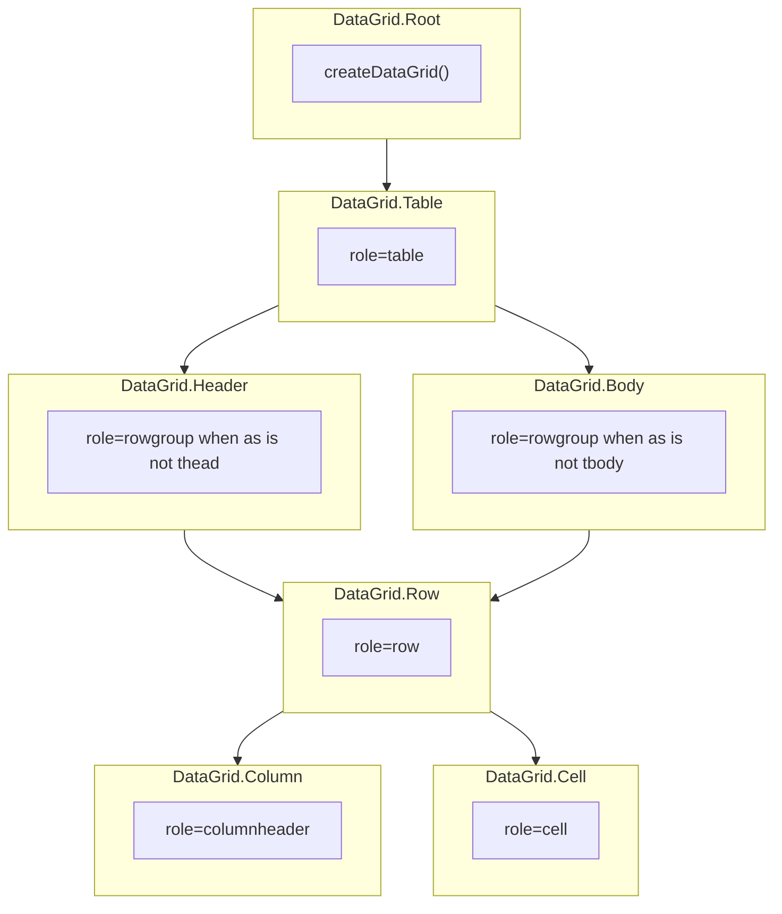

# DataGrid

<DocsPageFeatures :frontmatter />

Headless compound for tabular data with column layout, cell editing, row ordering, and row spanning.

## Usage

`DataGrid.Root` creates the grid. `DataGrid.Column` and `DataGrid.Row` register when they mount and unregister when they unmount — same lifecycle as `Checkbox.Group`. `context.items` is the pipeline over those registered rows. The client adapter defaults to **10 rows per page**; keep off-page rows mounted (`v-show`) so they stay in the registry. Compose [Pagination](/components/semantic/pagination) or pass `:pagination="{ itemsPerPage: n }"` on Root.

::: gn-example
/components/data-grid/basic
:::

## Anatomy

```vue Anatomy no-filename
<script setup lang="ts">
  import { DataGrid } from '@vuetify/v0'
</script>

<template>
  <DataGrid.Root>
    <DataGrid.Table>
      <DataGrid.Header>
        <DataGrid.Row>
          <DataGrid.Column />
        </DataGrid.Row>
      </DataGrid.Header>

      <DataGrid.Body>
        <DataGrid.Row>
          <DataGrid.Cell />
        </DataGrid.Row>
      </DataGrid.Body>
    </DataGrid.Table>
  </DataGrid.Root>
</template>
```

## Architecture

DataGrid extends DataTable with four additional capabilities:

- **Layout** — Column pinning, sizing, resizing, and reordering via `context.layout`
- **Rows** — Manual row ordering via `context.rows.move()` and `context.rows.reset()`. `v-for` Body `orderedItems` so a move reorders the DOM; `v-show` against `items` for the page.
- **Editing** — Cell editing state via `context.editing`
- **Spans** — Row spanning via `context.spans`

### Layout API

The `context.layout` API provides column sizing primitives:

- `layout.resize(columnId, delta)` — Resize a column by a percentage delta (composable neighbor-delta API; Handle does not call this)
- `layout.distribute(sizes)` — Set visible-column sizes at once in Column DOM/registry order (what a resizable row's Splitter `@layout` calls). Not `layout.columns` pin order.
- `layout.columns` — Reactive array of column layout state including `size`, `minSize`, `maxSize`
- `layout.pin(columnId, 'left' | 'right' | false)` — Pin or unpin at runtime



## Recipes

### Resizable columns

Set `resizable` on `DataGrid.Row` and place `DataGrid.Handle` between adjacent `DataGrid.Column` cells. The row composes [Splitter](/components/semantic/splitter) internally; Splitter emits `@layout` and the row calls `layout.distribute`. `layout.resize(id, delta)` is the composable neighbor-delta API — Handle does not call it.

Splitter cannot live in a native `<table>`. Use the full `as="div"` chain on Table, Header, Body, Row, Column, and Cell.

::: gn-example
/components/data-grid/resizable
:::

```vue
<template>
  <DataGrid.Table as="div">
    <DataGrid.Header as="div">
      <DataGrid.Row as="div" resizable>
        <DataGrid.Column as="div" id="name">Name</DataGrid.Column>
        <DataGrid.Handle />
        <DataGrid.Column as="div" id="email">Email</DataGrid.Column>
      </DataGrid.Row>
    </DataGrid.Header>

    <DataGrid.Body as="div">
      <DataGrid.Row as="div" :id="item.id" :value="item">
        <DataGrid.Cell as="div" column="name">{{ item.name }}</DataGrid.Cell>
      </DataGrid.Row>
    </DataGrid.Body>
  </DataGrid.Table>
</template>
```

## Accessibility

DataGrid ships structural table roles. It is not a WAI-ARIA Grid APG widget — there is no roving tabindex, `aria-activedescendant`, or keyboard cell navigation. Name it with `aria-label` or a `<caption>` — Root is a fragment and cannot be named.

- `DataGrid.Table` renders `<table role="table">`. `aria-rowcount` is set only when the current page is a subset of total (count includes header rows). When it is set, also bind `:index` on header Rows (`1`, or `i + 1` over `headers`) and on each body `DataGrid.Row`: `:index="headerRows + i + 1"` when v-for `orderedItems`, or `:index="rowStart + i"` when v-for `items`. Header rows are not auto-indexed.
- `DataGrid.Header` and `DataGrid.Body` omit `role` on native `thead`/`tbody`; `as="div"` gets `role="rowgroup"`.
- `DataGrid.Row` renders with `role="row"` and `aria-selected` when `selectable` is set
- `DataGrid.Column` renders with `role="columnheader"`, `scope="col"`, and `aria-sort` on sortable columns
- `DataGrid.Cell` renders with `role="cell"` and `rowspan` (or `aria-rowspan` when `as` is not `td`) for spanned cells

Put a button inside sortable header cells — do not make the `<th>` itself the control:

```vue
<template>
  <DataGrid.Column
    id="name"
    v-slot="{ isSortable, toggleSort }"
  >
    <button v-if="isSortable" @click="toggleSort">
      Name
    </button>
    <span v-else>Name</span>
  </DataGrid.Column>
</template>
```

`DataGrid.Handle` (inside a `resizable` row) inherits Splitter's `role="separator"` semantics.

## FAQ

::: faq

??? When should I use DataGrid vs DataTable?

DataGrid adds column layout (pinning, sizing), cell editing, row ordering, and row spanning on top of DataTable. Use DataGrid when you need spreadsheet-like editing or row reordering; use DataTable for read-only tabular data.

??? How do I enable cell editing?

Call `editing.edit(rowId, columnId)`, then `commit(value)` or `cancel()`. `onEdit` is 4-arg `(row, column, value, item)` and runs after a successful commit. `DataGrid.Cell` is display-only — it exposes an `isEditing` flag, not an editor. `DataGrid.Row` must use the same `id` as the ticket. See the [composable editing example](/composables/data/create-data-grid#examples).

??? How do I use a server adapter?

Pass `new ServerGridAdapter({ total, loading?, error? })` — there is no `fetch`. Onboard the current page of rows; the server owns sort, filter, and pagination.

??? How do I pin columns?

Runtime pin is `layout.pin(columnId, 'left' | 'right')`. Unpin with `false`. `ticket.pinned` is a registration snapshot; slot `pinPosition` / `isPinned` read `layout.columns`.

??? How does row spanning work?

A per-column `span(item)` function on the column ticket wins over Root `rowSpanning`. Spanned cells are hidden via `v-if` in `DataGrid.Cell`.

??? How do I enable column resizing?

Set `resizable` on `DataGrid.Row` and place `DataGrid.Handle` between `DataGrid.Column` cells. Handle → Splitter `@layout` → `layout.distribute`. `layout.resize(id, delta)` is the composable neighbor-delta API, not what Handle calls. Splitter cannot live in a native table — use the full `as="div"` chain.

```vue
<template>
  <DataGrid.Table as="div">
    <DataGrid.Header as="div">
      <DataGrid.Row as="div" resizable>
        <DataGrid.Column as="div" id="name">Name</DataGrid.Column>
        <DataGrid.Handle />
        <DataGrid.Column as="div" id="email">Email</DataGrid.Column>
      </DataGrid.Row>
    </DataGrid.Header>
  </DataGrid.Table>
</template>
```

:::

<DocsApi />
