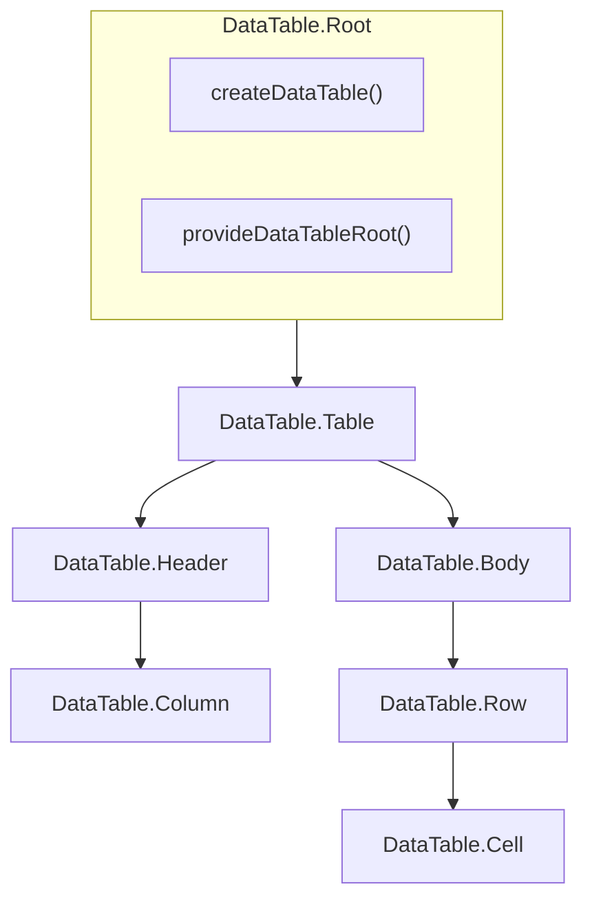

# DataTable

Headless compound component for rendering tabular data with sorting, pagination, selection, and expansion support.

<DocsPageFeatures :frontmatter />

## Usage

`DataTable.Root` creates the table. `DataTable.Column` and `DataTable.Row` register when they mount and unregister when they unmount — same lifecycle as `Checkbox.Group`. `context.items` is the pipeline over those registered rows. The client adapter defaults to **10 rows per page**[^page-size]; keep off-page rows mounted (`v-show`) so they stay in the registry. Compose [Pagination](/components/semantic/pagination) or pass `:pagination="{ itemsPerPage: n }"` on Root.

::: gn-example
/components/data-table/basic
:::

## Anatomy

```vue Anatomy no-filename
<script setup lang="ts">
  import { DataTable } from '@vuetify/v0'
</script>

<template>
  <DataTable.Root>
    <DataTable.Table>
      <DataTable.Header>
        <DataTable.Row>
          <DataTable.Column />
        </DataTable.Row>
      </DataTable.Header>

      <DataTable.Body>
        <DataTable.Row>
          <DataTable.Cell />
        </DataTable.Row>

        <DataTable.Empty>
          <DataTable.Cell />
        </DataTable.Empty>
      </DataTable.Body>
    </DataTable.Table>
  </DataTable.Root>
</template>
```

## Architecture

The DataTable compound is a thin shell over `createDataTable`. Root creates the instance; Column and Row register as children, like Checkbox.Group. `v-for` the source array ordered by `sortedItems`; `v-show` against `items` so off-page rows stay registered.



### Data Loading

Put a `DataTable.Row` in the DOM for each row and a `DataTable.Column` for each column. They register on setup and unregister on unmount. Pass `:value` on data rows. `v-for="user in rank(users)"` — `rank` is on the Body slot, ranks the source by the pipeline. Use `v-show` (not `v-if`) when hiding off-page rows so they stay registered.

::: gn-example
/components/data-table/useLoading.ts 1
/components/data-table/LoadingTable.vue 2
/components/data-table/loading.vue 3

| File | Role |
|------|------|
| `useLoading.ts` | Composable — user seed |
| `LoadingTable.vue` | Reusable table — children register on render, `v-show` the page, pager |
| `loading.vue` | Entry — wires the seed to the table |
:::

> [!TIP]
> For pipeline-only use without the compound, call [createDataTable](/composables/data/create-data-table) and `onboard` on the returned context.

## Examples

::: gn-example
/components/data-table/useTeam.ts 1
/components/data-table/TeamTable.vue 2
/components/data-table/team-directory.vue 3

### Team directory

A client-side roster that shows the loading path the compound is built for: each `DataTable.Column` and `DataTable.Row` registers on setup, `v-model:search` drives the filter pipeline, and body rows `v-for="member in rank(members)"` so a header click reorders the table without replacing the collection. Off-page rows stay mounted behind `v-show` against the paginated `items` list — `v-if` would unregister them and the pager would lie about totals. The name cell composes [Avatar](/components/semantic/avatar); members without an image fall through to initials.

The pager is `context.pagination`; swap those two buttons for [Pagination](/components/semantic/pagination) if you want numbered page items, but keep a single page owner.

Reach for this whenever the dataset fits in the client and you want a table you can copy into an app. The trade-off versus [createDataTable](/composables/data/create-data-table) plus `onboard` is that every row you might page to has to stay in the DOM. Huge lists belong on the server adapter or a virtualizer; this example is the default path. Related: [createFilter](/composables/data/create-filter) is the search stage, and [createPagination](/composables/data/create-pagination) is the page stage.

| File | Role |
|------|------|
| `useTeam.ts` | Composable — member seed, search query, and column definitions |
| `TeamTable.vue` | Reusable table — avatars, search, sortable headers, pager |
| `team-directory.vue` | Entry — wires the composable to the table and a short status line |
:::

::: gn-example
/components/data-table/useIssues.ts 1
/components/data-table/IssueTable.vue 2
/components/data-table/issue-selection.vue 3

### Issue list with row selection

A triage table that uses the table's own selection set instead of wrapping rows in [Checkbox.Group](/components/forms/checkbox). `DataTable.Row` with `selectable` exposes `isSelected` / `toggleSelection` and writes `data-selected` on the `<tr>`, so row chrome stays declarative. The header "Toggle page" calls `context.selection.toggleAll()` — with the default `selectStrategy: 'page'` that means the visible rows, not the whole registry.

Archive reads `selectedIds`, drops those issues from the source array, then `unselectAll()`. Because the table `v-for`s that source array, those rows unmount and unregister — same as removing a `Checkbox.Root` from a group. Search uses `v-model:search` against `filterable` title and assignee columns; `DataTable.Empty` covers both a failed query and a fully archived list.

Reach for this when the grid is the selection surface — issue trackers, file lists, anything with bulk actions. If you need a tri-state header checkbox that looks like the rest of your forms, compose `Checkbox.Root` as the cell visual and keep `toggleSelection` as the writer; don't run a parallel `Checkbox.Group` v-model next to `context.selection`. Related: [createGroup](/composables/selection/create-group) for the checkbox pattern, and `selectStrategy` of `'single'` / `'all'` when page-scoped select-all is the wrong unit.

| File | Role |
|------|------|
| `useIssues.ts` | Composable — issue seed, archive/reset, and status copy |
| `IssueTable.vue` | Reusable table — page toggle, archive action, selectable rows, sortable columns |
| `issue-selection.vue` | Entry — wires the composable to the table and a reset control |
:::

## Recipes

### Search

Bind `v-model:search` on Root — same shape as `Pagination.Root`'s `v-model`. Column `filterable` flags which fields the query matches.

```vue
<template>
  <DataTable.Root v-model:search="query">
    <input v-model="query" type="search" aria-label="Search">
    <!-- table markup -->
  </DataTable.Root>
</template>
```

### Sorting

`DataTable.Column` exposes sort state when given an `id`. `sortable` / `filterable` are live getters on the registered ticket, like `disabled` on `Tabs.Item`. Order the source array by `sortedItems` so toggling sort reorders the rows:

| Slot prop | Type | Description |
|-----------|------|-------------|
| `isSortable` | `boolean` | Whether the column is sortable |
| `direction` | `'asc' \| 'desc' \| 'none'` | Current sort direction |
| `priority` | `number` | Sort priority for multi-sort (-1 if not sorted) |
| `toggle` | `() => void` | Toggle sort on this column |

### Selection

`DataTable.Row` exposes selection state when given an `id`:

| Slot prop | Type | Description |
|-----------|------|-------------|
| `id` | `ID \| undefined` | Registered row id |
| `value` | `T \| undefined` | Registered row record. Undefined on header rows. |
| `isSelected` | `boolean` | Whether the row is selected |
| `isSelectable` | `boolean` | Whether the row can be selected |
| `toggleSelection` | `() => void` | Toggle row selection |

### Expansion

`DataTable.Row` also exposes expansion state:

| Slot prop | Type | Description |
|-----------|------|-------------|
| `isExpanded` | `boolean` | Whether the row is expanded |
| `toggleExpansion` | `() => void` | Toggle row expansion |

Bind `:id` to the same id the row registered with (`DataTable.Row`'s `id` prop), not a field on the row value unless they are the same.

### Pagination

The compound has no pager. Drive `context.pagination` yourself, or compose [Pagination](/components/semantic/pagination):

```vue
<template>
  <DataTable.Root v-slot="{ context }" :pagination="{ itemsPerPage: 10 }">
    <!-- table markup; keep off-page rows mounted with v-show[^collapse] -->

    <button :disabled="context.pagination.isFirst.value" @click="context.pagination.prev()">
      Previous
    </button>
    <span>{{ context.pagination.page.value }} / {{ context.pagination.pages }}</span>
    <button :disabled="context.pagination.isLast.value" @click="context.pagination.next()">
      Next
    </button>
  </DataTable.Root>
</template>
```

### Virtualization

Every row this compound registers has to stay mounted. That is correct for a page of results and the wrong shape for thousands of rows — unmounting a row to virtualize it also unregisters it, so totals and sort/filter state collapse to the viewport.

Use [createDataTable](/composables/data/create-data-table) with `VirtualDataTableAdapter` and wrap `table.items` in [createVirtual](/composables/data/create-virtual).[^virtualizer] The adapter filters and sorts without slicing pages; `createVirtual` mounts only the visible window. Tickets stay on the registry whether a row is on screen or not.

```vue
<script setup lang="ts">
  import { createDataTable, createVirtual } from '@vuetify/v0'
  import { VirtualDataTableAdapter } from '@vuetify/v0/data-table/adapters/virtual'

  const table = createDataTable({
    adapter: new VirtualDataTableAdapter(),
  })

  table.columns.onboard(columns)
  table.onboard(users.map(value => ({ id: value.id, value })))

  const { element, items: visible, offset, size, scroll } = createVirtual(table.items, {
    itemHeight: 40,
  })
</script>

<template>
  <div ref="element" class="h-[400px] overflow-y-auto" @scroll="scroll">
    <div :style="{ height: `${offset}px` }" />
    <div v-for="item in visible" :key="item.index">
      {{ item.raw.name }}
    </div>
    <div :style="{ height: `${size}px` }" />
  </div>
</template>
```

See the [virtual scrolling example](/composables/data/create-data-table#virtual-scrolling) for a full table with sticky headers. When the API owns filter, sort, and page, use `ServerDataTableAdapter` and `onboard` each response instead of keeping a client-side window.

| Dataset | Loading | Render |
|---------|---------|--------|
| Fits in the page | Children register | `v-for` the source, `v-show` the page |
| Fits in the client, not the DOM | `onboard` + `VirtualDataTableAdapter` | `createVirtual(table.items)` |
| Doesn't fit in the client | `ServerDataTableAdapter` + `onboard` the page | The page the API returned |

## Accessibility

DataTable renders semantic table markup with ARIA attributes:

- `DataTable.Table` renders `<table role="table">`. Name it with `aria-label` or a `<caption>` — Root is a fragment and cannot be named.
- `aria-rowcount` is set only when the current page is a **subset** of total. The count includes header rows. When it is set, bind `aria-rowindex` on each body `DataTable.Row` via `:index="rowStart + i"` (`rowStart` comes from Body slot props).
- `DataTable.Column` renders `<th role="columnheader">` with `aria-sort` for sortable columns
- `DataTable.Row` renders `<tr role="row">` with `aria-selected` when `selectable` is set
- `DataTable.Cell` renders `<td role="cell">`

Put a button inside sortable header cells — do not make the `<th>` itself the control:

```vue
<template>
  <DataTable.Column
    id="name"
    v-slot="{ isSortable, toggle }"
  >
    <button v-if="isSortable" @click="toggle">
      Name
    </button>
    <span v-else>Name</span>
  </DataTable.Column>
</template>
```

## FAQ

::: faq

??? When should I use DataTable vs createDataTable?

Use DataTable when you want semantic table markup and ARIA, with rows and columns as children. Use [createDataTable](/composables/data/create-data-table) when the dataset is not the DOM — cards, virtual lists, or `onboard` of a server page.

??? How do I read a row's data?

`items` and `sortedItems` are arrays of the records you registered — the same objects passed as `:value`. `DataTable.Row` also exposes that record as `value` on its slot, including when the row was registered with `onboard` first.

??? Can I pass `:items` to Root?

No. Collection composables don't take an `items` factory option, and neither does Root. Children register from the DOM, or you call `onboard` on a `createDataTable` instance.

??? Can I `v-for` `context.items` to create rows?

No. `items` is derived from registered rows. First paint is empty, nothing registers, the table stays empty. `v-for` the source array and order it by `sortedItems`.

??? Why is `v-show` required for pagination?

`v-if` unmounts the row, which unregisters the ticket, so `total` and page counts shrink to the visible page. `v-show` keeps the node mounted.

??? Why doesn't sort move the rows?

The pipeline reorders `sortedItems`, not your source array. `v-for="user in rank(users)"` — `rank` is on the Body slot. If you `v-for` `sortedItems` itself, rows that are not yet registered never mount.

??? How do I render thousands of rows?

This compound keeps every registered row mounted. For large client-side lists, use `createDataTable` with `VirtualDataTableAdapter` and [createVirtual](/composables/data/create-virtual) — see [Virtualization](#virtualization). If the API owns filter, sort, and page, use `ServerDataTableAdapter` instead.

??? How do I handle server-side data?

Pass a [ServerDataTableAdapter](/composables/data/create-data-table#serverdatatableadapter) to Root (`{ total, loading?, error? }` — no `fetch`). The API owns the window: `onboard` the returned page (or `v-for` that page as children). Don't keep other pages mounted.

??? How do I enable multi-column sorting?

Pass `sort-multiple` to Root:

```vue
<DataTable.Root :sort-multiple="true" />
```

??? Why does clicking a row toggle selection?

`selectable` on `DataTable.Row` wires click on the `<tr>`, same as `Checkbox.Root`. Don't also put `@click="toggleSelection"` on the Row — slot props aren't in scope on the component's own listeners.

??? Should I wrap rows in Checkbox.Group?

No. Selection lives on `context.selection`. A parallel group `v-model` will drift. Compose `Checkbox.Root` as cell chrome if you want the visual; keep `toggleSelection` as the writer.

??? Why is there a leftover line under the last visible row?

`border-collapse` still paints hidden `v-show` rows sitting in the same `<tbody>`. Use `border-separate border-spacing-0` on the table, and don't put `border-b` on the last item of the current page.

:::

[^page-size]: `itemsPerPage: 10` is the [createPagination](/composables/data/create-pagination) default the client adapter ships. Pass `:pagination="{ itemsPerPage: n }"` on Root, or `Infinity` for a single page — off-page rows still have to stay mounted.

[^collapse]: `v-show` sets `display: none` on the `<tr>`. In a `border-collapse` table those rows still participate in the border model, so page 1 shows a phantom line under the last visible record. `border-separate border-spacing-0` takes them out of that model.

[^virtualizer]: A [Virtualizer](/roadmap) compound is planned as a scroll viewport over `createVirtual`. It is not required to virtualize a table today — `createVirtual` is the render layer.

<DocsApi />
