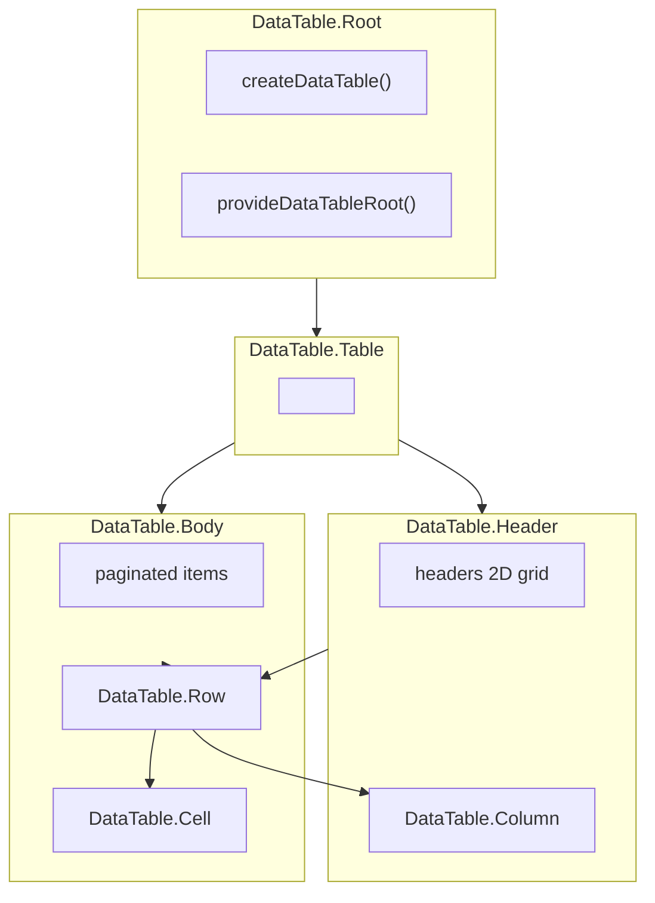

# DataTable

Headless compound component for rendering tabular data with sorting, pagination, selection, and expansion support.

<DocsPageFeatures :frontmatter />

## Usage

`DataTable.Body` renders the **current page** of rows. The client adapter defaults to **10 rows per page**, and the compound ships no pager — compose [Pagination](/components/semantic/pagination) or pass `:pagination="{ itemsPerPage: n }"` on Root.

::: gn-example
/components/data-table/basic
:::

## Anatomy

```vue Anatomy no-filename
<script setup lang="ts">
  import { DataTable } from '@vuetify/v0'
</script>

<template>
  <DataTable.Root>
    <DataTable.Table>
      <DataTable.Header>
        <DataTable.Row>
          <DataTable.Column />
        </DataTable.Row>
      </DataTable.Header>

      <DataTable.Body>
        <DataTable.Row>
          <DataTable.Cell />
        </DataTable.Row>

        <DataTable.Empty>
          <DataTable.Cell />
        </DataTable.Empty>
      </DataTable.Body>
    </DataTable.Table>
  </DataTable.Root>
</template>
```

## Architecture

The DataTable compound is a thin shell over the `createDataTable` composable. The Root creates and provides the context; child components consume it for rendering.



### Data Loading

Register columns and rows once via `useDataTableRoot` in a child component. Init `onboard` is **one-shot** — for async or replaced data call `clear()` then `onboard()`, or `upsert`. Duplicate ids warn and keep the old ticket.

`DataTable.Row` `:id` must be the **ticket id** used at `onboard({ id, value })`. `item.id` only works when it equals that ticket id.

```vue
<script setup lang="ts">
  import { defineComponent } from 'vue'
  import { DataTable, useDataTableRoot } from '@vuetify/v0'

  const columns = [
    { id: 'name', title: 'Name', sortable: true },
    { id: 'email', title: 'Email', filterable: true },
  ]
  const users = [/* your data */]

  // One-shot initialization component
  const DataTableInit = defineComponent({
    setup () {
      const context = useDataTableRoot('v0:data-table')
      context.columns.onboard(columns)
      context.onboard(users.map(u => ({ id: u.id, value: u })))
      return () => null
    },
  })
</script>

<template>
  <DataTable.Root>
    <DataTableInit />
    <!-- Table structure -->
  </DataTable.Root>
</template>
```

> [!TIP]
> For full control over the data pipeline without the component layer, use [createDataTable](/composables/data/create-data-table) directly.

## Recipes

### Sorting

`DataTable.Column` exposes sort state when given an `id`:

| Slot prop | Type | Description |
|-----------|------|-------------|
| `isSortable` | `boolean` | Whether the column is sortable |
| `sortDirection` | `'asc' \| 'desc' \| 'none'` | Current sort direction |
| `sortPriority` | `number` | Sort priority for multi-sort (-1 if not sorted) |
| `toggleSort` | `() => void` | Toggle sort on this column |

### Selection

`DataTable.Row` exposes selection state when given an `id`:

| Slot prop | Type | Description |
|-----------|------|-------------|
| `isSelected` | `boolean` | Whether the row is selected |
| `isSelectable` | `boolean` | Whether the row can be selected |
| `toggleSelection` | `() => void` | Toggle row selection |

### Expansion

`DataTable.Row` also exposes expansion state:

| Slot prop | Type | Description |
|-----------|------|-------------|
| `isExpanded` | `boolean` | Whether the row is expanded |
| `toggleExpansion` | `() => void` | Toggle row expansion |

Bind `:id` to the **ticket id** from `onboard({ id, value })`, not a field on the row value unless they are the same.

### Pagination

The compound has no pager. Drive `context.pagination` yourself, or compose [Pagination](/components/semantic/pagination):

```vue
<template>
  <DataTable.Root v-slot="{ context }" :pagination="{ itemsPerPage: 10 }">
    <!-- table markup -->

    <button :disabled="context.pagination.isFirst.value" @click="context.pagination.prev()">
      Previous
    </button>
    <span>{{ context.pagination.page.value }} / {{ context.pagination.pages }}</span>
    <button :disabled="context.pagination.isLast.value" @click="context.pagination.next()">
      Next
    </button>
  </DataTable.Root>
</template>
```

## Accessibility

DataTable renders semantic table markup with ARIA attributes:

- `DataTable.Table` renders `<table role="table">`. Name it with `aria-label` or a `<caption>` — Root is a fragment and cannot be named.
- `aria-rowcount` is set only when the current page is a **subset** of total. The count includes header rows. When it is set, bind `aria-rowindex` on each body `DataTable.Row` via `:index="rowStart + i"` (`rowStart` comes from Body slot props).
- `DataTable.Column` renders `<th role="columnheader">` with `aria-sort` for sortable columns
- `DataTable.Row` renders `<tr role="row">` with `aria-selected` when `selectable` is set
- `DataTable.Cell` renders `<td role="cell">`

Put a button inside sortable header cells — do not make the `<th>` itself the control:

```vue
<template>
  <DataTable.Column
    id="name"
    v-slot="{ isSortable, toggleSort }"
  >
    <button v-if="isSortable" @click="toggleSort">
      Name
    </button>
    <span v-else>Name</span>
  </DataTable.Column>
</template>
```

## FAQ

::: faq

??? When should I use DataTable vs createDataTable?

Use DataTable when you want a semantic table structure with built-in ARIA. Use `createDataTable` directly when you need custom rendering (cards, virtual lists) or want full control over the DOM.

??? How do I enable multi-column sorting?

Pass `sort-multiple` to the Root:

```vue
<template>
  <DataTable.Root :sort-multiple="true" />
</template>
```

??? How do I handle server-side data?

Construct a [ServerDataTableAdapter](/composables/data/create-data-table) in `<script setup>` with `{ total, loading?, error? }` — there is no `fetch` option. Watch query/sort/page and replace rows with `clear()` then `onboard()`.

```vue
<script setup lang="ts">
  import { DataTable, ServerDataTableAdapter, useDataTableRoot } from '@vuetify/v0'
  import { defineComponent, shallowRef, watch } from 'vue'

  const total = shallowRef(0)
  const loading = shallowRef(false)
  const adapter = new ServerDataTableAdapter({ total, loading })

  const DataTableInit = defineComponent({
    name: 'DataTableInit',
    setup () {
      const context = useDataTableRoot('v0:data-table')

      async function load () {
        loading.value = true
        const result = await fetchPage(/* query, sort, page */)
        total.value = result.total
        context.clear()
        context.onboard(result.items.map(u => ({ id: u.id, value: u })))
        loading.value = false
      }

      watch(
        [context.query, context.sort.columns, context.pagination.page],
        () => load(),
        { immediate: true },
      )

      return () => null
    },
  })
</script>

<template>
  <DataTable.Root :adapter="adapter">
    <DataTableInit />
    <!-- table markup -->
  </DataTable.Root>
</template>
```

:::

<DocsApi />
