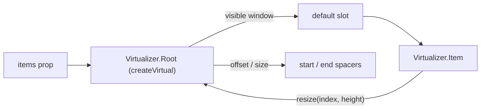

# Virtualizer

<DocsPageFeatures :frontmatter />

Headless virtualized list that mounts only the rows inside (and slightly beyond) the visible viewport.

## Usage

`Virtualizer.Root` renders the scroll container and the spacers that stand in for off-screen rows. Its default slot receives only the visible window — iterate it with `Virtualizer.Item`, passing each item's `index` from the full list. The container needs a definite height — the `height` prop, an `h-*` class, or a flex or grid parent that sizes it. `max-height` alone is not enough: the container starts at zero height, so no rows render to grow it.

::: gn-example
/components/virtualizer/basic
:::

## Anatomy

```vue Anatomy no-filename
<script setup lang="ts">
  import { Virtualizer } from '@vuetify/v0'
</script>

<template>
  <Virtualizer.Root>
    <Virtualizer.Item />
  </Virtualizer.Root>
</template>
```

## Architecture

Root wraps [createVirtual](/composables/data/create-virtual) and provides it to every Item. Root owns the scroll container, the leading and trailing spacers, and the visible window; each Item measures its own border box with a `ResizeObserver` and reports it back through `resize(index, height)`.



`itemHeight` is the estimate for rows that have not rendered yet. Omit it and the first measured row becomes the estimate. Rows with padding or borders are measured by their border box, so they do not drift.

## Recipes

### Variable heights

Rows do not need a fixed height. Each `Virtualizer.Item` reports its measured height, and the spacers and scrollbar correct themselves as rows render.

The measurement is the row's border box, so margins are not counted. Space rows with padding inside the row, or a `gap` on content inside it — never a margin on `Virtualizer.Item`.

```vue
<script setup lang="ts">
  import { Virtualizer } from '@vuetify/v0'

  const messages = Array.from({ length: 5000 }, (_, i) => ({
    id: i,
    body: 'Lorem ipsum '.repeat(1 + (i % 12)),
  }))
</script>

<template>
  <Virtualizer.Root v-slot="{ items }" :height="480" :items="messages">
    <Virtualizer.Item
      v-for="item in items"
      :key="item.raw.id"
      class="p-3 border-b border-divider"
      :index="item.index"
    >
      {{ item.raw.body }}
    </Virtualizer.Item>
  </Virtualizer.Root>
</template>
```

### Infinite scroll

`@bottom` fires when the scroll position comes within `bottom-threshold` pixels of the bottom edge, with the remaining distance in pixels. Replace the array with one that includes the new page — `items.value = [...items.value, ...page]` — and the window extends. Pushing onto the existing array in place is not detected. `@top` and `top-threshold` mirror it for the top edge.

The events fire on every animation frame of scrolling while the position stays inside the threshold, not once per crossing. An async loader needs an in-flight guard so a slow request is not started several times.

They only fire in response to scrolling — never on mount. A list shorter than the viewport plus `bottom-threshold` cannot scroll, so `@bottom` never fires for it. Load the first page yourself before handing `items` to Root.

```vue
<script setup lang="ts">
  import { Virtualizer } from '@vuetify/v0'
  import { shallowRef } from 'vue'

  const rows = shallowRef(Array.from({ length: 100 }, (_, i) => i))
  const loading = shallowRef(false)

  async function fetchPage (start: number) {
    await new Promise(resolve => setTimeout(resolve, 300))
    return Array.from({ length: 100 }, (_, i) => start + i)
  }

  async function onBottom () {
    if (loading.value) return
    loading.value = true
    try {
      rows.value = [...rows.value, ...await fetchPage(rows.value.length)]
    } finally {
      loading.value = false
    }
  }
</script>

<template>
  <Virtualizer.Root
    v-slot="{ items }"
    :bottom-threshold="200"
    :height="400"
    :item-height="40"
    :items="rows"
    @bottom="onBottom"
  >
    <Virtualizer.Item
      v-for="item in items"
      :key="item.raw"
      :index="item.index"
    >
      Row {{ item.raw }}
    </Virtualizer.Item>
  </Virtualizer.Root>
</template>
```

### Scrolling to an item

`scrollTo(index, options)` and `reset()` are available two ways: from Root's default slot, and from a template ref on Root. `options` accepts `behavior`, `block` (`'start' | 'center' | 'end' | 'nearest'`), and a pixel `offset`. Controls inside the list belong in the rows — anything else rendered inside Root sits between the spacers and throws off the row offsets. Controls outside the list use the template ref (see [Outside controls](#outside-controls)).

```vue
<script setup lang="ts">
  import { Button, Virtualizer } from '@vuetify/v0'

  const rows = Array.from({ length: 10_000 }, (_, i) => ({ id: i, name: `Row ${i + 1}` }))
</script>

<template>
  <Virtualizer.Root
    v-slot="{ items, scrollTo }"
    :height="400"
    :item-height="40"
    :items="rows"
    tabindex="-1"
  >
    <Virtualizer.Item
      v-for="item in items"
      :key="item.raw.id"
      class="flex items-center justify-between h-10 px-3"
      :index="item.index"
    >
      {{ item.raw.name }}

      <Button.Root
        :aria-label="`Center ${item.raw.name}`"
        @click="scrollTo(item.index, { block: 'center', behavior: 'smooth' })"
      >
        Center
      </Button.Root>
    </Virtualizer.Item>
  </Virtualizer.Root>
</template>
```

### Outside controls

A toolbar, search box, or "jump to" field outside the list reaches the same methods through a template ref on Root.

```vue
<script setup lang="ts">
  import { Button, Virtualizer } from '@vuetify/v0'
  import { useTemplateRef } from 'vue'

  const rows = Array.from({ length: 10_000 }, (_, i) => ({ id: i, name: `Row ${i + 1}` }))
  const list = useTemplateRef('list')
</script>

<template>
  <div class="flex gap-2 mb-2">
    <Button.Root @click="list?.scrollTo(0, { behavior: 'smooth' })">
      Top
    </Button.Root>

    <Button.Root @click="list?.scrollTo(4999, { block: 'center' })">
      Row 5,000
    </Button.Root>

    <Button.Root @click="list?.scrollTo(rows.length - 1, { block: 'end' })">
      Bottom
    </Button.Root>
  </div>

  <Virtualizer.Root
    ref="list"
    v-slot="{ items }"
    :height="400"
    :item-height="40"
    :items="rows"
  >
    <Virtualizer.Item
      v-for="item in items"
      :key="item.raw.id"
      class="flex items-center h-10 px-3"
      :index="item.index"
    >
      {{ item.raw.name }}
    </Virtualizer.Item>
  </Virtualizer.Root>
</template>
```

## Accessibility

The scroll container gets `tabindex="0"` so keyboard users can focus it and scroll with the arrow, Page Up/Down, Home, and End keys (axe `scrollable-region-focusable`). It is a default — pass your own `tabindex` (for example `-1` when focus lives on the rows) and it wins. The same goes for `overflow-y` in your own `style`.

Virtualizer imposes no role. A bare row has no semantics, and the right role depends on the content — a feed, a listbox, a grid. Pass the role and its position attributes yourself; they reach the rendered element through attribute passthrough. Because only the visible window is in the DOM, `aria-setsize` and `aria-posinset` are how assistive tech learns the true list length — for `list`, `listbox`, and `feed` rows.

```vue
<script setup lang="ts">
  import { Virtualizer } from '@vuetify/v0'

  const contacts = Array.from({ length: 2000 }, (_, i) => ({ id: i, name: `Contact ${i + 1}` }))
</script>

<template>
  <Virtualizer.Root
    v-slot="{ items: visible }"
    aria-label="Contacts"
    :height="320"
    :item-height="40"
    :items="contacts"
    role="list"
  >
    <Virtualizer.Item
      v-for="item in visible"
      :key="item.raw.id"
      :aria-posinset="item.index + 1"
      :aria-setsize="contacts.length"
      :index="item.index"
      role="listitem"
    >
      {{ item.raw.name }}
    </Virtualizer.Item>
  </Virtualizer.Root>
</template>
```

A `grid` or `table` uses row counts instead: put `aria-rowcount` on Root (the total row count plus any header rows), `:aria-rowindex` on each Item (its 1-based position, counting header rows), and `role="gridcell"` cells inside each row. [DataGrid](/components/data/data-grid) wires the same attributes.

Rows with focusable content unmount when they scroll out of the window. If a row holding focus unmounts, Virtualizer moves focus to the scroll container so it does not fall back to `<body>`.

For keyboard-navigable lists, prefer keeping DOM focus on the container and pointing at the current row with `aria-activedescendant`. That attribute is only valid on a composite role, so the container must be a `listbox` or `grid` (with `option` or `row` items), not a `list`.

A cursor over a windowed list has to scroll before it highlights. [useVirtualFocus](/composables/system/use-virtual-focus) only highlights a row whose element exists, so after a Home or End jump the target row is not mounted yet and the cursor moves while `aria-activedescendant` does not. Each cursor move needs `scrollTo(index, { block: 'nearest' })` to mount the row, then `highlight(id)` after `nextTick` to point at it.

A template ref on Root provides both halves: `element` is the container that keeps focus and carries `aria-activedescendant`, and `scrollTo` mounts the target row. Give every cursor item an `id` and an `el` getter that finds the mounted row (or `null` while it is scrolled out), and put the same `id` on each Item.

```vue
<script setup lang="ts">
  import { isUndefined, useVirtualFocus, Virtualizer } from '@vuetify/v0'
  import { nextTick, useTemplateRef, watch } from 'vue'

  const fruits = Array.from({ length: 5000 }, (_, i) => ({ id: `fruit-${i}`, name: `Fruit ${i + 1}` }))
  const list = useTemplateRef('list')

  const cursor = useVirtualFocus(
    () => fruits.map(fruit => ({ id: fruit.id, el: () => document.getElementById(fruit.id) })),
    { control: () => list.value?.element },
  )

  watch(cursor.highlightedId, id => {
    if (isUndefined(id)) return
    list.value?.scrollTo(fruits.findIndex(fruit => fruit.id === id), { block: 'nearest' })
    nextTick(() => cursor.highlight(id))
  })
</script>

<template>
  <Virtualizer.Root
    ref="list"
    v-slot="{ items }"
    aria-label="Fruits"
    :height="320"
    :item-height="40"
    :items="fruits"
    role="listbox"
  >
    <Virtualizer.Item
      v-for="item in items"
      :id="item.raw.id"
      :key="item.raw.id"
      :aria-posinset="item.index + 1"
      :aria-setsize="fruits.length"
      class="h-10 px-3 flex items-center data-[highlighted]:bg-surface-tint"
      :index="item.index"
      role="option"
    >
      {{ item.raw.name }}
    </Virtualizer.Item>
  </Virtualizer.Root>
</template>
```

`control` must be a getter over the template ref so `useVirtualFocus` attaches its keydown listener once Root mounts. For a combobox, or full control over the markup, the [virtualized listbox](/composables/forms/create-combobox#virtualized-listbox) example drives [createVirtual](/composables/data/create-virtual) directly with the same sequence.

### Data Attributes

| Element | Attribute | Description |
|---------|-----------|-------------|
| Item | `data-index` | The item's index in the full list |
| Spacer | `data-spacer` | `start` or `end` — the placeholders for rows above and below the window |

## FAQ

::: faq

??? Which props are reactive?

`items` and `height` are read live, and `@top` / `@bottom` handlers can be swapped at any time. `itemHeight`, `overscan`, `direction`, `anchor`, `anchorSmooth`, the thresholds, `momentum`, and `elastic` are read once when Root mounts — key the Root to apply a new value.

??? Why doesn't @bottom fire for my first page?

`@top` and `@bottom` fire from scroll events only, never on mount. If the initial `items` are shorter than the viewport plus `bottom-threshold`, nothing can scroll and the event never fires. Fetch the first page before rendering, or keep loading until the list overflows the container.

??? Does Virtualizer support renderless mode?

No. The spacers and scroll measurement need the wrapper element, so Root warns and renders no spacers when `renderless` is set or `as` is `null`. Item warns too — without its element it cannot measure, so the row stops reporting its height. For full control over the markup, use [createVirtual](/composables/data/create-virtual) directly.

??? What does Virtualizer render on the server?

No rows. The visible window is measured from the scroll container, which only exists in the browser, so the server HTML holds the empty container and its spacers. Hydration stays consistent — the client mounts, measures, and then renders the window — but server-rendered HTML carries no row content for crawlers or no-JS readers.

??? Can I virtualize a DataTable with this?

Not the `DataTable` compound — it keeps every registered row mounted. Use [createDataTable](/composables/data/create-data-table) with `VirtualDataTableAdapter` and [createVirtual](/composables/data/create-virtual); see [DataTable virtualization](/components/data/data-table#virtualization).

:::

<DocsApi />
