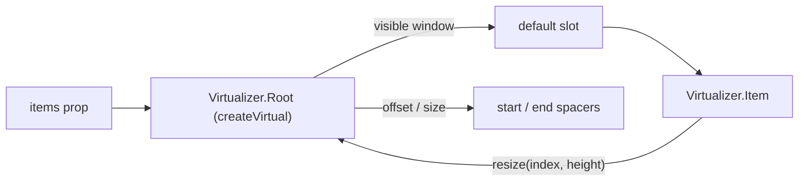

# Virtualizer

<DocsPageFeatures :frontmatter />

Headless virtualized list that mounts only the rows inside (and slightly beyond) the visible viewport.

## Usage

`Virtualizer.Root` renders the scroll container and the spacers that stand in for off-screen rows. Its default slot receives only the visible window — iterate it with `Virtualizer.Item`, passing each item's `index` from the full list. Give the container a height with the `height` prop, an inline style, or a class.

::: gn-example
/components/virtualizer/basic
:::

## Anatomy

```vue Anatomy no-filename
<script setup lang="ts">
  import { Virtualizer } from '@vuetify/v0'
</script>

<template>
  <Virtualizer.Root>
    <Virtualizer.Item />
  </Virtualizer.Root>
</template>
```

## Architecture

Root wraps [createVirtual](/composables/data/create-virtual) and provides it to every Item. Root owns the scroll container, the leading and trailing spacers, and the visible window; each Item measures its own border box with a `ResizeObserver` and reports it back through `resize(index, height)`.



`itemHeight` is the estimate for rows that have not rendered yet. Omit it and the first measured row becomes the estimate. Rows with padding or borders are measured by their border box, so they do not drift.

## Recipes

### Variable heights

Rows do not need a fixed height. Each `Virtualizer.Item` reports its measured height, and the spacers and scrollbar correct themselves as rows render.

```vue
<script setup lang="ts">
  import { Virtualizer } from '@vuetify/v0'

  const messages = Array.from({ length: 5000 }, (_, i) => ({
    id: i,
    body: 'Lorem ipsum '.repeat(1 + (i % 12)),
  }))
</script>

<template>
  <Virtualizer.Root v-slot="{ items }" :height="480" :items="messages">
    <Virtualizer.Item
      v-for="item in items"
      :key="item.raw.id"
      class="p-3 border-b border-divider"
      :index="item.index"
    >
      {{ item.raw.body }}
    </Virtualizer.Item>
  </Virtualizer.Root>
</template>
```

### Infinite scroll

`@end-reached` fires when the scroll position comes within `end-threshold` pixels of the end. Append to `items` and the window extends. `@start-reached` mirrors it for the top.

The callbacks fire on every animation frame of scrolling while the position stays inside the threshold, not once per crossing. An async loader needs an in-flight guard so a slow request is not started several times.

They only fire in response to scrolling — never on mount. A list shorter than the viewport plus `end-threshold` cannot scroll, so `@end-reached` never fires for it. Load the first page yourself before handing `items` to Root.

```vue
<script setup lang="ts">
  import { Virtualizer } from '@vuetify/v0'
  import { shallowRef } from 'vue'

  const rows = shallowRef(Array.from({ length: 100 }, (_, i) => i))
  const loading = shallowRef(false)

  async function fetchPage (start: number) {
    await new Promise(resolve => setTimeout(resolve, 300))
    return Array.from({ length: 100 }, (_, i) => start + i)
  }

  async function onEndReached () {
    if (loading.value) return
    loading.value = true
    try {
      rows.value = [...rows.value, ...await fetchPage(rows.value.length)]
    } finally {
      loading.value = false
    }
  }
</script>

<template>
  <Virtualizer.Root
    v-slot="{ items }"
    :end-threshold="200"
    :height="400"
    :item-height="40"
    :items="rows"
    @end-reached="onEndReached"
  >
    <Virtualizer.Item
      v-for="item in items"
      :key="item.raw"
      :index="item.index"
    >
      Row {{ item.raw }}
    </Virtualizer.Item>
  </Virtualizer.Root>
</template>
```

### Scrolling to an item

The default slot exposes `scrollTo(index, options)` and `reset()`. `options` accepts `behavior`, `block` (`'start' | 'center' | 'end' | 'nearest'`), and a pixel `offset`. Call them from the rows themselves — anything else rendered inside Root sits between the spacers and throws off the row offsets.

```vue
<script setup lang="ts">
  import { Virtualizer } from '@vuetify/v0'

  const rows = Array.from({ length: 10_000 }, (_, i) => ({ id: i, name: `Row ${i + 1}` }))
</script>

<template>
  <Virtualizer.Root
    v-slot="{ items, scrollTo }"
    :height="400"
    :item-height="40"
    :items="rows"
  >
    <Virtualizer.Item
      v-for="item in items"
      :key="item.raw.id"
      :index="item.index"
      @click="scrollTo(item.index, { block: 'center', behavior: 'smooth' })"
    >
      {{ item.raw.name }}
    </Virtualizer.Item>
  </Virtualizer.Root>
</template>
```

## Accessibility

The scroll container gets `tabindex="0"` so keyboard users can focus it and scroll with the arrow, Page Up/Down, Home, and End keys (axe `scrollable-region-focusable`). It is a default — pass your own `tabindex` (for example `-1` when focus lives on the rows) and it wins. The same goes for `overflow-y` in your own `style`.

Virtualizer imposes no role. A bare row has no semantics, and the right role depends on the content — a feed, a listbox, a grid. Pass the role and its position attributes yourself; they reach the rendered element through attribute passthrough. Because only the visible window is in the DOM, `aria-setsize` and `aria-posinset` are how assistive tech learns the true list length.

```vue
<script setup lang="ts">
  import { Virtualizer } from '@vuetify/v0'

  const contacts = Array.from({ length: 2000 }, (_, i) => ({ id: i, name: `Contact ${i + 1}` }))
</script>

<template>
  <Virtualizer.Root
    v-slot="{ items: visible }"
    aria-label="Contacts"
    :height="320"
    :item-height="40"
    :items="contacts"
    role="list"
  >
    <Virtualizer.Item
      v-for="item in visible"
      :key="item.raw.id"
      :aria-posinset="item.index + 1"
      :aria-setsize="contacts.length"
      :index="item.index"
      role="listitem"
    >
      {{ item.raw.name }}
    </Virtualizer.Item>
  </Virtualizer.Root>
</template>
```

### Data Attributes

| Element | Attribute | Description |
|---------|-----------|-------------|
| Item | `data-index` | The item's index in the full list |
| Spacer | `data-spacer` | `start` or `end` — the placeholders for rows above and below the window |

## FAQ

::: faq

??? Which props are reactive?

`items`, `height`, `onStartReached`, and `onEndReached` are read live. `itemHeight`, `overscan`, `direction`, `anchor`, `anchorSmooth`, the thresholds, `momentum`, and `elastic` are read once when Root mounts — key the Root to apply a new value.

??? Why doesn't end-reached fire for my first page?

Edge callbacks run from scroll events only, never on mount. If the initial `items` are shorter than the viewport plus `end-threshold`, nothing can scroll and the callback never fires. Fetch the first page before rendering, or keep loading until the list overflows the container.

??? Does Virtualizer support renderless mode?

No. The spacers and scroll measurement need the wrapper element, so Root warns and renders no spacers when `renderless` is set. For full control over the markup, use [createVirtual](/composables/data/create-virtual) directly.

??? What does Virtualizer render on the server?

No rows. The visible window is measured from the scroll container, which only exists in the browser, so the server HTML holds the empty container and its spacers. Hydration stays consistent — the client mounts, measures, and then renders the window — but server-rendered HTML carries no row content for crawlers or no-JS readers.

??? Can I virtualize a DataTable with this?

Not the `DataTable` compound — it keeps every registered row mounted. Use [createDataTable](/composables/data/create-data-table) with `VirtualDataTableAdapter` and [createVirtual](/composables/data/create-virtual); see [DataTable virtualization](/components/data/data-table#virtualization).

:::

<DocsApi />
