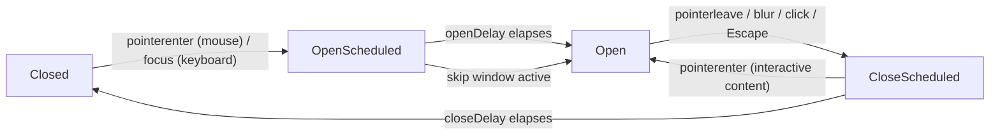

# Tooltip

Headless description tooltip with hover and focus triggers, configurable open/close delays, region-scoped skip-window coordination, and optional interactive-content mode.

<DocsPageFeatures :frontmatter />

## Usage

::: example
/components/tooltip/basic
:::

## Anatomy

```vue playground collapse
<template>
  <Tooltip>
    <Tooltip.Root>
      <Tooltip.Activator />
      <Tooltip.Content />
    </Tooltip.Root>
  </Tooltip>
</template>
```

The bare `<Tooltip>` is the optional scope wrapper — it overrides delay defaults for descendants. Skip it when the plugin defaults are sufficient.

## Architecture



## Examples

::: example
/components/tooltip/interactive

### Interactive content

Set `interactive` on `<Tooltip.Root>` to let the user move the cursor from the activator into the content without dismissing the tooltip. Useful for tooltips that surface secondary actions or links.

The strict WAI-ARIA APG tooltip pattern forbids interactive content; if you need a richer hover surface with focusable controls, consider whether a future `HoverCard` component is a better fit.

| File | Role |
|------|------|
| `interactive.vue` | Demonstrates the `interactive` flag with two action buttons inside the content |

:::

## Accessibility

| Concern | Behavior |
|---------|----------|
| Role | Content renders `role="tooltip"` |
| Linkage | Activator gets `aria-describedby={contentId}` while open |
| Keyboard | Focus opens instantly (no delay), Escape closes, Enter / Space close (the underlying control activates) |
| Touch | Tooltips are not shown on touch interactions per the WAI-ARIA APG |
| Hoverable content | Off by default; opt-in with `interactive` on `<Tooltip.Root>` |

## FAQ

::: faq

??? Why don't tooltips show on touch?

Touch devices have no hover state, and showing a tooltip on tap competes with whatever action the underlying control performs. Both React Aria and the WAI-ARIA Authoring Practices Guide recommend skipping tooltips on touch and ensuring the UI is usable without them. v0 follows this guidance.

??? How do I share delay defaults across an app?

Install the plugin: `app.use(createTooltipPlugin({ openDelay: 500 }))`. Every `<Tooltip.Root>` reads from the region — wrap a subtree in `<Tooltip>` for region-specific overrides.

??? Why doesn't `<Tooltip.Activator>` open when I focus it via mouse click?

The activator suppresses focus-driven opens that arrive within ~50 ms of a `pointerdown`, so a click doesn't double-trigger as both click-close and focus-open. Keyboard-driven focus (Tab) opens instantly.

??? How do I render a non-button activator?

`<Tooltip.Activator>` defaults to `as="button"`; pass `as="a"`, `as="div"`, etc. to render a different element. Always ensure the activator is keyboard-focusable (`tabindex="0"` on a non-button if needed).

:::

<DocsApi />
