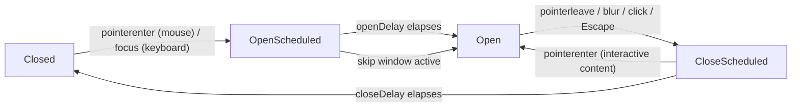

# Tooltip

Headless description tooltip with hover and focus triggers, configurable open/close delays, region-scoped skip-window coordination, and optional interactive-content mode.

<DocsPageFeatures :frontmatter />

## Usage

::: gn-example
/components/tooltip/basic
:::

## Anatomy

```vue Anatomy no-filename
<script setup lang="ts">
  import { Tooltip } from '@vuetify/v0'
</script>

<template>
  <Tooltip.Root>
    <Tooltip.Activator />
    <Tooltip.Content />
  </Tooltip.Root>
</template>
```

## Architecture



## Examples

::: gn-example
/components/tooltip/TooltipButton.vue 1
/components/tooltip/toolbar.vue 2

### Coordinated toolbar

A single tooltip hides one of v0's better tricks: the `createTooltipPlugin` registry coordinates *every* tooltip in the app from one place. Hover a toolbar button and wait out the open delay, then slide to a neighbor — it opens instantly, because the shared region is already warm. Without the plugin each tooltip would re-wait its own delay on every move, so the toolbar would feel sluggish. That shared skip-window is exactly why open and close timing lives in one plugin instead of per-tooltip state.

The `Link` control adds `interactive`: its content stays open while you move the pointer in to copy the URL, and Copy flips to a `bg-success` / `text-on-success` confirmation that stays legible in both light and dark themes. Reach for `interactive` only when the content genuinely needs pointer access — the strict WAI-ARIA APG tooltip pattern forbids focusable content, so a richer surface may belong in a future `HoverCard` instead.

| File | Role |
|------|------|
| `TooltipButton.vue` | Reusable wrapper pairing a `Button` activator with its tooltip |
| `toolbar.vue` | Formatting toolbar wiring several coordinated tooltips plus one interactive `Link` |

:::

## Accessibility

| Concern | Behavior |
|---------|----------|
| Role | Content renders `role="tooltip"` |
| Linkage | Activator always carries `aria-describedby={contentId}` so screen readers announce the description on focus |
| Keyboard | Focus opens instantly (no delay), Escape closes; Enter / Space activate the underlying control, which closes via click |
| Touch | Tooltips are not shown on touch interactions per the WAI-ARIA APG |
| Hoverable content | Off by default; opt-in with `interactive` on `<Tooltip.Root>` |

## FAQ

::: faq

??? Why don't tooltips show on touch?

Touch devices have no hover state, and showing a tooltip on tap competes with whatever action the underlying control performs. Both React Aria and the WAI-ARIA Authoring Practices Guide recommend skipping tooltips on touch and ensuring the UI is usable without them. v0 follows this guidance.

??? How do I set default open and close delays?

Two layers, and the narrower one wins. App-wide: install the plugin — `app.use(createTooltipPlugin({ openDelay: 500, closeDelay: 150 }))`. One tooltip: set props on its Root — `<Tooltip.Root :open-delay="0">`. Warmup coordination stays shared across every tooltip through the plugin registry. With no plugin installed it still works, falling back to the documented defaults.

??? Why doesn't Tooltip.Activator open when I focus it via mouse click?

The activator gates focus-driven opens on `:focus-visible`. A pointer click that incidentally moves focus into the activator does not match `:focus-visible`, so it doesn't open the tooltip. Keyboard-driven focus (Tab) sets `:focus-visible` and opens the tooltip instantly.

??? How do I render a non-button activator?

The activator defaults to `as="button"`; pass `as="a"`, `as="div"`, etc. to render a different element. Always ensure the activator is keyboard-focusable (`tabindex="0"` on a non-button if needed).

:::

<DocsApi />
