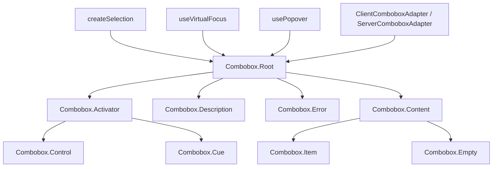

# Combobox

A headless autocomplete input that filters options as the user types, with client and server-side filtering support.

<DocsPageFeatures :frontmatter />

## Usage

The Combobox component follows the same compound pattern as Select, but replaces the activator button with a `Control` input that accepts free text. Filtering happens automatically as the user types.

::: gn-example
/components/combobox/basic
:::

## Anatomy

```vue Anatomy no-filename
<script setup lang="ts">
  import { Combobox } from '@vuetify/v0'
</script>

<template>
  <Combobox.Root>
    <Combobox.Activator>
      <Combobox.Control />

      <Combobox.Cue />
    </Combobox.Activator>

    <Combobox.Description />

    <Combobox.Error />

    <Combobox.Content>
      <Combobox.Item />

      <Combobox.Empty />
    </Combobox.Content>

    <Combobox.HiddenInput />
  </Combobox.Root>
</template>
```

## Architecture

Root creates selection, virtual focus, popover, and adapter contexts. Control drives the query string — the adapter translates queries into a filtered ID set. Items register with selection and use `v-show` (not `v-if`) against the filtered set, preserving selection state even when hidden. Empty renders when the filtered set is empty. Description and Error provide accessible help text and validation messages linked to Control via ARIA attributes.



## Examples

::: gn-example
/components/combobox/useUserSearch.ts 1
/components/combobox/UserPicker.vue 2
/components/combobox/user-picker.vue 3

### Async assignee picker

A GitHub-style assignee picker that searches people from a mocked server as you type. It wires `ServerComboboxAdapter` onto `Combobox.Root` to disable client-side filtering, debounces the `query`, runs an async lookup that resolves a `Promise`, shows a loading hint while the request is in flight, and renders multi-select chips for everyone assigned. When the server returns nothing, `Combobox.Empty` reports the unmatched term.

The interesting piece is how the query reaches the fetch without prop-drilling. A renderless `SearchWatcher` — a `defineComponent` with `render: () => null` — reads the combobox context via [useComboboxContext](/composables/forms/create-combobox) and watches its `query`, emitting a `search` event that the composable debounces before calling the mock `search()`. Results flow back down as a prop, so `Combobox.Item` re-registers on each update. `open-on="input"` on `Combobox.Control` keeps an empty focus from firing a needless fetch, and the `name` prop on `Combobox.Root` auto-renders the hidden inputs for native form submission — one per selected handle — so you never place a hidden input by hand (Combobox does not export one).

Reach for this whenever the dataset is too large to ship to the client, needs full-text indexing, or depends on server context like permissions or org membership. The trade-off versus the default [ClientComboboxAdapter](/composables/forms/create-combobox) is the debounce-and-network latency and the loading state you must surface; for small static lists, prefer client filtering. Related: [createSelection](/composables/selection/create-selection) powers the multi-select state, and [Select](/components/forms/select) covers the non-typeahead equivalent.

| File | Role |
|------|------|
| `useUserSearch.ts` | Owns the mock user dataset, debounced `onSearch`, async `search` returning a Promise, loading flag, and assignee state |
| `UserPicker.vue` | Reusable combobox surface — server adapter, SearchWatcher, chips, results list, and Empty state; owns the UnoCSS classes |
| `user-picker.vue` | Demo entry wiring the composable to the picker, with an assignment summary and a clear action |
:::

## Recipes

### Form Submission

Set `name` on Root to auto-render hidden inputs for form submission — one per selected value in multi-select mode:

```vue
<template>
  <Combobox.Root v-model="value" name="country">
    <!-- ... -->
  </Combobox.Root>
</template>
```

### Custom Client Filtering

Pass a `ClientComboboxAdapter` with a custom `filter` function to override the default substring matching:

```vue
<script setup lang="ts">
  import { Combobox, ClientComboboxAdapter } from '@vuetify/v0'

  const adapter = new ClientComboboxAdapter({
    filter: (query, value) => String(value).toLowerCase().startsWith(query.toLowerCase()),
  })
</script>

<template>
  <Combobox.Root :adapter>
    <!-- ... -->
  </Combobox.Root>
</template>
```

### Open on Input Only

By default the dropdown opens on focus. Set `open-on="input"` on Control to only open when the user starts typing — useful for server search where an empty query should not trigger a fetch:

```vue
<template>
  <Combobox.Control open-on="input" placeholder="Type to search…" />
</template>
```

### Data Attributes

Style interactive states without slot props:

| Attribute | Values | Component |
|-----------|--------|-----------|
| `data-selected` | `true` | Item |
| `data-highlighted` | `""` | Item |
| `data-disabled` | `true` | Item |
| `data-state` | `"open"` / `"closed"` | Activator, Cue |

## Accessibility

The Combobox implements the [WAI-ARIA Combobox](https://www.w3.org/WAI/ARIA/apg/patterns/combobox/) pattern with a listbox popup.

### ARIA Attributes

| Attribute | Value | Component |
|-----------|-------|-----------|
| `role` | `combobox` | Control |
| `role` | `listbox` | Content |
| `role` | `option` | Item |
| `aria-autocomplete` | `list` / `both` | Control |
| `aria-expanded` | `true` / `false` | Control |
| `aria-haspopup` | `listbox` | Control |
| `aria-controls` | listbox ID | Control |
| `aria-activedescendant` | highlighted option ID | Control |
| `aria-describedby` | description ID | Control (when Description mounted) |
| `aria-errormessage` | error ID | Control (when Error mounted and errors exist) |
| `aria-invalid` | `true` | Control (when invalid) |
| `aria-selected` | `true` / `false` | Item |
| `aria-disabled` | `true` | Item (when disabled) |
| `aria-multiselectable` | `true` | Content (when multiple) |
| `aria-hidden` | `true` | Cue |
| `aria-live` | `polite` | Error |

> [!TIP]
> `aria-autocomplete="both"` is set automatically when `strict` is enabled, signaling that the input value will revert to a valid option on close.

### Keyboard Navigation

| Key | Action |
|-----|--------|
| `ArrowDown` / `ArrowUp` | Open dropdown, or move highlight down / up |
| `Enter` | Select highlighted item |
| `Escape` | Close dropdown |
| `Tab` | Close dropdown and move focus |
| `Home` | Move highlight to first item |
| `End` | Move highlight to last item |

<DocsApi />
