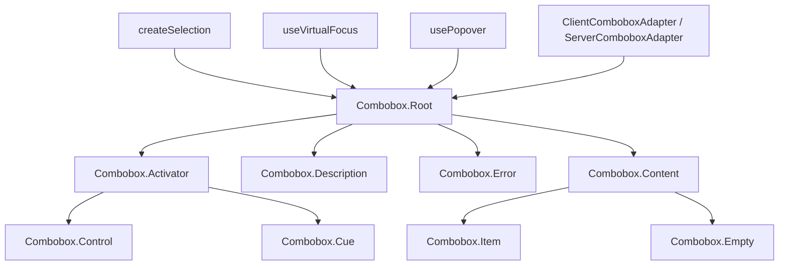

# Combobox

A headless autocomplete input that filters options as the user types, with client and server-side filtering support.

<DocsPageFeatures :frontmatter />

## Usage

The Combobox component follows the same compound pattern as Select, but replaces the activator button with a `Control` input that accepts free text. Filtering happens automatically as the user types.

::: gn-example
/components/combobox/basic
:::

## Anatomy

```vue Anatomy no-filename
<script setup lang="ts">
  import { Combobox } from '@vuetify/v0'
</script>

<template>
  <Combobox.Root>
    <Combobox.Activator>
      <Combobox.Control />

      <Combobox.Cue />
    </Combobox.Activator>

    <Combobox.Description />

    <Combobox.Error />

    <Combobox.Content>
      <Combobox.Item />

      <Combobox.Empty />
    </Combobox.Content>

    <Combobox.HiddenInput />
  </Combobox.Root>
</template>
```

## Architecture

Root creates selection, virtual focus, popover, and adapter contexts. Control drives the query string — the adapter translates queries into a filtered ID set. Items register with selection and use `v-show` (not `v-if`) against the filtered set, preserving selection state even when hidden. Empty renders when the filtered set is empty. Description and Error provide accessible help text and validation messages linked to Control via ARIA attributes.



## Examples

::: gn-example
/components/combobox/multiple

### Multi-Select

Set `multiple` on Root to enable multi-selection. The dropdown stays open after each selection and the query clears so the user can keep searching. `v-model` binds to an array of item values (the `value` prop of each selected item). Render selected chips or tags using the `selected` model value directly.

Selected chips appear inside `Combobox.Activator` alongside the `Control` — because the activator is a flex container, chips and input sit in the same row and wrap naturally. This layout is the recommended multi-select pattern: it keeps the selected count visible while leaving the input usable without any extra state management.

Reach for multi-select when users need to pick several items from a filterable list — tag editors, language pickers, permission selectors. The query resets after each selection so users can immediately type the next search term.

:::

::: gn-example
/components/combobox/strict

### Strict Mode

Set `strict` on Root to enforce valid selections. When the dropdown closes without a matching item being selected, the input reverts to the last confirmed selection (or clears if nothing was selected). Use this when free-text values are not allowed.

In strict mode, `aria-autocomplete` is set to `"both"` automatically, signaling to assistive technology that the input value will revert to a known option on close. This is the correct pattern for fields like country selectors, currency pickers, or any enumerated value where typed free text should not be persisted.

The trade-off: users who type partial input and then tab away will see it reset, which can feel surprising. Pair with a `Combobox.Empty` message explaining that the typed value was not found.

:::

::: gn-example
/components/combobox/disabled

### Disabled States

Both individual items and the entire combobox can be disabled. Disabled items are skipped by virtual focus keyboard navigation. The `disabled` prop on Root prevents the input from opening the dropdown and suppresses keyboard interactions.

Item-level disabling is declared with the `disabled` prop on each `Combobox.Item`. The item remains visible in the list but cannot be selected or highlighted — `data-[disabled]` is applied so you can render it with reduced opacity or strikethrough. Combine root-level and item-level disabling to model scenarios like "temporarily unavailable roles" or "read-only field with some inactive options."

:::

::: gn-example
/components/combobox/server

### Server-Side Filtering

Pass a `ServerComboboxAdapter` instance via the `adapter` prop to disable client-side filtering. The adapter is a pass-through — it shows all registered items and leaves filtering to the consumer. Watch `context.query` via `useComboboxContext()` to drive your own async data fetching.

The example uses a `SearchWatcher` renderless component (defined via `defineComponent` with a `render: () => null`) to observe `ctx.query` and emit a `search` event up to the parent. The parent debounces the event with a `setTimeout` and replaces the `items` array. Because items use `v-for`, they re-register with the combobox on each update.

Use `ServerComboboxAdapter` when your dataset is too large for client-side filtering, when search requires full-text indexing, or when results depend on server context (user permissions, location, etc.). The `open-on="input"` modifier on `Control` avoids triggering a server fetch before the user starts typing.

:::

## Recipes

### Form Submission

Set `name` on Root to auto-render hidden inputs for form submission — one per selected value in multi-select mode:

```vue
<template>
  <Combobox.Root v-model="value" name="country">
    <!-- ... -->
  </Combobox.Root>
</template>
```

### Custom Client Filtering

Pass a `ClientComboboxAdapter` with a custom `filter` function to override the default substring matching:

```vue
<script setup lang="ts">
  import { Combobox, ClientComboboxAdapter } from '@vuetify/v0'

  const adapter = new ClientComboboxAdapter({
    filter: (query, value) => String(value).toLowerCase().startsWith(query.toLowerCase()),
  })
</script>

<template>
  <Combobox.Root :adapter>
    <!-- ... -->
  </Combobox.Root>
</template>
```

### Open on Input Only

By default the dropdown opens on focus. Set `open-on="input"` on Control to only open when the user starts typing — useful for server search where an empty query should not trigger a fetch:

```vue
<template>
  <Combobox.Control open-on="input" placeholder="Type to search…" />
</template>
```

### Data Attributes

Style interactive states without slot props:

| Attribute | Values | Component |
|-----------|--------|-----------|
| `data-selected` | `true` | Item |
| `data-highlighted` | `""` | Item |
| `data-disabled` | `true` | Item |
| `data-state` | `"open"` / `"closed"` | Activator, Cue |

## Accessibility

The Combobox implements the [WAI-ARIA Combobox](https://www.w3.org/WAI/ARIA/apg/patterns/combobox/) pattern with a listbox popup.

### ARIA Attributes

| Attribute | Value | Component |
|-----------|-------|-----------|
| `role` | `combobox` | Control |
| `role` | `listbox` | Content |
| `role` | `option` | Item |
| `aria-autocomplete` | `list` / `both` | Control |
| `aria-expanded` | `true` / `false` | Control |
| `aria-haspopup` | `listbox` | Control |
| `aria-controls` | listbox ID | Control |
| `aria-activedescendant` | highlighted option ID | Control |
| `aria-describedby` | description ID | Control (when Description mounted) |
| `aria-errormessage` | error ID | Control (when Error mounted and errors exist) |
| `aria-invalid` | `true` | Control (when invalid) |
| `aria-selected` | `true` / `false` | Item |
| `aria-disabled` | `true` | Item (when disabled) |
| `aria-multiselectable` | `true` | Content (when multiple) |
| `aria-hidden` | `true` | Cue |
| `aria-live` | `polite` | Error |

> [!TIP]
> `aria-autocomplete="both"` is set automatically when `strict` is enabled, signaling that the input value will revert to a valid option on close.

### Keyboard Navigation

| Key | Action |
|-----|--------|
| `ArrowDown` / `ArrowUp` | Open dropdown, or move highlight down / up |
| `Enter` | Select highlighted item |
| `Escape` | Close dropdown |
| `Tab` | Close dropdown and move focus |
| `Home` | Move highlight to first item |
| `End` | Move highlight to last item |

<DocsApi />
