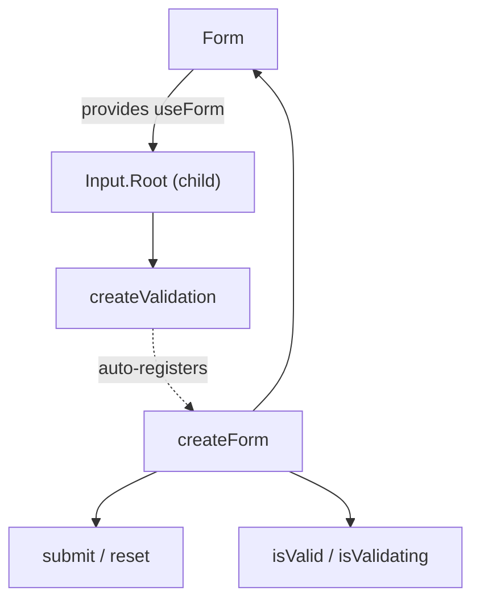

# Form

A form wrapper that coordinates validation across child input fields and handles submit/reset events.

<DocsPageFeatures :frontmatter />

## Usage

Wrap your inputs in `<Form>`. Native `<button type="submit">` and `<button type="reset">` work as expected.

::: example
/components/form/basic

### Form with Validation

Email and password fields with validation rules, submit/reset buttons, and success feedback on completion.

:::

## Anatomy

```vue Anatomy playground collapse no-filename
<script setup lang="ts">
  import { Form, Input } from '@vuetify/v0'
</script>

<template>
  <Form>
    <Input.Root>
      <Input.Control />
      <Input.Error />
    </Input.Root>
  </Form>
</template>
```

## Architecture

`Form` creates a `createForm` instance and provides it via `useForm()`. Child validations auto-register on mount and unregister on unmount.



The `@submit` event is **pass-through** — it always fires, regardless of validity. Guard in your handler:

```ts
function onSubmit ({ valid }: { valid: boolean }) {
  if (!valid) return
  // handle submission
}
```

## Recipes

### Slot Props

Use slot props for reactive form state in the template:

```vue
<template>
  <Form v-slot="{ isValid, isValidating, submit, reset }">
    <!-- Inputs -->

    <button type="submit" :disabled="isValidating">
      {{ isValidating ? 'Validating…' : 'Submit' }}
    </button>

    <p v-if="isValid === false">Please fix the errors above.</p>
  </Form>
</template>
```

### Disabled / Readonly

The `disabled` and `readonly` props propagate to the form context. Child components can read them via `useForm()`:

```vue
<template>
  <Form disabled>
    <!-- All fields read form.disabled via useForm() -->
  </Form>
</template>
```

### Custom Namespace

Use `namespace` to isolate multiple forms on the same page:

```vue
<template>
  <Form namespace="billing">
    <!-- useForm('billing') resolves this form -->
  </Form>

  <Form namespace="shipping">
    <!-- useForm('shipping') resolves this form -->
  </Form>
</template>
```

### Programmatic Submit

Call `submit()` from slot props when you need to trigger validation without a submit button:

```vue
<template>
  <Form v-slot="{ submit }">
    <!-- Inputs -->

    <button type="button" @click="submit">Save Draft</button>
  </Form>
</template>
```

> [!TIP]
> Calling `submit()` or `reset()` via slot props invokes the form methods directly and does **not** emit `@submit` or `@reset`. Those events only fire from native form submission/reset.

## Accessibility

`Form` renders a native `<form>` element, so all standard form semantics apply. No custom ARIA is needed — the browser handles submit on Enter, associates labels with inputs via `id`/`for`, and reports validation errors to assistive technology through child inputs.

### Keyboard Interaction

| Key | Behavior |
|-----|----------|
| `Enter` (in input) | Submits the form |
| `Escape` | No default behavior — handle in your submit handler |

<DocsApi />
