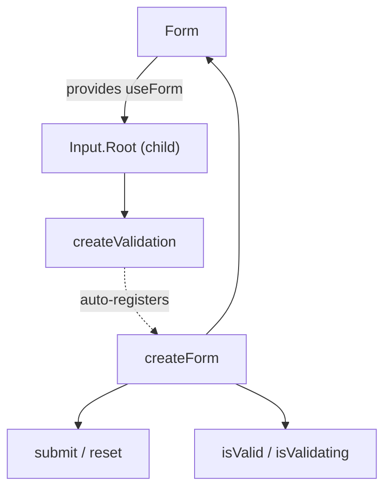

# Form

A form wrapper that coordinates validation across child input fields and handles submit/reset events.

<DocsPageFeatures :frontmatter />

## Usage

Wrap your inputs in `<Form>`. Native `<button type="submit">` and `<button type="reset">` work as expected.

::: gn-example
/components/form/basic
:::

## Anatomy

```vue Anatomy no-filename
<script setup lang="ts">
  import { Form, Input } from '@vuetify/v0'
</script>

<template>
  <Form>
    <Input.Root>
      <Input.Control />
      <Input.Error />
    </Input.Root>
  </Form>
</template>
```

## Architecture

`Form` creates a `createForm` instance and provides it via `useForm()`. Child validations auto-register on mount and unregister on unmount.



The `@submit` event is **pass-through** — it always fires, regardless of validity. Guard in your handler:

```ts
function onSubmit ({ valid }: { valid: boolean }) {
  if (!valid) return
  // handle submission
}
```

## Examples

::: gn-example
/components/form/useSignup.ts 1
/components/form/SignupForm.vue 2
/components/form/signup-form.vue 3

### Account Sign-Up

A complete account registration form that shows how `Form` coordinates validation across several `Input.Root` fields and reports a single aggregate result. The form gathers name, email, password, and a confirmation, validates each field on blur, and only commits when every child validation passes.

The interesting part is cross-field validation. The confirmation field's rule compares its value against the live `password` model rather than a static value, so changing the password re-evaluates whether the two still match. Because `Form`'s `@submit` event is pass-through — it fires on every native submit regardless of validity — the handler guards on `payload.valid` before doing any work, then simulates a server-side duplicate-account check that surfaces through the email field's `error` / `error-messages` props. The composable owns the field state and the submitted/server-error flags, so the entry component can swap the form for a success panel without the form needing to know about it.

Reach for this pattern whenever a form is more than a single field: extract the state and submit logic into a `use*` composable, keep the markup in a reusable component, and let the entry wire them together. For the underlying validation primitives, see [createForm](/composables/forms/create-form) and [createValidation](/composables/forms/create-validation); for individual field anatomy, see [Input](/components/forms/input).

| File | Role |
|------|------|
| `useSignup.ts` | Composable — field state, submit/reset logic, simulated server error |
| `SignupForm.vue` | Reusable component — renders the `Form` with four validated `Input.Root` fields and a cross-field match rule |
| `signup-form.vue` | Entry — wires the composable to the form and swaps in a success panel on submit |
:::

## Recipes

### Slot Props

Use slot props for reactive form state in the template:

```vue
<template>
  <Form v-slot="{ isValid, isValidating, submit, reset }">
    <!-- Inputs -->

    <button type="submit" :disabled="isValidating">
      {{ isValidating ? 'Validating…' : 'Submit' }}
    </button>

    <p v-if="isValid === false">Please fix the errors above.</p>
  </Form>
</template>
```

### Disabled / Readonly

The `disabled` and `readonly` props propagate to the form context. Child components can read them via `useForm()`:

```vue
<template>
  <Form disabled>
    <!-- All fields read form.disabled via useForm() -->
  </Form>
</template>
```

### Custom Namespace

Use `namespace` to isolate multiple forms on the same page:

```vue
<template>
  <Form namespace="billing">
    <!-- useForm('billing') resolves this form -->
  </Form>

  <Form namespace="shipping">
    <!-- useForm('shipping') resolves this form -->
  </Form>
</template>
```

### Programmatic Submit

Call `submit()` from slot props when you need to trigger validation without a submit button:

```vue
<template>
  <Form v-slot="{ submit }">
    <!-- Inputs -->

    <button type="button" @click="submit">Save Draft</button>
  </Form>
</template>
```

> [!TIP]
> Calling `submit()` or `reset()` via slot props invokes the form methods directly and does **not** emit `@submit` or `@reset`. Those events only fire from native form submission/reset.

## Accessibility

`Form` renders a native `<form>` element, so all standard form semantics apply. No custom ARIA is needed — the browser handles submit on Enter, associates labels with inputs via `id`/`for`, and reports validation errors to assistive technology through child inputs.

### Keyboard Interaction

| Key | Behavior |
|-----|----------|
| `Enter` (in input) | Submits the form |
| `Escape` | No default behavior — handle in your submit handler |

## FAQ

::: faq

??? Why does my `@submit` handler run even when the form is invalid?

`@submit` is pass-through — it fires on every native submit regardless of validity. Guard inside the handler: read the `valid` flag from the payload and `return` early when it's `false`.

??? How do I keep two forms on the same page from interfering?

Give each a `namespace` (e.g. `namespace="billing"`). Children then resolve their form with `useForm('billing')`, so the two forms stay isolated.

??? Why doesn't calling `submit()` from slot props emit the `@submit` event?

`submit()` and `reset()` from slot props invoke the form methods directly. The `@submit` and `@reset` events only fire from native form submission or reset.

:::

<DocsApi />
