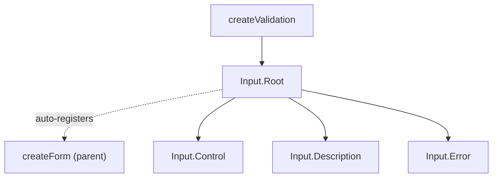

# Input

A headless text input component with integrated validation. Creates a [createValidation](/composables/forms/create-validation) context internally and auto-registers with parent [createForm](/composables/forms/create-form) instances.

<DocsPageFeatures :frontmatter />

## Usage

The Input supports text, email, password, and other native input types. Validation rules run on blur by default, with `lazy` and `eager` modifiers available.

::: example
/components/input/basic
:::

## Anatomy

```vue Anatomy playground collapse no-filename
<script setup lang="ts">
  import { Input } from '@vuetify/v0'
</script>

<template>
  <!-- Basic -->
  <Input.Root>
    <Input.Control />
  </Input.Root>

  <!-- With description and errors -->
  <Input.Root>
    <Input.Control />
    <Input.Description>Help text</Input.Description>
    <Input.Error v-slot="{ errors }">{{ errors }}</Input.Error>
  </Input.Root>

  <!-- Textarea -->
  <Input.Root>
    <Input.Control as="textarea" />
  </Input.Root>
</template>
```

## Architecture

Root creates a validation context, provides it to children, and manages focus/validation lifecycle. Control is the native `<input>` (or any element via `as`). Description and Error auto-wire their IDs into Control's ARIA attributes.



## Examples

::: example
/components/input/useContact.ts 1
/components/input/ContactForm.vue 2
/components/input/contact-form.vue 3

### Contact Form

Multi-field form with `createForm` integration, lazy validation, and server-side error injection. Each `Input.Root` creates its own `createValidation` and auto-registers with the parent form.

**File breakdown:**

| File | Role |
|------|------|
| `useContact.ts` | Composable — form instance, field refs, submit with server-side validation |
| `ContactForm.vue` | Reusable component — three Input fields with different rules and types |
| `contact-form.vue` | Demo — wires composable to form, shows submitted data |

**Key patterns:**

- `validateOn="blur lazy"` defers validation until the user blurs the field for the first time, then validates on every subsequent blur
- `:error` and `:error-messages` inject server-side errors after submit — the email field shows "already registered" when `taken@example.com` is used
- `Input.Control as="textarea"` renders the message field as a native textarea while keeping all validation and ARIA wiring

:::

::: example
/components/input/useSearch.ts 1
/components/input/SearchInput.vue 2
/components/input/search.vue 3

### Live Search

Debounced search with `validateOn="input"` for real-time validation. The composable watches the Input's value ref directly — no event wiring needed.

**File breakdown:**

| File | Role |
|------|------|
| `useSearch.ts` | Composable — debounced search with mock results, watches the query ref |
| `SearchInput.vue` | Reusable component — Input with search icon, loading spinner, result count |
| `search.vue` | Demo — renders SearchInput with a result list |

**Key patterns:**

- `validateOn="input"` validates on every keystroke (minimum 2 characters)
- The composable watches the query ref with `debounce` from `@vuetify/v0/utilities`, demonstrating that `value` is a standard writable Ref
- `data-[focused]:border-primary` and `data-[state=invalid]:border-error` style the input purely through data attributes — no slot props needed for visual states

:::

## Accessibility

Input.Control renders as a native `<input>` and manages all ARIA attributes automatically.

### ARIA Attributes

| Attribute | Value | Notes |
|-----------|-------|-------|
| `aria-invalid` | `true` | When validation fails or `error` prop is set |
| `aria-label` | Label text | From Root's `label` prop |
| `aria-describedby` | Description ID | Auto-wired to Input.Description |
| `aria-errormessage` | Error ID | Auto-wired to Input.Error when errors exist |
| `disabled` | `true` | Native attribute, from Root's `disabled` prop |
| `readonly` | `true` | Native attribute, from Root's `readonly` prop |

### Keyboard Navigation

Standard native `<input>` keyboard behavior. No custom key handlers — the browser handles focus, selection, and editing.

<DocsApi />

## Recipes

### validateOn Modes

Control when validation runs with the `validateOn` prop and optional `lazy`/`eager` modifiers:

```vue
<template>
  <!-- Validate on blur (default) -->
  <Input.Root validate-on="blur" />

  <!-- Validate on every keystroke -->
  <Input.Root validate-on="input" />

  <!-- Only validate on form submit -->
  <Input.Root validate-on="submit" />

  <!-- Lazy: skip validation until first blur, then validate on blur -->
  <Input.Root validate-on="blur lazy" />

  <!-- Eager: after first error, validate on every keystroke -->
  <Input.Root validate-on="blur eager" />
</template>
```

### Manual Error State

Override validation with the `error` and `error-messages` props for server-side errors:

```vue
<template>
  <Input.Root
    :error="!!serverError"
    :error-messages="serverError"
    :rules="[(v) => !!v || 'Required']"
  >
    <Input.Control />
    <Input.Error v-slot="{ errors }">
      <span v-for="e in errors" :key="e">{{ e }}</span>
    </Input.Error>
  </Input.Root>
</template>
```

### Data Attributes

Style interactive states without slot props:

```vue
<template>
  <Input.Control class="data-[focused]:border-primary data-[state=invalid]:border-error" />
</template>
```

| Attribute | Values | Components |
|-----------|--------|------------|
| `data-state` | `pristine`, `valid`, `invalid` | Root, Control |
| `data-dirty` | `true` | Root |
| `data-focused` | `true` | Root, Control |
| `data-disabled` | `true` | Root, Control |
| `data-readonly` | `true` | Root, Control |
