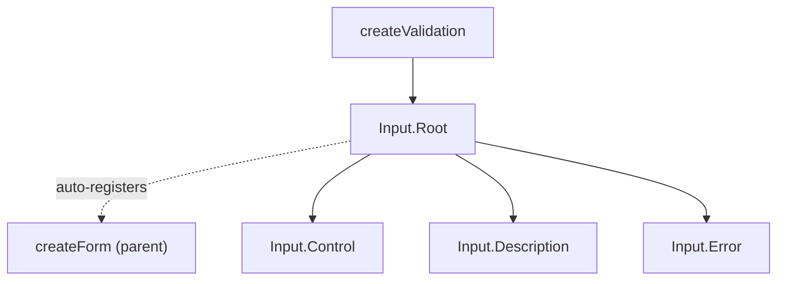

# Input

Headless text input with integrated validation and automatic form registration.

<DocsPageFeatures :frontmatter />

## Usage

The Input supports text, email, password, and other native input types. Validation rules run on blur by default, with `lazy` and `eager` modifiers available.

::: gn-example
/components/input/basic
:::

## Anatomy

```vue Anatomy no-filename
<script setup lang="ts">
  import { Input } from '@vuetify/v0'
</script>

<template>
  <Input.Root>
    <Input.Control />
    <Input.Description />
    <Input.Error />
  </Input.Root>
</template>
```

## Architecture

Root creates a validation context, provides it to children, and manages focus/validation lifecycle. Control is the native `<input>` (or any element via `as`). Description and Error auto-wire their IDs into Control's ARIA attributes.



## Examples

::: gn-example
/components/input/useContact.ts 1
/components/input/ContactForm.vue 2
/components/input/contact-form.vue 3

### Contact Form

A multi-field form showing `createForm` integration, lazy validation, and server-side error injection. Each `Input.Root` creates its own `createValidation` instance and auto-registers with the parent `Form` on mount — no manual wiring is required.

The `validateOn="blur lazy"` modifier defers validation until the first blur, then validates on every subsequent blur. This avoids showing errors while the user is still typing their first attempt. After the initial blur, the field becomes responsive again so corrections are caught immediately.

Server-side error injection is demonstrated on the email field: entering `taken@example.com` and submitting causes the composable to push an error string through the `:error-messages` prop. This pattern keeps client-side rules and server responses in the same display channel without any custom error UI.

| File | Role |
|------|------|
| `useContact.ts` | Composable — form instance, field refs, submit with server-side validation |
| `ContactForm.vue` | Reusable component — three Input fields with different rules and types |
| `contact-form.vue` | Demo — wires composable to form, shows submitted data |

:::

::: gn-example
/components/input/useSearch.ts 1
/components/input/SearchInput.vue 2
/components/input/search.vue 3

### Live Search

Debounced search with `validateOn="input"` for real-time validation as the user types. The composable watches the Input's value ref directly — no event wiring needed.

Because `Input.Root` exposes `value` as a plain writable `Ref`, any composable can `watch` it without subscribing to DOM events. `useSearch.ts` uses `useTimer` from `@vuetify/v0` for debouncing — staying within the v0 primitive layer rather than reaching for raw `setTimeout`. Minimum 2 characters are required before the search fires.

Visual states are driven exclusively through data attributes: `data-[focused]:border-primary` and `data-[state=invalid]:border-error` on `Input.Control` with no slot props or conditional classes. This is the recommended styling approach — it keeps the template clean and decouples visual states from layout logic.

| File | Role |
|------|------|
| `useSearch.ts` | Composable — debounced search with mock results, watches the query ref |
| `SearchInput.vue` | Reusable component — Input with search icon, loading spinner, result count |
| `search.vue` | Demo — renders SearchInput with a result list |

:::

## Recipes

### validateOn Modes

Control when validation runs with the `validateOn` prop and optional `lazy`/`eager` modifiers:

```vue
<template>
  <!-- Validate on blur (default) -->
  <Input.Root validate-on="blur" />

  <!-- Validate on every keystroke -->
  <Input.Root validate-on="input" />

  <!-- Only validate on form submit -->
  <Input.Root validate-on="submit" />

  <!-- Lazy: skip validation until first blur, then validate on blur -->
  <Input.Root validate-on="blur lazy" />

  <!-- Eager: after first error, validate on every keystroke -->
  <Input.Root validate-on="blur eager" />
</template>
```

### Manual Error State

Override validation with the `error` and `error-messages` props for server-side errors:

```vue
<template>
  <Input.Root
    :error="!!serverError"
    :error-messages="serverError"
    :rules="[(v) => !!v || 'Required']"
  >
    <Input.Control />
    <Input.Error v-slot="{ errors }">
      <span v-for="e in errors" :key="e">{{ e }}</span>
    </Input.Error>
  </Input.Root>
</template>
```

### Data Attributes

Style interactive states without slot props:

```vue
<template>
  <Input.Control class="data-[focused]:border-primary data-[state=invalid]:border-error" />
</template>
```

| Attribute | Values | Components |
|-----------|--------|------------|
| `data-state` | `pristine`, `valid`, `invalid` | Root, Control |
| `data-dirty` | `true` | Root |
| `data-focused` | `true` | Root, Control |
| `data-disabled` | `true` | Root, Control |
| `data-readonly` | `true` | Root, Control |

## Accessibility

Input.Control renders as a native `<input>` and manages all ARIA attributes automatically.

### ARIA Attributes

| Attribute | Value | Notes |
|-----------|-------|-------|
| `aria-invalid` | `true` | When validation fails or `error` prop is set |
| `aria-label` | Label text | From Root's `label` prop |
| `aria-describedby` | Description ID | Only present when `Input.Description` is mounted |
| `aria-errormessage` | Error ID | Only present when `Input.Error` is mounted and errors exist |
| `aria-required` | `true` | From Root's `required` prop |
| `required` | `true` | Native attribute, from Root's `required` prop |
| `disabled` | `true` | Native attribute, from Root's `disabled` prop |
| `readonly` | `true` | Native attribute, from Root's `readonly` prop |

### Keyboard Navigation

Standard native `<input>` keyboard behavior. No custom key handlers — the browser handles focus, selection, and editing.

<DocsApi />
