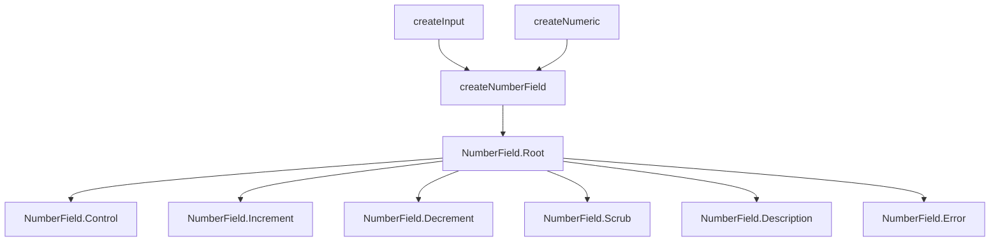

# NumberField

Numeric input with increment/decrement buttons, drag-to-scrub, and locale-aware formatting. Supports currency, percent, and unit display via `Intl.NumberFormat`.

<DocsPageFeatures :frontmatter />

## Usage

NumberField renders a spinbutton input with optional increment, decrement, and scrub controls. Wire it up with `v-model` for two-way binding.

::: gn-example
/components/number-field/basic
:::

## Anatomy

```vue Anatomy no-filename
<script setup lang="ts">
  import { NumberField } from '@vuetify/v0'
</script>

<template>
  <NumberField.Root>
    <NumberField.Scrub />

    <NumberField.Description />

    <NumberField.Decrement />

    <NumberField.Control />

    <NumberField.Increment />

    <NumberField.Error />

    <NumberField.HiddenInput />
  </NumberField.Root>
</template>
```

## Architecture

Root composes `createNumberField` which delegates to `createInput` for field state and `createNumeric` for math operations. Each sub-component consumes the root context.



## Examples

::: gn-example
/components/number-field/currency

### Currency Formatting

Two `NumberField` instances side by side demonstrate different `Intl.NumberFormatOptions` styles: `style: 'currency'` for a USD amount and `style: 'unit'` with `unit: 'percent'` for a tip percentage. The `format` prop accepts any valid `Intl.NumberFormatOptions` object — the component reformats on blur and parses the locale-specific string back to a number on focus, stripping currency symbols and group separators automatically.

Both fields expose `NumberField.Scrub` as the label element. Dragging horizontally on the label adjusts the value without clicking the increment/decrement buttons — the cursor shows `ew-resize` to signal this. The scrub uses the Pointer Lock API for unbounded movement so the cursor does not hit screen edges.

Reach for this pattern when you need a numeric input that presents formatted output (totals, budgets, quantities with units) but still requires a machine-readable `number` value in v-model.

:::

::: gn-example
/components/number-field/scrub

### Design Tool Scrub

Four property inputs (X, Y, W, H) arranged in a two-column grid, each with a single-letter `NumberField.Scrub` label. Dragging any label adjusts its field's value and the preview rectangle updates live via a `toRef`-derived style object.

This pattern mirrors Figma-style property panels: the scrub label is the primary interaction surface and no increment/decrement buttons are present. Each field uses `step: 1` and `min: 0` on W/H to prevent negative dimensions. The `tabular-nums` class on `Control` keeps digits from shifting width as values change.

Use this layout whenever you have multiple tightly-grouped numeric properties and want drag-to-adjust as the primary input method, with direct keyboard entry as the fallback.

:::

## Recipes

### Spin-on-Hold

Increment and Decrement buttons repeat automatically when held. Configure timing with `spin-delay` (initial pause, default 400ms) and `spin-rate` (repeat interval, default 60ms):

```vue
<template>
  <NumberField.Root :spin-delay="300" :spin-rate="40">
    <NumberField.Decrement>-</NumberField.Decrement>
    <NumberField.Control />
    <NumberField.Increment>+</NumberField.Increment>
  </NumberField.Root>
</template>
```

### Mouse Wheel

Enable value adjustment via scroll wheel when the input is focused:

```vue
<template>
  <NumberField.Root v-model="value" wheel>
    <NumberField.Control />
  </NumberField.Root>
</template>
```

### Data Attributes

Style interactive states without slot props:

| Attribute | Values | Components |
|-----------|--------|------------|
| `data-state` | `valid`, `invalid`, `pristine` | Root, Control |
| `data-dirty` | `true` | Root |
| `data-focused` | `true` | Root, Control |
| `data-disabled` | `true` | Root, Control, Increment, Decrement, Scrub |
| `data-readonly` | `true` | Root, Control, Scrub |

## Accessibility

NumberField.Control renders with `role="spinbutton"` and full ARIA attributes per the [WAI-ARIA Spinbutton pattern](https://www.w3.org/WAI/ARIA/apg/patterns/spinbutton/).

### ARIA Attributes

| Attribute | Value | Notes |
|-----------|-------|-------|
| `role` | `spinbutton` | Applied to Control |
| `aria-valuenow` | Current value | `undefined` when empty |
| `aria-valuemin` | Min value | Only when finite |
| `aria-valuemax` | Max value | Only when finite |
| `aria-valuetext` | Formatted string | Screen readers announce "$42.00" not "42" |
| `aria-invalid` | `true` | When validation fails |
| `aria-label` | Label text | From Root's `label` prop |
| `aria-describedby` | Description ID | When Description is mounted |
| `aria-errormessage` | Error ID | When Error is mounted with messages |
| `aria-required` | `true` | When Root has `required` |

Increment and Decrement buttons use `tabindex="-1"` to keep them out of the tab sequence — only the Input is focusable.

### Keyboard Navigation

| Key | Action |
|-----|--------|
| `ArrowUp` | Increment by one step |
| `ArrowDown` | Decrement by one step |
| `Shift+ArrowUp` | Increment by 10 steps |
| `Shift+ArrowDown` | Decrement by 10 steps |
| `PageUp` | Increment by leap (default step × 10) |
| `PageDown` | Decrement by leap (default step × 10) |
| `Home` | Set to minimum |
| `End` | Set to maximum |
| `Enter` | Commit the typed value |

::: faq

??? How does formatting work?

Root accepts a `locale` prop (BCP 47 tag, defaults to `en-US`) and a `format` prop with `Intl.NumberFormatOptions`. While the input is focused it shows the raw number for editing; on blur it displays the formatted string. Parsing strips locale-specific group separators and currency symbols automatically.

??? What happens when I type an invalid value?

On blur, the Input parses the text via `parse()`. If the result is `NaN`, the value becomes `null`. If `clamp` is `true` (default), the value is clamped to min/max and snapped to the nearest step.

??? How does scrub sensitivity work?

`Scrub` accepts a `sensitivity` prop (default 1) that controls how many pixels of horizontal movement equal one step. Higher values require more movement per step for finer control.

??? Can I use NumberField without increment/decrement buttons?

Yes. Only `Root` and `Input` are required. Buttons, Scrub, Description, and Error are all optional.

:::

<DocsApi />
