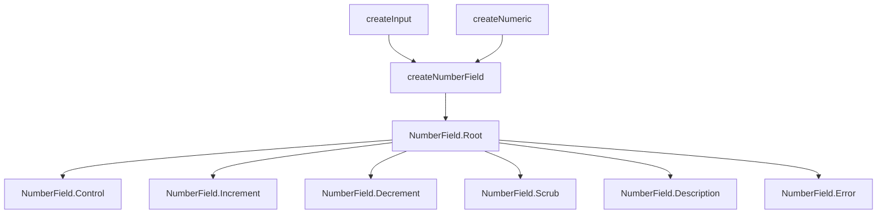

# NumberField

Numeric input with increment/decrement buttons, drag-to-scrub, and locale-aware formatting. Supports currency, percent, and unit display via `Intl.NumberFormat`.

<DocsPageFeatures :frontmatter />

## Usage

NumberField renders a spinbutton input with optional increment, decrement, and scrub controls. Wire it up with `v-model` for two-way binding.

::: gn-example
/components/number-field/basic
:::

## Anatomy

```vue Anatomy no-filename
<script setup lang="ts">
  import { NumberField } from '@vuetify/v0'
</script>

<template>
  <NumberField.Root>
    <NumberField.Scrub />

    <NumberField.Description />

    <NumberField.Decrement />

    <NumberField.Control />

    <NumberField.Increment />

    <NumberField.Error />
  </NumberField.Root>
</template>
```

## Architecture

Root composes `createNumberField` which delegates to `createInput` for field state and `createNumeric` for math operations. Each sub-component consumes the root context.



## Examples

::: gn-example
/components/number-field/useCart.ts 1
/components/number-field/CartLineItems.vue 2
/components/number-field/cart-line-items.vue 3

### Cart Quantity Editor

A shopping-cart editor where every line item is a quantity `NumberField` that drives a live order summary. Each field is bound with `:min="0"`, `:max="item.stock"`, `:step="1"`, and `clamp`, so a shopper can never order more than what's in stock and typing an out-of-range value snaps back to the boundary on blur. The out-of-stock line has a stock of zero, so the component sets `:disabled` on its `NumberField.Root` — the increment, decrement, and control all read the Root's `data-disabled` and dim accordingly.

The interesting part is how the totals stay in sync. Quantities live as numbers on the cart items in the composable, and `subtotal`, `tax`, and `total` are `computed` reductions over those quantities — touch any stepper and every dependent figure recomputes. Each `NumberField.Root` carries a `name` (`qty-{id}`), which lands directly on the underlying `NumberField.Control` input, so the quantities post with native form submission — NumberField has no separate hidden-input sub-component. The whole thing is wrapped in a [Form](/components/forms/form), whose `@submit` is pass-through, so the handler guards on `payload.valid` before committing the order — and because `total` can be zero, the submit button disables itself rather than placing an empty order.

Reach for this triad shape whenever numeric inputs feed a derived calculation: keep the line data and the `computed` totals in a `use*` composable, render the compound surface plus its UnoCSS styling in a reusable component, and let a thin entry wire them together and swap in a confirmation panel. For the underlying numeric math and formatting primitive, see [createNumberField](/composables/forms/create-number-field); for the field's keyboard and ARIA contract, see the Accessibility section below.

| File | Role |
|------|------|
| `useCart.ts` | Composable — cart line items, `computed` subtotal/tax/total, checkout/reset logic |
| `CartLineItems.vue` | Reusable component — renders the `Form` with a quantity `NumberField` per line and the totals summary |
| `cart-line-items.vue` | Entry — wires the composable to the editor and swaps in an order-confirmation panel on submit |
:::

## Recipes

### Spin-on-Hold

Increment and Decrement buttons repeat automatically when held. Configure timing with `spin-delay` (initial pause, default 400ms) and `spin-rate` (repeat interval, default 60ms):

```vue
<template>
  <NumberField.Root :spin-delay="300" :spin-rate="40">
    <NumberField.Decrement>-</NumberField.Decrement>
    <NumberField.Control />
    <NumberField.Increment>+</NumberField.Increment>
  </NumberField.Root>
</template>
```

### Mouse Wheel

Enable value adjustment via scroll wheel when the input is focused:

```vue
<template>
  <NumberField.Root v-model="value" wheel>
    <NumberField.Control />
  </NumberField.Root>
</template>
```

### Data Attributes

Style interactive states without slot props:

| Attribute | Values | Components |
|-----------|--------|------------|
| `data-state` | `valid`, `invalid`, `pristine` | Root, Control |
| `data-dirty` | `true` | Root |
| `data-focused` | `true` | Root, Control |
| `data-disabled` | `true` | Root, Control, Increment, Decrement, Scrub |
| `data-readonly` | `true` | Root, Control, Scrub |

## Accessibility

NumberField.Control renders with `role="spinbutton"` and full ARIA attributes per the [WAI-ARIA Spinbutton pattern](https://www.w3.org/WAI/ARIA/apg/patterns/spinbutton/).

### ARIA Attributes

| Attribute | Value | Notes |
|-----------|-------|-------|
| `role` | `spinbutton` | Applied to Control |
| `aria-valuenow` | Current value | `undefined` when empty |
| `aria-valuemin` | Min value | Only when finite |
| `aria-valuemax` | Max value | Only when finite |
| `aria-valuetext` | Formatted string | Screen readers announce "$42.00" not "42" |
| `aria-invalid` | `true` | When validation fails |
| `aria-label` | Label text | From Root's `label` prop |
| `aria-describedby` | Description ID | When Description is mounted |
| `aria-errormessage` | Error ID | When Error is mounted with messages |
| `aria-required` | `true` | When Root has `required` |

Increment and Decrement buttons use `tabindex="-1"` to keep them out of the tab sequence — only the Input is focusable.

### Keyboard Navigation

| Key | Action |
|-----|--------|
| `ArrowUp` | Increment by one step |
| `ArrowDown` | Decrement by one step |
| `Shift+ArrowUp` | Increment by 10 steps |
| `Shift+ArrowDown` | Decrement by 10 steps |
| `PageUp` | Increment by leap (default step × 10) |
| `PageDown` | Decrement by leap (default step × 10) |
| `Home` | Set to minimum |
| `End` | Set to maximum |
| `Enter` | Commit the typed value |

## FAQ

::: faq

??? How does formatting work?

Root accepts a `locale` prop (BCP 47 tag, defaults to `en-US`) and a `format` prop with `Intl.NumberFormatOptions`. While the input is focused it shows the raw number for editing; on blur it displays the formatted string. Parsing strips locale-specific group separators and currency symbols automatically.

??? What happens when I type an invalid value?

On blur, the Input parses the text via `parse()`. If the result is `NaN`, the value becomes `null`. If `clamp` is `true` (default), the value is clamped to min/max and snapped to the nearest step.

??? How does scrub sensitivity work?

`Scrub` accepts a `sensitivity` prop (default 1) that controls how many pixels of horizontal movement equal one step. Higher values require more movement per step for finer control.

??? Can I use NumberField without increment/decrement buttons?

Yes. Only `Root` and `Input` are required. Buttons, Scrub, Description, and Error are all optional.

:::

<DocsApi />
