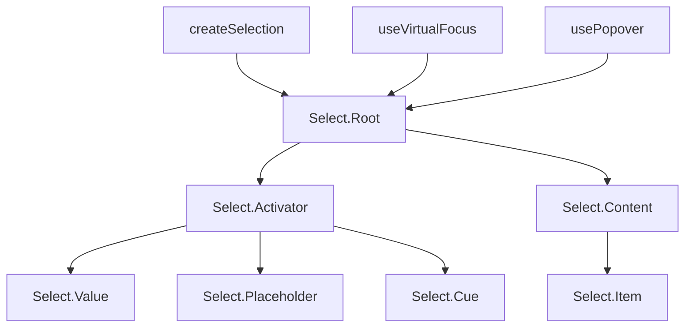

# Select

A headless dropdown select component with single and multi-selection support. Uses `createSelection` for state management, `useVirtualFocus` for keyboard navigation, and `usePopover` for native popover positioning.

<DocsPageFeatures :frontmatter />

## Usage

The Select component provides a compound pattern for building accessible dropdown selects. It supports `v-model` for both single values and arrays (multi-select mode).

::: example
/components/select/basic
:::

## Anatomy

```vue Anatomy playground collapse no-filename
<script setup lang="ts">
  import { Select } from '@vuetify/v0'
</script>

<template>
  <Select.Root>
    <Select.Activator>
      <Select.Value />
      <Select.Placeholder />

      <Select.Cue />
    </Select.Activator>

    <Select.Content>
      <Select.Item />
    </Select.Content>
  </Select.Root>
</template>
```

## Architecture

The Root creates selection, virtual focus, and popover contexts. The Activator serves as the combobox trigger with keyboard event handling. Content renders via the native popover API with CSS anchor positioning. Each Item registers with the selection context and provides data attributes for styling.



## Examples

::: example
/components/select/disabled

### Disabled States

Both individual items and the entire select can be disabled. Disabled items are skipped by virtual focus keyboard navigation. The `disabled` prop on Root prevents the dropdown from opening.

:::

::: example
/components/select/multiple

### Multi-Select

Set `multiple` on Root to enable multi-selection. The dropdown stays open after each selection. `v-model` binds to an array of IDs. The Value slot receives `selectedValues` for rendering chips, tags, or comma-separated text.

:::

## Recipes

### Form Submission

Set `name` on Root to auto-render hidden inputs for form submission — one per selected value in multi-select mode:

```vue
<template>
  <Select.Root v-model="value" name="color">
    <!-- ... -->
  </Select.Root>
</template>
```

### Mandatory Selection

Use `mandatory` to prevent deselecting the last item, or `mandatory="force"` to auto-select the first item on mount:

```vue
<template>
  <Select.Root v-model="value" mandatory="force">
    <!-- First non-disabled item is selected automatically -->
  </Select.Root>
</template>
```

### Understanding `id` vs `value`

Each `Select.Item` has two key props:

- **`id`** — Internal key for the selection registry. Used for virtual focus, ARIA attributes, and ticket lookup.
- **`value`** — The value synced to `v-model`. This is what `Select.Value`'s `selectedValue` slot prop exposes.

The model always receives the `value` prop, not the `id`. When `id` and `value` differ, use the `selectedValue` slot prop to look up a display label:

```vue
<script setup lang="ts">
  import { Select } from '@vuetify/v0'
  import { shallowRef } from 'vue'

  const language = shallowRef('en')

  const languages = [
    { id: 'en', label: 'English' },
    { id: 'es', label: 'Spanish' },
    { id: 'fr', label: 'French' },
  ]
</script>

<template>
  <Select.Root v-model="language" mandatory>
    <Select.Activator>
      <Select.Value v-slot="{ selectedValue }">
        {{ languages.find(l => l.id === selectedValue)?.label }}
      </Select.Value>
      <Select.Cue />
    </Select.Activator>

    <Select.Content>
      <Select.Item
        v-for="lang in languages"
        :id="lang.id"
        :key="lang.id"
        :value="lang.id"
      >
        {{ lang.label }}
      </Select.Item>
    </Select.Content>
  </Select.Root>
</template>
```

> [!TIP]
> When `id` and `value` are the same (the common case), `Select.Value` displays the model value directly — no lookup needed.

### Pre-Selected Values

Select supports pre-selected values via `v-model` or `:model-value`. The `Select.Value` component shows the model value immediately, even before the dropdown has been opened. `Select.Placeholder` automatically hides when a model value is present:

```vue
<template>
  <!-- "Banana" shows immediately, no dropdown open needed -->
  <Select.Root v-model="fruit" mandatory>
    <Select.Activator>
      <Select.Value v-slot="{ selectedValue }">{{ selectedValue }}</Select.Value>
      <Select.Placeholder>Pick a fruit…</Select.Placeholder>
    </Select.Activator>

    <Select.Content>
      <Select.Item value="Apple">Apple</Select.Item>
      <Select.Item value="Banana">Banana</Select.Item>
    </Select.Content>
  </Select.Root>
</template>
```

### Custom Positioning

Control dropdown placement with CSS anchor positioning props on Content:

```vue
<template>
  <Select.Content position-area="top" position-try="flip-block">
    <!-- Dropdown appears above the activator -->
  </Select.Content>
</template>
```

### Data Attributes

Style interactive states without slot props:

| Attribute | Values | Component |
|-----------|--------|-----------|
| `data-selected` | `true` | Item |
| `data-highlighted` | `""` | Item |
| `data-disabled` | `true` | Item |
| `data-select-open` | `""` | Activator |
| `data-state` | `"open"` / `"closed"` | Cue |

## Accessibility

The Select implements the [WAI-ARIA Combobox](https://www.w3.org/WAI/ARIA/apd/patterns/combobox/) pattern with a listbox popup.

### ARIA Attributes

| Attribute | Value | Component |
|-----------|-------|-----------|
| `role` | `combobox` | Activator |
| `role` | `listbox` | Content |
| `role` | `option` | Item |
| `aria-expanded` | `true` / `false` | Activator |
| `aria-haspopup` | `listbox` | Activator |
| `aria-controls` | listbox ID | Activator |
| `aria-selected` | `true` / `false` | Item |
| `aria-disabled` | `true` | Item (when disabled) |
| `aria-multiselectable` | `true` | Content (when multiple) |

### Keyboard Navigation

| Key | Action |
|-----|--------|
| `Enter` / `Space` | Open dropdown, or select highlighted item |
| `ArrowDown` | Open dropdown, or move highlight down |
| `ArrowUp` | Open dropdown, or move highlight up |
| `Home` | Move highlight to first item |
| `End` | Move highlight to last item |
| `Escape` | Close dropdown |
| `Tab` | Close dropdown and move focus |

<DocsApi />
