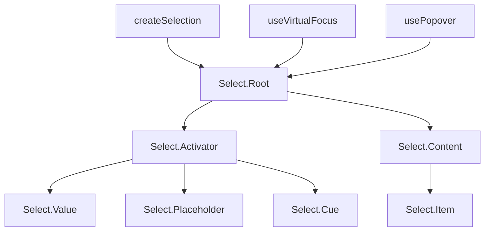

# Select

Headless dropdown select with single and multi-selection, keyboard navigation, and native popover positioning.

<DocsPageFeatures :frontmatter />

## Usage

The Select component provides a compound pattern for building accessible dropdown selects. It supports `v-model` for both single values and arrays (multi-select mode).

::: gn-example
/components/select/basic
:::

## Anatomy

```vue Anatomy no-filename
<script setup lang="ts">
  import { Select } from '@vuetify/v0'
</script>

<template>
  <Select.Root>
    <Select.Activator>
      <Select.Value />
      <Select.Placeholder />
      <Select.Cue />
    </Select.Activator>

    <Select.Content>
      <Select.Item />
    </Select.Content>
  </Select.Root>
</template>
```

## Architecture

The Root creates selection, virtual focus, and popover contexts. The Activator serves as the combobox trigger with keyboard event handling. Content renders via the native popover API with CSS anchor positioning. Each Item registers with the selection context and provides data attributes for styling.



## Examples

::: gn-example
/components/select/disabled

### Disabled States

This example demonstrates two levels of disabling: individual items within the list (XL and 2XL sizes are marked `disabled` on their `Select.Item`) and the entire select control via the `disabled` prop on `Select.Root`. A `Switch.Root` at the top of the demo lets you toggle the whole-select disabled state at runtime.

Disabled items remain visible in the dropdown but are skipped by virtual focus keyboard navigation — arrow keys jump over them as if they weren't there. The `isDisabled` slot prop (exposed by each item's default slot) lets you apply visual treatment such as strikethrough and reduced opacity without needing extra state.

Disabling the entire `Select.Root` prevents the dropdown from opening; pair this with visual styling on the `Activator` (opacity, cursor) to communicate the non-interactive state to the user.

:::

::: gn-example
/components/select/multiple

### Multi-Select

Setting `multiple` on `Select.Root` switches the `v-model` binding from a single value to an array of item values. The dropdown stays open after each selection so the user can pick multiple fruits without reopening. The `Select.Value` component receives a `selectedValues` array in its default slot, used here to render each selection as a chip with primary background coloring.

`Select.Placeholder` hides automatically once at least one value is selected. The `Select.Cue` arrow is pushed to the trailing edge with `ms-auto` to stay in position regardless of how many chips are showing.

Reach for multi-select when the field accepts several independent choices — tag pickers, filter panels, permission editors. For ordered or ranked selections where order matters, combine with a custom drag-to-reorder chip list.

:::

## Recipes

### Form Submission

Set `name` on Root to auto-render hidden inputs for form submission — one per selected value in multi-select mode:

```vue
<template>
  <Select.Root v-model="value" name="color">
    <!-- ... -->
  </Select.Root>
</template>
```

### Mandatory Selection

Use `mandatory` to prevent deselecting the last item, or `mandatory="force"` to auto-select the first item on mount:

```vue
<template>
  <Select.Root v-model="value" mandatory="force">
    <!-- First non-disabled item is selected automatically -->
  </Select.Root>
</template>
```

### Understanding `id` vs `value`

Each `Select.Item` has two key props:

- **`id`** — Internal key for the selection registry. Used for virtual focus, ARIA attributes, and ticket lookup.
- **`value`** — The value synced to `v-model`. This is what `Select.Value`'s `selectedValue` slot prop exposes.

The model always receives the `value` prop, not the `id`. When `id` and `value` differ, use the `selectedValue` slot prop to look up a display label:

```vue
<script setup lang="ts">
  import { Select } from '@vuetify/v0'
  import { shallowRef } from 'vue'

  const language = shallowRef('en')

  const languages = [
    { id: 'en', label: 'English' },
    { id: 'es', label: 'Spanish' },
    { id: 'fr', label: 'French' },
  ]
</script>

<template>
  <Select.Root v-model="language" mandatory>
    <Select.Activator>
      <Select.Value v-slot="{ selectedValue }">
        {{ languages.find(l => l.id === selectedValue)?.label }}
      </Select.Value>
      <Select.Cue />
    </Select.Activator>

    <Select.Content>
      <Select.Item
        v-for="lang in languages"
        :id="lang.id"
        :key="lang.id"
        :value="lang.id"
      >
        {{ lang.label }}
      </Select.Item>
    </Select.Content>
  </Select.Root>
</template>
```

> [!TIP]
> When `id` and `value` are the same (the common case), `Select.Value` displays the model value directly — no lookup needed.

### Pre-Selected Values

Select supports pre-selected values via `v-model` or `:model-value`. The `Select.Value` component shows the model value immediately, even before the dropdown has been opened. `Select.Placeholder` automatically hides when a model value is present:

```vue
<template>
  <!-- "Banana" shows immediately, no dropdown open needed -->
  <Select.Root v-model="fruit" mandatory>
    <Select.Activator>
      <Select.Value v-slot="{ selectedValue }">{{ selectedValue }}</Select.Value>
      <Select.Placeholder>Pick a fruit…</Select.Placeholder>
    </Select.Activator>

    <Select.Content>
      <Select.Item value="Apple">Apple</Select.Item>
      <Select.Item value="Banana">Banana</Select.Item>
    </Select.Content>
  </Select.Root>
</template>
```

### Custom Positioning

Control dropdown placement with CSS anchor positioning props on Content:

```vue
<template>
  <Select.Content position-area="top" position-try="flip-block">
    <!-- Dropdown appears above the activator -->
  </Select.Content>
</template>
```

### Data Attributes

Style interactive states without slot props:

| Attribute | Values | Component |
|-----------|--------|-----------|
| `data-selected` | `true` | Item |
| `data-highlighted` | `""` | Item |
| `data-disabled` | `true` | Item |
| `data-open` | `true` | Activator |
| `data-state` | `"open"` / `"closed"` | Cue |

## Accessibility

The Select implements the [WAI-ARIA Combobox](https://www.w3.org/WAI/ARIA/apg/patterns/combobox/) pattern with a listbox popup.

### ARIA Attributes

| Attribute | Value | Component |
|-----------|-------|-----------|
| `role` | `combobox` | Activator |
| `role` | `listbox` | Content |
| `role` | `option` | Item |
| `aria-expanded` | `true` / `false` | Activator |
| `aria-haspopup` | `listbox` | Activator |
| `aria-controls` | listbox ID | Activator |
| `aria-selected` | `true` / `false` | Item |
| `aria-disabled` | `true` | Item (when disabled) |
| `aria-multiselectable` | `true` | Content (when multiple) |

### Keyboard Navigation

| Key | Action |
|-----|--------|
| `Enter` / `Space` | Open dropdown, or select highlighted item |
| `ArrowDown` | Open dropdown, or move highlight down |
| `ArrowUp` | Open dropdown, or move highlight up |
| `Home` | Move highlight to first item |
| `End` | Move highlight to last item |
| `Escape` | Close dropdown |
| `Tab` | Close dropdown and move focus |

<DocsApi />
