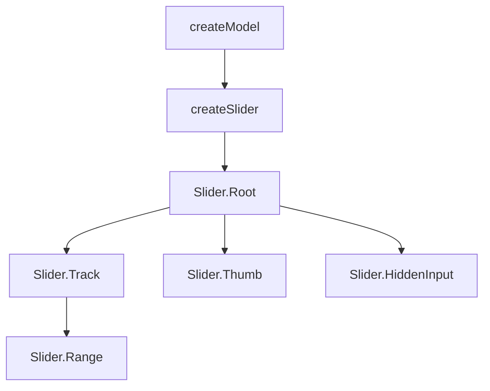

# Slider

A headless slider component for building single-value and range inputs with pointer drag, keyboard navigation, and step snapping. Uses [createSlider](/composables/forms/create-slider) internally, which delegates value storage to [createModel](/composables/selection/create-model).

<DocsPageFeatures :frontmatter />

## Usage

The Slider supports single-value and range modes. Add one `Slider.Thumb` for a single value, or two for a range.

::: example
/components/slider/basic
:::

## Anatomy

```vue Anatomy playground collapse no-filename
<script setup lang="ts">
  import { Slider } from '@vuetify/v0'
</script>

<template>
  <!-- Single thumb -->
  <Slider.Root>
    <Slider.Track>
      <Slider.Range />
    </Slider.Track>

    <Slider.Thumb />
  </Slider.Root>

  <!-- Range (two thumbs) -->
  <Slider.Root>
    <Slider.Track>
      <Slider.Range />
    </Slider.Track>

    <Slider.Thumb />
    <Slider.Thumb />
  </Slider.Root>

  <!-- With form submission -->
  <Slider.Root>
    <Slider.Track>
      <Slider.Range />
    </Slider.Track>

    <Slider.Thumb />

    <Slider.HiddenInput />
  </Slider.Root>
</template>
```

## Architecture

The Root component composes [createSlider](/composables/forms/create-slider) for pointer/keyboard interaction and [createModel](/composables/selection/create-model) for value storage. Each Thumb registers via a ticket and receives its position as a percentage.



The Root creates a slider instance and provides it via context. Track listens for pointer events to update the nearest thumb. Each Thumb registers itself and manages drag/keyboard interaction for its value. Range renders the filled region between thumbs (or from min to a single thumb).

## Examples

::: example
/components/slider/useEqualizer.ts 1
/components/slider/Equalizer.vue 2
/components/slider/equalizer.vue 3

### Audio Equalizer

Multiple vertical sliders composed into a 5-band equalizer with preset management. Each band is an independent `Slider.Root` with `orientation="vertical"`, bridged to a shared gains array via `@update:model-value`.

**File breakdown:**

| File | Role |
|------|------|
| `useEqualizer.ts` | Composable — band definitions, gain state, named presets, `apply()` and `reset()` |
| `Equalizer.vue` | Reusable component — renders one vertical Slider per band with dB scale and frequency labels |
| `equalizer.vue` | Demo — wires preset buttons to the composable |

**Key patterns:**

- `Slider.Thumb v-slot="{ value, isDragging }"` drives both the scale animation and the floating dB label that appears only while dragging
- Each band's `Slider.Root` receives a single-element array (`[gains[index]]`) and writes back via an `update` function that splices into the shared array
- The composable owns all state — the component is purely presentational, making it reusable with different band configurations

:::

::: example
/components/slider/ColorSlider.vue 1
/components/slider/ColorPicker.vue 2
/components/slider/color-picker.vue 3

### HSL Color Picker

Three sliders for Hue, Saturation, and Lightness with reactive gradient tracks and a live color preview. Demonstrates how to hide `Slider.Range` when the track gradient **is** the visualization.

**File breakdown:**

| File | Role |
|------|------|
| `ColorSlider.vue` | Reusable gradient slider — accepts a `gradient` prop for the track background and `thumbColor` for dynamic thumb styling |
| `ColorPicker.vue` | Composes three ColorSliders with reactive gradients that update when hue changes, plus a color swatch and hex output |
| `color-picker.vue` | Demo — adds clickable color presets that set all three models at once |

**Key patterns:**

- `Slider.Range` is omitted entirely — the gradient track replaces it as the visual indicator
- `Slider.Thumb` uses `data-[state=dragging]:scale-125` for drag feedback without needing slot props — the component sets `left` automatically via its internal `attrs.style`
- Saturation and lightness gradients are `toRef` derivations that recompute when hue changes, making the tracks shift color in real time
- `defineModel` with named models (`v-model:hue`, `v-model:saturation`, `v-model:lightness`) gives the parent fine-grained control over each channel

:::

## Recipes

### Form Integration

Set `name` on Root to auto-render hidden inputs for form submission — one per thumb:

```vue
<template>
  <Slider.Root name="price" :min="0" :max="1000">
    <Slider.Track>
      <Slider.Range />
    </Slider.Track>

    <Slider.Thumb />
  </Slider.Root>
</template>
```

### Drag Events

Root emits `start` and `end` for pointer drag lifecycle:

```vue
<template>
  <Slider.Root
    v-model="value"
    @start="onStart"
    @end="onEnd"
  >
    <Slider.Track>
      <Slider.Range />
    </Slider.Track>

    <Slider.Thumb />
  </Slider.Root>
</template>
```

### Data Attributes

Style interactive states without slot props:

```vue
<template>
  <Slider.Thumb class="data-[state=dragging]:scale-125 transition-transform" />
</template>
```

| Attribute | Values | Components |
|-----------|--------|------------|
| `data-state` | `dragging`, `idle` | Thumb |
| `data-disabled` | `true` | Root, Track, Range, Thumb |
| `data-readonly` | `true` | Root, Track, Range, Thumb |
| `data-orientation` | `horizontal`, `vertical` | Root, Track, Range |

## Accessibility

Each `Slider.Thumb` manages its own ARIA attributes automatically.

### ARIA Attributes

| Attribute | Value | Notes |
|-----------|-------|-------|
| `role` | `slider` | Applied to each Thumb |
| `aria-valuenow` | Current value | Updates on drag/keyboard |
| `aria-valuemin` | Min value | From Root's `min` prop |
| `aria-valuemax` | Max value | From Root's `max` prop |
| `aria-valuetext` | Custom text | Optional, via Thumb prop |
| `aria-orientation` | `horizontal` / `vertical` | Reflects Root orientation |
| `aria-disabled` | `true` | When slider is disabled |
| `aria-readonly` | `true` | When slider is readonly |
| `tabindex` | `0` / removed | Removed when disabled |

### Keyboard Navigation

| Key | Action |
|-----|--------|
| `ArrowRight` / `ArrowUp` | Increment by one step |
| `ArrowLeft` / `ArrowDown` | Decrement by one step |
| `Shift+Arrow` | Increment/decrement by 10 steps |
| `PageUp` | Increment by 10 steps |
| `PageDown` | Decrement by 10 steps |
| `Home` | Set to minimum |
| `End` | Set to maximum |

<DocsApi />
