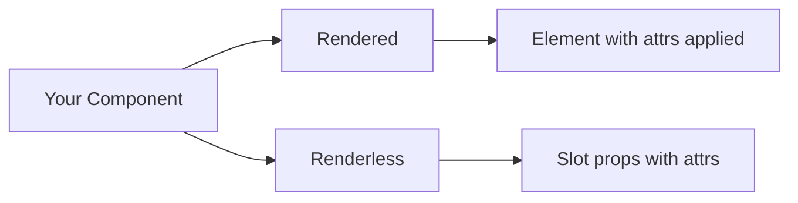
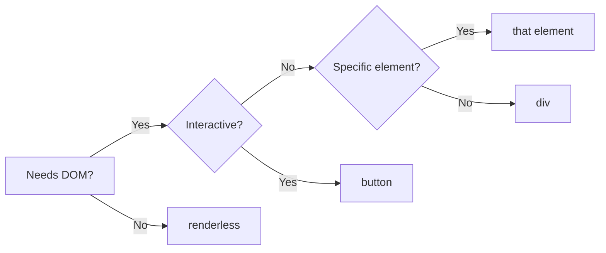

# Atom

Low-level primitive for building polymorphic components.

<DocsPageFeatures :frontmatter />

## Usage

This is the pattern used by every v0 component. Extend `AtomProps`, choose a default element, build your attributes, and let Atom handle the rendering:

```vue collapse
<script lang="ts">
  import { Atom } from '@vuetify/v0'
  import { toRef } from 'vue'
  import type { AtomProps } from '@vuetify/v0'

  export interface PaginationItemProps extends AtomProps {
    value: number
  }

  export interface PaginationItemSlotProps {
    page: number
    isSelected: boolean
    select: () => void
    attrs: Record<string, any>
  }
</script>

<script setup lang="ts">
  defineOptions({ name: 'PaginationItem' })

  defineSlots<{
    default: (props: PaginationItemSlotProps) => any
  }>()

  const {
    as = 'button',
    renderless,
    value
  } = defineProps<PaginationItemProps>()

  const slotProps = toRef((): PaginationItemSlotProps => ({
    page: value,
    isSelected: isSelected.value,
    select,
    attrs: {
      'aria-label': `Go to page ${value}`,
      'aria-current': isSelected.value ? 'page' : undefined,
      onClick: select,
    },
  }))
</script>

<template>
  <Atom
    :as
    :renderless
    v-bind="slotProps.attrs"
  >
    <slot v-bind="slotProps">
      {{ value }}
    </slot>
  </Atom>
</template>
```

In **element mode**, Atom renders the element and applies attrs to it. In **renderless mode**, Atom renders nothing — attrs are passed as slot props for the consumer to bind themselves.

```html collapse
<!-- Rendered mode: attrs applied automatically -->
<PaginationItem
  :value="1"
  class="data-[selected=true]:text-primary"
/>

<!-- Renderless mode: consumer applies attrs -->
<PaginationItem
  :value="1"
  renderless
  v-slot="{ page, isSelected, attrs }"
>
  <!-- Renderless mode: consumer applies attrs -->
  <div
    v-bind="attrs"
    :class="isSelected ? 'text-primary' : ''"
  >
    Page {{ page }} {{ isSelected.value ? '(current)' : '' }}
  </div>
</PaginationItem>
```

## Anatomy

```vue Anatomy no-filename
<script setup lang="ts">
  import { Atom } from '@vuetify/v0'
</script>

<template>
  <Atom />
</template>
```

## Guide

Atom is an advanced, low-level primitive that enables **polymorphic components**. A polymorphic component can render an element with default attributes applied, or go renderless and expose its functionality entirely through slot props. Most of the time you won't need Atom directly — it's there for when you're building your own components that need this flexibility.

### What is a polymorphic component?

A polymorphic component is one where the **consumer decides** how it renders. The component provides behavior and attributes; the consumer chooses the element — or opts out of an element entirely.



In **rendered mode**, Atom outputs the element and applies attributes automatically. In **renderless mode**, Atom outputs nothing — your slot content is the only DOM, and attributes are passed as slot props for you to bind yourself.

### Rendered mode

Consider `CheckboxRoot`. It defaults to `as="button"` so you get native keyboard focus and activation for free:

```html
<!-- CheckboxRoot renders as <button> by default -->
<Checkbox.Root v-model="agreed">
  <Checkbox.Indicator />
  I agree to the terms
</Checkbox.Root>
```

The consumer didn't specify an element — `CheckboxRoot` chose `<button>` because that's the right semantic default. But if a consumer needs a `<div>` instead, they override it:

```html
<!-- Override: render as <div> instead -->
<Checkbox.Root v-model="agreed" as="div">
  <Checkbox.Indicator />
  I agree to the terms
</Checkbox.Root>
```

### Renderless mode

Now consider `DialogRoot`. It's renderless by default — a pure context provider that adds no DOM at all:

```html
<!-- DialogRoot is renderless — no wrapper element -->
<Dialog.Root>
  <Dialog.Activator>Open</Dialog.Activator>
  <Dialog.Content>
    <Dialog.Title>Confirm</Dialog.Title>
  </Dialog.Content>
</Dialog.Root>
```

In renderless mode, the component provides state and behavior through its slot props. The consumer controls the DOM:

```html
<!-- Group.Root is renderless by default — slot props provide selection state -->
<Selection.Root v-model="selected" v-slot="{ items }">
  <div v-for="item in items" :key="item.id">
    {{ item.value }}
  </div>
</Selection.Root>
```

> [!TIP]
> Any v0 component can be switched between rendered and renderless. Pass `renderless` to strip the wrapper. Pass `as="section"` to add one. This works on every component because they all use Atom underneath.

### Choosing a default element

When you build a component on Atom, the first decision is: **should it render an element by default, or should it be renderless?**



| Your component... | Default to | Why |
|-------------------|------------|-----|
| Handles clicks, focus, or keyboard input | `button` | Native keyboard activation, focus management, implicit ARIA role |
| Wraps a specific semantic concept | The matching element (`nav`, `dialog`, `img`, `ol`) | Browser built-ins — focus trapping, image semantics, landmark regions |
| Groups or lays out children | `div` | No semantic meaning, just a container |
| Provides state/behavior only | `renderless` | No DOM — the consumer decides how to render |

### Accessing the rendered element

When your component needs a reference to Atom's rendered DOM element — for measuring, registering with a parent, or imperative DOM access — use `AtomExpose` to type the template ref:

```vue collapse
<script setup lang="ts">
  import { Atom } from '@vuetify/v0'
  import { useTemplateRef, watch } from 'vue'
  import type { AtomExpose } from '@vuetify/v0'

  const atomEl = useTemplateRef<AtomExpose>('atom')

  // atomEl.value?.element is the rendered HTMLElement (or null in renderless mode)
  watch(() => atomEl.value?.element, el => {
    if (!el) return
    // register with parent, measure, observe, etc.
  })
</script>

<template>
  <Atom
    ref="atom"
    :as
    :renderless
    v-bind="slotProps.attrs"
  >
    <slot v-bind="slotProps" />
  </Atom>
</template>
```

This is how Pagination components register their elements for width measurement, and how Splitter accesses its root for pointer event coordinates. In renderless mode, `element` is `null` — there's no wrapper to reference.

## Examples

::: example
/components/atom/AppButton.vue 1
/components/atom/polymorphic.vue 2

### Polymorphic Button

The same `AppButton` component used two ways. In rendered mode, it outputs a `<button>` and applies attrs automatically — you just drop it in. In renderless mode, it outputs nothing — you provide your own element and bind the attrs from the slot.

This is the core value of building on Atom: one component definition, two consumption patterns.

| File | Role |
|------|------|
| `AppButton.vue` | Reusable button — extends `AtomProps`, builds `slotProps.attrs` with class and type, forwards through Atom |
| `polymorphic.vue` | Demo — same component used rendered (3 variants) and renderless (consumer `<a>` with attrs from slot) |

:::

## Accessibility

Atom renders semantic HTML — accessibility starts with choosing the right element.

### Element Selection

The `as` prop determines the accessibility baseline. Using `as="button"` gives you keyboard focus, Enter/Space activation, and an implicit `role="button"` — none of which you get from `as="div"`.

| Element | You get for free |
|---------|-----------------|
| `button` | Focus, keyboard activation, implicit role |
| `a` | Focus, Enter activation, link semantics |
| `nav` | Landmark region |
| `dialog` | Focus trapping (native), Escape to close |
| `img` | Alt text support, image semantics |

### ARIA Passthrough

All attributes pass through to the rendered element. Set ARIA attributes directly on Atom:

```html
<Atom
  as="button"
  aria-label="Close dialog"
  aria-expanded="true"
>
  ×
</Atom>
```

### Renderless Bindings

In renderless mode, you're responsible for applying attrs to your custom element:

```html
<Atom renderless v-slot="attrs">
  <div v-bind="attrs" role="button" tabindex="0">
    Custom interactive element
  </div>
</Atom>
```

> [!WARNING]
> When using renderless mode, ensure your custom element is accessible. A `<div>` needs explicit `role`, `tabindex`, and keyboard event handlers to match what a native `<button>` provides for free.

## Questions

::: faq
??? When would I use Atom directly vs just using a v0 component?

**You wouldn't, in most cases.** v0 components already wrap Atom with sensible defaults. CheckboxRoot is a `<button>`, AvatarImage is an ``, DialogRoot is renderless. You override the element via the `as` and `renderless` props on those components.

**Use Atom directly when building a custom component** that needs polymorphic rendering — like a design system button that renders as `<button>` by default but allows consumers to render it as `<a>` or go renderless. The [Polymorphic Button](#polymorphic-button) example shows this pattern.

**Use Atom for one-off polymorphic needs** — rare, but sometimes you need a single element whose tag is dynamic.

??? What's the difference between `renderless` and `:as="null"`?

They're equivalent. Both skip the wrapper element and render only the slot content, forwarding attrs as slot props. The `renderless` prop is the preferred API — it reads more explicitly and doesn't require knowing that `as` accepts `null`.

??? How do I access the underlying DOM element?

Atom exposes a template ref via `defineExpose`. Use a ref on the Atom component to access `.element`:

```vue
<script setup lang="ts">
  import { Atom } from '@vuetify/v0'
  import { useTemplateRef } from 'vue'

  const atomEl = useTemplateRef('atom')
  // atom.value?.element → HTMLElement | null
</script>

<template>
  <Atom ref="atom" as="button">Click me</Atom>
</template>
```

In renderless mode, `element` is `null` — there's no wrapper element to reference.

??? Why does Atom forward attrs in both element and renderless modes?

Element mode binds attrs on the rendered element via `v-bind`. Renderless mode passes the same attrs as slot props. This dual forwarding means parent components can set attributes (like `aria-label`, `class`, event handlers) without knowing which mode Atom is in. The consuming component always receives the attrs — either applied automatically or available for manual binding.

??? What happens if I put children in a self-closing element?

Atom silently ignores slot content for self-closing tags like `img`, `input`, `br`, and `hr`. The slot is simply not rendered:

```html
<!-- The "Hello" text is ignored -->
<Atom as="img" src="photo.jpg" alt="Photo">
  Hello
</Atom>
```

This matches HTML behavior — browsers ignore content inside void elements too.
:::

<DocsApi />
