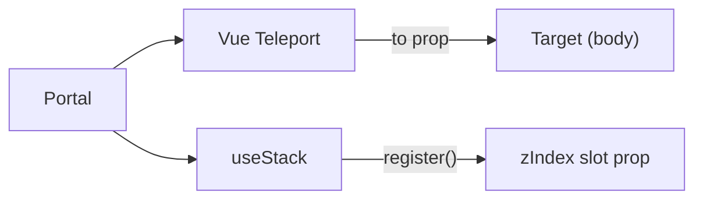

# Portal

Renderless teleport wrapper with automatic z-index stacking.

<DocsPageFeatures :frontmatter />

## Usage

Portal wraps Vue's `<Teleport>` with automatic `useStack` integration. Content is teleported to `body` by default and receives a `zIndex` via slot props for proper overlay ordering.

::: example
/components/portal/basic

### Basic

Toggle a floating element that teleports to the body on desktop or renders inline on mobile. Uses `disabled` with `useBreakpoints` for responsive behavior. Portal registers with the stack and provides `zIndex` for proper layering.

:::

## Anatomy

```vue Anatomy no-filename
<script setup lang="ts">
  import { Portal } from '@vuetify/v0'
</script>

<template>
  <Portal />
</template>
```

## Architecture

Portal is a thin abstraction over two existing v0 systems:



When mounted, Portal registers a stack ticket. The ticket's computed `zIndex` is exposed as a slot prop. When the component unmounts, the ticket is automatically cleaned up via scope disposal.

The `disabled` prop controls teleporting — when `true`, content renders inline instead of being teleported. Stack registration is always active regardless of `disabled` state.

## Examples

::: example
/components/portal/stacking

### Stacking

Each Portal registers its own stack ticket. Add multiple layers to see how `useStack` assigns incrementing `zIndex` values — each new Portal layers above the previous one. Layers can be dismissed via the close button or programmatically. The `zIndex` slot prop updates reactively as layers are added and removed.

:::

## Accessibility

Portal is transparent — it adds no DOM elements, ARIA attributes, or keyboard behavior. Accessibility is the responsibility of the content you teleport.

> [!TIP]
> When teleporting interactive content (modals, menus, notifications), ensure it has proper ARIA roles, keyboard handling, and focus management. Portal handles *where* content renders, not *how* it behaves.

## Questions

::: faq
??? When should I use Portal vs native Teleport?

Use Portal when your teleported content needs z-index coordination with other overlays. Portal auto-registers with `useStack` so your content stacks correctly alongside Dialogs, Snackbars, and other overlay components.

If you don't need stacking — for example, teleporting a non-overlay element to a specific container — Vue's native [Teleport](https://vuejs.org/guide/built-ins/teleport) works fine.

??? Does Portal work with SSR?

Yes. Portal relies on Vue's native `<Teleport>` SSR support. Vue renders teleported content into a separate SSR stream and hydrates it correctly on the client.

??? What happens when disabled is true?

Content renders inline at its original position in the DOM tree instead of being teleported. Stack registration stays active, so `zIndex` is still provided via slot props — useful if your inline content still needs to participate in overlay ordering.

??? Do I need useStack installed for Portal to work?

Portal always calls `useStack()`, which provides a singleton fallback if no explicit stack plugin is installed. This matches how Dialog and Snackbar work. You don't need to install anything extra — it works out of the box.
:::

<DocsApi />
