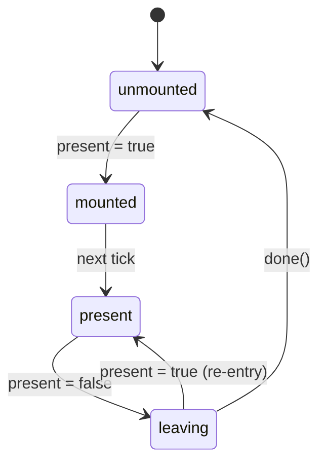

# Presence

Animation-agnostic mount lifecycle for conditional content.

<DocsPageFeatures :frontmatter />

## Usage

The Presence component and `usePresence` composable manage the mount lifecycle of conditional content. They provide a four-state machine that handles lazy mounting, exit animation delay, and unmounting.

::: gn-example
/components/presence/basic
:::

## Anatomy

```vue Anatomy no-filename
<script setup lang="ts">
  import { Presence } from '@vuetify/v0'
</script>

<template>
  <Presence />
</template>
```

## Architecture

Presence wraps the `usePresence` composable, which implements a four-state machine:



| State | `data-state` | In DOM? | Purpose |
|-------|-------------|---------|---------|
| `unmounted` | — | No | Content removed |
| `mounted` | `mounted` | Yes | Just entered DOM — target for enter animations |
| `present` | `present` | Yes | Active and visible |
| `leaving` | `leaving` | Yes | Exit animation running, waiting for `done()` |

The `mounted` state lasts one tick, giving the browser a frame to apply initial styles before transitioning to `present`. This is the same principle behind `requestAnimationFrame`-based enter animations.

## Examples

::: example
/components/presence/animation

### Re-Entry

Toggle rapidly during the exit animation. Presence cancels the leave and returns to `present` without unmounting and remounting — the element stays in the DOM and the exit animation is interrupted cleanly.

:::

::: example
/components/presence/lazy

### Lazy Mounting

With `lazy`, content is not mounted until `v-model` is first `true`. The event log shows the full mount/unmount lifecycle — notice that nothing happens until the first toggle.

:::

## Accessibility

Presence is transparent — it adds no DOM elements, ARIA attributes, or keyboard behavior. Accessibility is the responsibility of the content you render inside.

> [!TIP]
> Ensure animated content respects `prefers-reduced-motion`. Presence doesn't enforce motion preferences — your CSS should handle `@media (prefers-reduced-motion: reduce)`.

## FAQ

::: faq
??? Why not use Vue's Transition component?

`<Transition>` works well for simple CSS transitions but has limitations in headless component libraries: it requires a single root element, it's coupled to CSS class naming conventions, and it doesn't compose cleanly when a parent component needs to control mount lifecycle independently of animation. Presence separates the "when to unmount" concern from the "how to animate" concern.

??? How is this different from v-if?

`v-if` removes content immediately. Presence adds a `leaving` state between "logically hidden" and "removed from DOM" — your exit animation runs, then content is removed when you call `done()`.

??? When should I use immediate vs manual mode?

Use `immediate: true` (default) when you don't need exit animations — content unmounts on the next tick. Use `immediate: false` when you have animations and need to call `done()` to control when unmounting happens.

??? Can I use Presence with GSAP or Web Animations API?

Yes. Set `immediate` to `false`, start your animation when `isLeaving` becomes true, and call `done()` in the animation's completion callback. Presence doesn't care how the animation runs.

??? What happens if present becomes true during a leave animation?

Presence cancels the leave and transitions back to `present`. The content stays mounted — no unmount/remount cycle.

??? Should I use the composable or the component?

Use `<Presence>` for template-driven conditional rendering. Use `usePresence` when building custom components that need mount lifecycle control in their setup function.
:::

<DocsApi />
