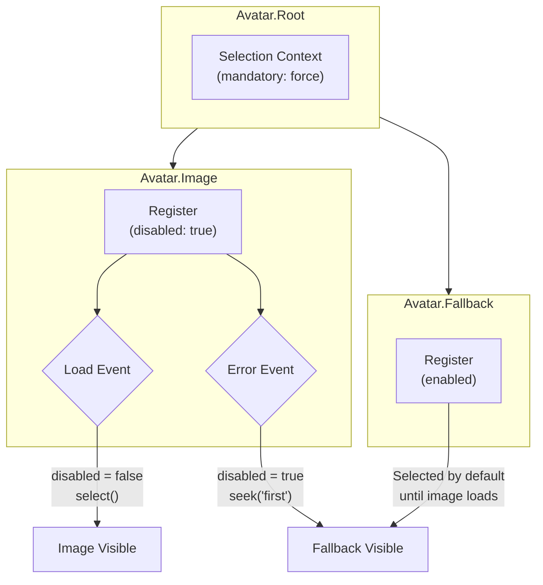

<script setup>
import BasicExample from '@/examples/components/avatar/basic.vue'
import BasicExampleRaw from '@/examples/components/avatar/basic.vue?raw'
</script>

# Avatar

A headless component for managing image loading with priority-based fallback system.

<DocsPageFeatures :frontmatter />

## Usage

The Avatar component provides a robust image loading system with automatic fallback handling. It manages multiple image sources with priority ordering and only displays the highest-priority loaded image or fallback content.

<DocsExample file="basic.vue" :code="BasicExampleRaw">
  <BasicExample />
</DocsExample>

## Anatomy

```vue Anatomy playground
<script setup lang="ts">
  import { Avatar } from '@vuetify/v0'
</script>

<template>
  <Avatar.Root>
    <Avatar.Image />

    <Avatar.Fallback />
  </Avatar.Root>
</template>
```

## Architecture

The Avatar uses an internal selection system with `mandatory: 'force'` to ensure exactly one element is always visible. Images register as disabled until they load successfully.



### Priority System

When multiple images are present, the `priority` prop determines display order. Higher priority images are preferred when loaded:

```vue
<template>
  <Avatar.Root>
    <!-- Preferred when loaded -->
    <Avatar.Image src="/high-res.jpg" :priority="1" />

    <!-- Fallback image -->
    <Avatar.Image src="/low-res.jpg" :priority="0" />

    <!-- Text fallback -->
    <Avatar.Fallback>JD</Avatar.Fallback>
  </Avatar.Root>
</template>
```

<DocsApi />
