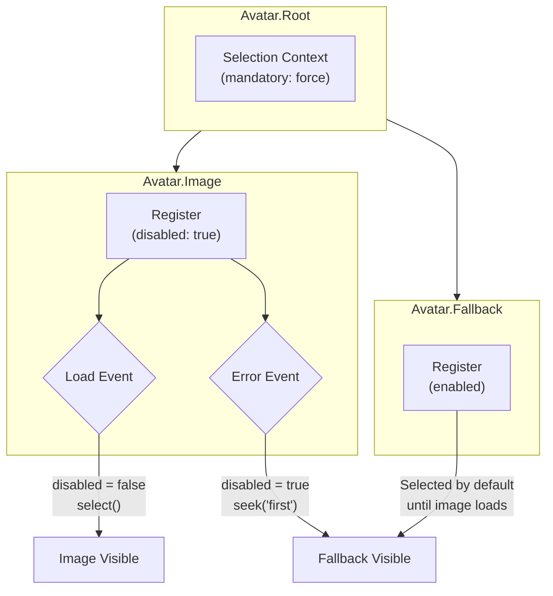

# Avatar

Headless image component with automatic fallback to icon or text content.

<DocsPageFeatures :frontmatter />

## Usage

The Avatar component provides a robust image loading system with automatic fallback handling. It manages multiple image sources with priority ordering and only displays the highest-priority loaded image or fallback content.

::: gn-example
/components/avatar/basic
:::

## Anatomy

```vue Anatomy no-filename
<script setup lang="ts">
  import { Avatar } from '@vuetify/v0'
</script>

<template>
  <Avatar.Root>
    <Avatar.Image />
    <Avatar.Fallback />
  </Avatar.Root>

  <Avatar.Group>
    <Avatar.Root>
      <Avatar.Image />
      <Avatar.Fallback />
    </Avatar.Root>
    <Avatar.Indicator />
  </Avatar.Group>
</template>
```

## Architecture

The Avatar uses an internal selection system with `mandatory: 'force'` to ensure exactly one element is always visible. Images register as disabled until they load successfully.


```mermaid "Image/Fallback Flow"
flowchart TD
  subgraph Root["Avatar.Root"]
    Selection["Selection Context<br/>(mandatory: force)"]
  end

  subgraph Image["Avatar.Image"]
    Register["Register<br/>(disabled: true)"]
    Load{Load Event}
    Error{Error Event}
  end

  subgraph Fallback["Avatar.Fallback"]
    FallbackReg["Register<br/>(enabled)"]
  end

  Root --> Image
  Root --> Fallback

  Register --> Load
  Register --> Error

  Load -->|"disabled = false<br/>select()"| Visible["Image Visible"]
  Error -->|"disabled = true<br/>seek('first')"| FallbackVisible["Fallback Visible"]

  FallbackReg -->|"Selected by default<br/>until image loads"| FallbackVisible
```

> [!TIP]
> For single-source content images with placeholder and error fallback, use [Image](/components/semantic/image) instead. Avatar specializes in identity / profile UIs with priority-based multi-source fallback.

### Loading state slot props

`Avatar.Image` exposes the underlying loading state from `useImage` via slot props. Use these for custom transitions, retry UI, or status indicators.

| Slot prop | Purpose |
|-----------|---------|
| `status` | Current state: `'idle' \| 'loading' \| 'loaded' \| 'error'` |
| `isLoaded` | True when the image has loaded successfully |
| `isError` | True when the image failed to load |
| `retry` | Reset the image and re-attempt loading |

### Priority System

When multiple images are present, the `priority` prop determines display order. Higher priority images are preferred when loaded:

```vue
<template>
  <Avatar.Root>
    <!-- Preferred when loaded -->
    <Avatar.Image src="/high-res.jpg" :priority="1" />

    <!-- Fallback image -->
    <Avatar.Image src="/low-res.jpg" :priority="0" />

    <!-- Text fallback -->
    <Avatar.Fallback>JD</Avatar.Fallback>
  </Avatar.Root>
</template>
```

## Examples

::: gn-example
/components/avatar/members.ts
/components/avatar/team.vue

### Team roster

A realistic project-members panel — the kind of header you'd find on a Slack channel, GitHub team page, or Jira project view. The row fills the available chrome width and collapses into a `+N` chip when there isn't enough room. The chip's `title` lists everyone who's currently hidden, so the truncation never costs the reader information.

The data lives in a separate module so the component stays focused on composition and ARIA. Each member is registered with `:value="member"` rather than just an id, which makes `Avatar.Indicator`'s `hidden` slot prop directly useful — the tooltip resolves names without a separate lookup. The negative `marginInlineStart` is skipped on the first child via the `(member, index)` form so the leading avatar doesn't hang off the container's left edge.

`responsive` opts the group into `createOverflow` under a `useToggleScope`, so groups that don't need width tracking pay nothing. The indicator self-measures its width and writes it back via `reserved` on `createOverflow`, so the group always carves out exactly enough room for the chip — no hard-coded pixel reserve needed. Drag the example pane's resize handle to watch the visible count adjust.

| File | Role |
|------|------|
| `members.ts` | Member type + sample data; the kind of array your API would return |
| `team.vue` | Panel UI — labelled `Avatar.Group` with hover tooltips on every avatar and the `+N` chip |

:::

## FAQ

::: faq

??? When should I use Avatar vs [Image](/components/semantic/image)?

Avatar is for identity and profile UIs with priority-based multi-source fallback to initials or an icon. For a single-source content image with placeholder and error fallback, use Image instead.

??? How does Avatar pick which source to show?

Each `Avatar.Image` registers disabled until it loads; an internal selection with `mandatory: 'force'` keeps exactly one element visible, preferring the highest-`priority` loaded image and falling back to `Avatar.Fallback` when none load.

??? How does `Avatar.Group` collapse into a `+N` chip?

Set `responsive` on the group to opt into [createOverflow](/composables/semantic/create-overflow); the indicator self-measures and reserves room, so the visible count adjusts to the available width.

??? How do I show a loading or retry affordance while the image loads?

`Avatar.Image` exposes the underlying `useImage` state via slot props — `status`, `isLoaded`, `isError`, and a `retry` method — so you can drive spinners, transitions, or a retry button.

:::

<DocsApi />
