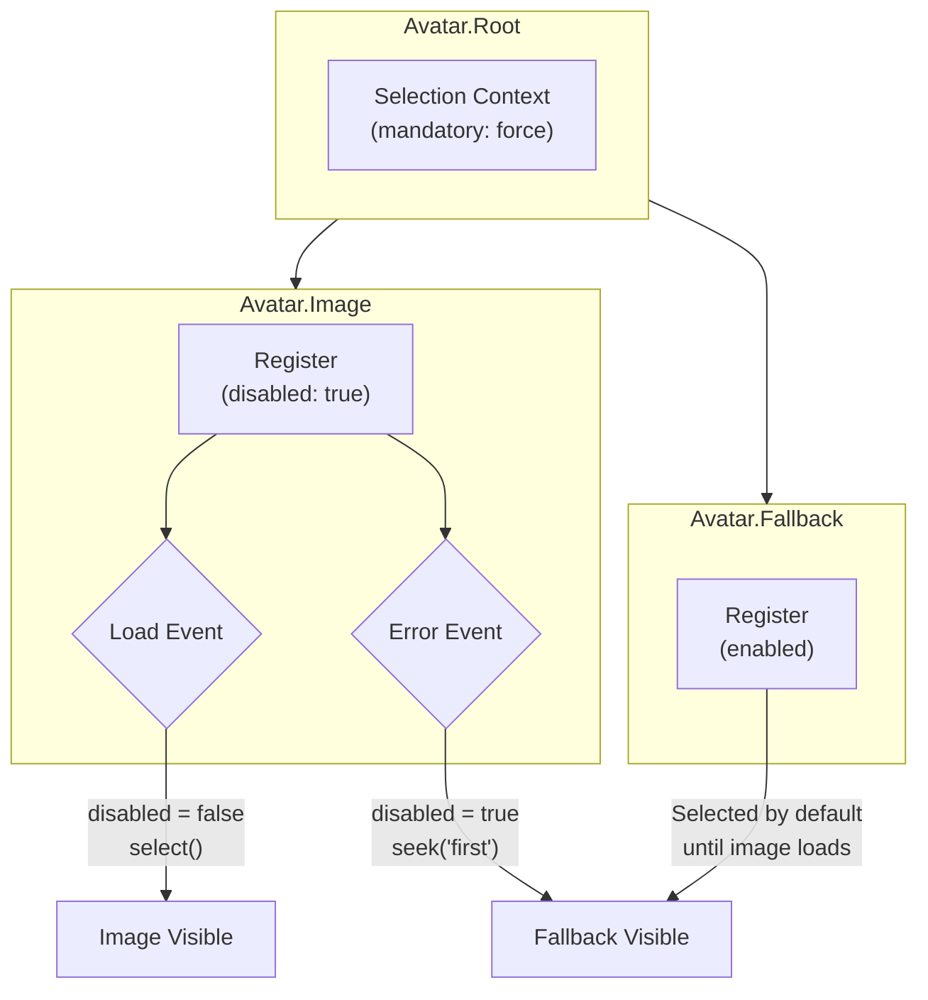

# Avatar

Headless image component with automatic fallback to icon or text content.

<DocsPageFeatures :frontmatter />

## Usage

The Avatar component provides a robust image loading system with automatic fallback handling. It manages multiple image sources with priority ordering and only displays the highest-priority loaded image or fallback content.

::: example
/components/avatar/basic

### Image and Fallback

Two avatars showing successful image loading and graceful fallback to initials when the image fails.

:::

## Anatomy

```vue Anatomy playground
<script setup lang="ts">
  import { Avatar } from '@vuetify/v0'
</script>

<template>
  <Avatar.Root>
    <Avatar.Image />

    <Avatar.Fallback />
  </Avatar.Root>
</template>
```

## Architecture

The Avatar uses an internal selection system with `mandatory: 'force'` to ensure exactly one element is always visible. Images register as disabled until they load successfully.


```mermaid "Image/Fallback Flow"
flowchart TD
  subgraph Root["Avatar.Root"]
    Selection["Selection Context<br/>(mandatory: force)"]
  end

  subgraph Image["Avatar.Image"]
    Register["Register<br/>(disabled: true)"]
    Load{Load Event}
    Error{Error Event}
  end

  subgraph Fallback["Avatar.Fallback"]
    FallbackReg["Register<br/>(enabled)"]
  end

  Root --> Image
  Root --> Fallback

  Register --> Load
  Register --> Error

  Load -->|"disabled = false<br/>select()"| Visible["Image Visible"]
  Error -->|"disabled = true<br/>seek('first')"| FallbackVisible["Fallback Visible"]

  FallbackReg -->|"Selected by default<br/>until image loads"| FallbackVisible
```

> [!TIP]
> For single-source content images with placeholder and error fallback, use [Image](/components/semantic/image) instead. Avatar specializes in identity / profile UIs with priority-based multi-source fallback.

### Loading state slot props

`Avatar.Image` exposes the underlying loading state from `useImage` via slot props. Use these for custom transitions, retry UI, or status indicators.

| Slot prop | Purpose |
|-----------|---------|
| `status` | Current state: `'idle' \| 'loading' \| 'loaded' \| 'error'` |
| `isLoaded` | True when the image has loaded successfully |
| `isError` | True when the image failed to load |
| `retry` | Reset the image and re-attempt loading |

### Priority System

When multiple images are present, the `priority` prop determines display order. Higher priority images are preferred when loaded:

```vue
<template>
  <Avatar.Root>
    <!-- Preferred when loaded -->
    <Avatar.Image src="/high-res.jpg" :priority="1" />

    <!-- Fallback image -->
    <Avatar.Image src="/low-res.jpg" :priority="0" />

    <!-- Text fallback -->
    <Avatar.Fallback>JD</Avatar.Fallback>
  </Avatar.Root>
</template>
```

## Group

`Avatar.Group` collapses a row of avatars into a `+N` chip when the count exceeds `max`, or — with `responsive` — when the container runs out of width. `Avatar.Root` registers with the surrounding group automatically; nothing changes about a standalone `Avatar.Root`.

::: example
/components/avatar/group-basic

### Basic group

A simple stack of overlapping avatars with no truncation. Every member renders; no `max` is set and `responsive` is off, so the group exercises the registration path and shared ARIA `role="group"` labelling without any visibility math. Use this pattern when you know the member count is fixed and small — it avoids the ResizeObserver overhead that `responsive` would install.

:::

### Count-based truncation

Set `max` to cap how many avatars render. Disabled avatars are exempt from the cap and always render. Use `priority="end"` to keep trailing avatars instead of leading ones.

::: example
/components/avatar/group-max

### Max with indicator

Six users with `:max="4"`; the indicator shows the hidden count. The first four avatars are visible; the remaining two are hidden by `v-show` (they stay mounted so the group can keep accurate registry bookkeeping). `Avatar.Indicator` silently renders nothing when the group is not overflowing, so no conditional wrapper is needed in the template.

:::

### Width-based truncation

Set `responsive` to opt into width tracking. The group composes `createOverflow` under a `useToggleScope` so there is no ResizeObserver overhead when `responsive` is off. `max` and `responsive` cooperate — the effective cap is `min(max, capacityFromWidth)`.

::: example
/components/avatar/group-responsive

### Responsive group

Eight users in an `overflow-hidden` container; avatars truncate as the container shrinks. The indicator self-measures its own width and feeds it back to `createOverflow` so the group reserves exactly enough space for the `+N` chip — no hard-coded pixel offset required. Resize the browser window or the example pane to see the count update.

:::

## Indicator

`Avatar.Indicator` renders the `+N` chip and exposes `count` and `hidden` on its slot. It silently renders nothing outside an `Avatar.Group` or while the group is not overflowing. Use the `hidden` array to render a tooltip listing the remaining avatars.

<DocsApi />
