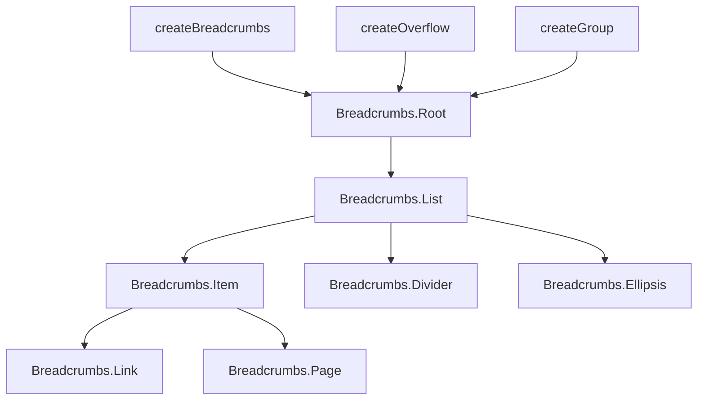

# Breadcrumbs

A headless component for creating responsive breadcrumb navigation with proper ARIA support.

<DocsPageFeatures :frontmatter />

## Usage

The Breadcrumbs component provides a compound component pattern for building navigation trails. It uses [createBreadcrumbs](/composables/utilities/create-breadcrumbs), [createGroup](/composables/selection/create-group), and [createOverflow](/composables/utilities/create-overflow) internally.

::: example
/components/breadcrumbs/basic
:::

## Anatomy

```vue playground
<script setup lang="ts">
  import { Breadcrumbs } from '@vuetify/v0'
</script>

<template>
  <Breadcrumbs.Root>
    <Breadcrumbs.List>
      <Breadcrumbs.Item>
        <Breadcrumbs.Link />
      </Breadcrumbs.Item>

      <Breadcrumbs.Divider />

      <Breadcrumbs.Ellipsis />

      <Breadcrumbs.Divider />

      <Breadcrumbs.Item>
        <Breadcrumbs.Page />
      </Breadcrumbs.Item>
    </Breadcrumbs.List>
  </Breadcrumbs.Root>
</template>
```

## Architecture

The Root component composes three internal systems: [createBreadcrumbs](/composables/utilities/create-breadcrumbs) for navigation state, [createGroup](/composables/selection/create-group) for visibility tracking, and [createOverflow](/composables/utilities/create-overflow) for width measurement.



The Root creates three internal composables: `createBreadcrumbs` manages the navigation model, `createGroup` tracks item visibility, and `createOverflow` measures widths to determine how many items fit.

## Examples

::: example
/components/breadcrumbs/overflow

### Responsive Overflow

Breadcrumb trails can easily exceed their container in sidebars, mobile viewports, or resizable panels. Rather than wrapping or clipping, the Root measures each item's width via [createOverflow](/composables/utilities/create-overflow) and hides items from the beginning when space runs out. The Ellipsis component appears automatically to indicate hidden items.

**Key patterns:**

- Items without an `href` render as `Breadcrumbs.Page` with `aria-current="page"`
- The Ellipsis is placed after the first item (`v-if="index === 1"`) so the root crumb always stays visible
- `shrink-0` and `whitespace-nowrap` on items prevent text from wrapping before overflow kicks in

Drag the slider to shrink the container and watch items collapse into the ellipsis.

:::

::: example
/components/breadcrumbs/mobile

### Mobile Overflow

On narrow viewports, the breadcrumb trail automatically collapses leading items behind an ellipsis. The Root reserves space for the ellipsis element before computing how many items fit, preventing visual clipping. No configuration is needed — `createOverflow` with `reverse: true` ensures the trailing (most relevant) items stay visible.

The container below is capped at `max-w-sm` to simulate a mobile viewport. On actual mobile devices, the breadcrumbs would fill the full screen width and overflow naturally.

:::

::: example
/components/breadcrumbs/AppBreadcrumbs.vue
/components/breadcrumbs/useBreadcrumbItems.ts

### Route-Derived Breadcrumbs

In most applications, breadcrumbs mirror the current URL. Rather than manually maintaining a list of items, this example derives the trail reactively from [useRoute()](https://router.vuejs.org/api/interfaces/Router.html#currentRoute). When no `items` prop is provided, `AppBreadcrumbs` automatically uses the route-derived trail.

**File breakdown:**

| File | Role |
|------|------|
| `useBreadcrumbItems.ts` | Composable that reads [route.path](https://router.vuejs.org/api/interfaces/RouteLocationNormalizedLoaded.html#path), splits it into segments, and returns a reactive breadcrumb array |
| `AppBreadcrumbs.vue` | Reusable component — falls back to `useBreadcrumbItems` when no `items` prop is provided |

**Key patterns:**

- The composable wraps its logic in a `computed` so the trail updates automatically when [route.path](https://router.vuejs.org/api/interfaces/RouteLocationNormalizedLoaded.html#path) changes during navigation
- Path segments are title-cased with a simple regex (`replace(/\b\w/g, ...)`)
- Segments that don't resolve to a real route (like category folders) render as plain text instead of links
- The last segment omits `href`, which causes `AppBreadcrumbs` to render it as a `Breadcrumbs.Page` with `aria-current="page"`
- Pass explicit `items` for static trails, or omit the prop to derive from the current route

Navigate to a different page in the docs and watch the breadcrumb trail update.

:::

<DocsApi />

## Plugins

Breadcrumbs integrates with v0's plugin system for internationalization.

### Locale

The Root uses [useLocale](/composables/plugins/use-locale) internally for the navigation landmark's `aria-label`. Without any configuration, it defaults to `"Breadcrumb"`.

**Override with a prop** — no plugin needed:

```vue
<template>
  <Breadcrumbs.Root label="Fil d'Ariane">
    <!-- ... -->
  </Breadcrumbs.Root>
</template>
```

**Override with the locale plugin** — for app-wide i18n:

```ts main.ts
import { createApp } from 'vue'
import { createLocalePlugin } from '@vuetify/v0'
import App from './App.vue'

const app = createApp(App)

app.use(
  createLocalePlugin({
    messages: {
      en: { 'Breadcrumbs.label': 'Breadcrumb' },
      fr: { 'Breadcrumbs.label': "Fil d'Ariane" },
    },
  })
)

app.mount('#app')
```

The `label` prop takes priority over locale messages, so you can still override individual instances when needed.

## Recipes

Common patterns for integrating Breadcrumbs into your application.

### Links and Current Page

Use `Breadcrumbs.Link` for navigable items and `Breadcrumbs.Page` for the current (last) item. Page automatically applies `aria-current="page"`.

```vue
<template>
  <Breadcrumbs.Item>
    <Breadcrumbs.Link href="/products">Products</Breadcrumbs.Link>
  </Breadcrumbs.Item>

  <!-- Last item uses Page instead of Link -->
  <Breadcrumbs.Item>
    <Breadcrumbs.Page>Current</Breadcrumbs.Page>
  </Breadcrumbs.Item>
</template>
```

### With Vue Router

Use the `as` prop to render `Breadcrumbs.Link` as a `RouterLink`:

```vue
<template>
  <Breadcrumbs.Item>
    <Breadcrumbs.Link :as="RouterLink" to="/products">
      Products
    </Breadcrumbs.Link>
  </Breadcrumbs.Item>
</template>
```

### Slot Props

The Root exposes navigation state and methods through its default slot:

```vue
<template>
  <Breadcrumbs.Root v-slot="{ isOverflowing, depth, isRoot, first, prev, select }">
    <!-- Use navigation methods and overflow state -->
  </Breadcrumbs.Root>
</template>
```

### Custom Ellipsis

Override the ellipsis globally on Root or per-instance:

```vue
<template>
  <Breadcrumbs.Root ellipsis="[more]">
    <!-- Ellipsis shows "[more]" instead of default -->
  </Breadcrumbs.Root>
</template>
```
