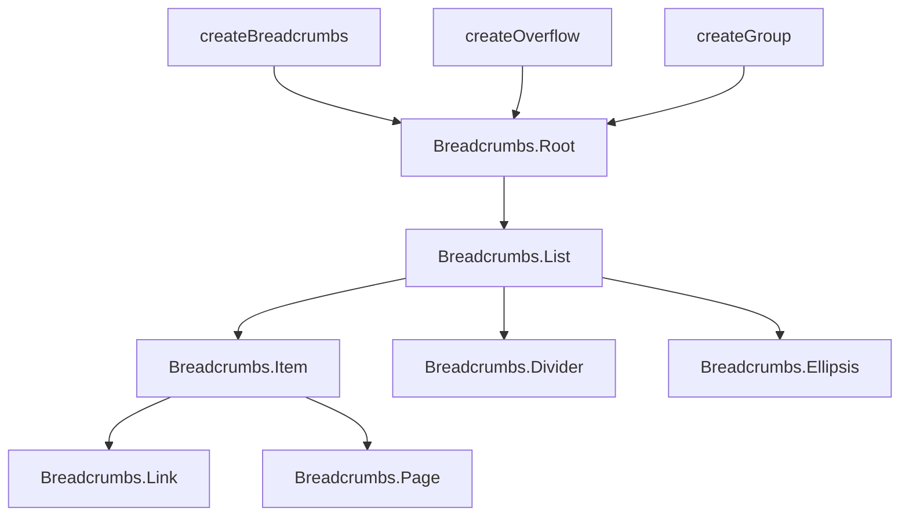

# Breadcrumbs

A headless component for creating responsive breadcrumb navigation with proper ARIA support.

<DocsPageFeatures :frontmatter />

## Usage

The Breadcrumbs component provides a compound component pattern for building navigation trails. It uses `createBreadcrumbs`, `createGroup`, and `createOverflow` internally.

::: gn-example
/components/breadcrumbs/basic
:::

## Anatomy

```vue Anatomy no-filename
<script setup lang="ts">
  import { Breadcrumbs } from '@vuetify/v0'
</script>

<template>
  <Breadcrumbs.Root>
    <Breadcrumbs.List>
      <Breadcrumbs.Item>
        <Breadcrumbs.Link />
      </Breadcrumbs.Item>

      <Breadcrumbs.Divider />

      <Breadcrumbs.Ellipsis />

      <Breadcrumbs.Divider />

      <Breadcrumbs.Item>
        <Breadcrumbs.Page />
      </Breadcrumbs.Item>
    </Breadcrumbs.List>
  </Breadcrumbs.Root>
</template>
```

## Architecture

The Root component composes three internal systems: `createBreadcrumbs` for navigation state, `createGroup` for visibility tracking, and `createOverflow` for width measurement.


```mermaid "Breadcrumbs Architecture"
flowchart TD
  Breadcrumbs["createBreadcrumbs"]
  Overflow["createOverflow"]
  Group["createGroup"]
  Root["Breadcrumbs.Root"]:::primary
  List["Breadcrumbs.List"]
  Item["Breadcrumbs.Item"]
  Divider["Breadcrumbs.Divider"]
  Ellipsis["Breadcrumbs.Ellipsis"]
  Link["Breadcrumbs.Link"]
  Page["Breadcrumbs.Page"]

  Breadcrumbs --> Root
  Overflow --> Root
  Group --> Root
  Root --> List
  List --> Item
  List --> Divider
  List --> Ellipsis
  Item --> Link
  Item --> Page
```

The Root creates three internal composables: `createBreadcrumbs` manages the navigation model, `createGroup` tracks item visibility, and `createOverflow` measures widths to determine how many items fit.

## Examples

::: gn-example
/components/breadcrumbs/useTrail.ts 1
/components/breadcrumbs/BreadcrumbTrail.vue 2
/components/breadcrumbs/breadcrumb-trail.vue 3

### Responsive Trail with Overflow Collapse

A breadcrumb trail can easily outgrow its container in a sidebar, a resizable panel, or a phone viewport. This example builds a reusable `BreadcrumbTrail` from a plain path array and lets the Root collapse leading crumbs behind an ellipsis when space runs out. Use the width buttons to shrink the container and watch the middle crumbs fold away while the root and the current page stay put.

The Root composes [createOverflow](/composables/semantic/create-overflow) internally: each `Breadcrumbs.Item` and `Breadcrumbs.Divider` self-measures, the Root reserves room for the first crumb plus the ellipsis, then hides items from the start using a reverse measurement so the trailing, most-relevant crumbs survive. Crumbs render as `Breadcrumbs.Link` when they carry an `href` and as `Breadcrumbs.Page` (which applies `aria-current="page"`) when they don't, so the last segment is automatically the current page. The component reads the `isOverflowing` slot prop off the Root to caption whether the trail collapsed.

Reach for this whenever the number of segments is unknown at design time. The tradeoffs to remember: `shrink-0` and `whitespace-nowrap` keep crumbs from wrapping before the overflow math runs, and the Root `gap` prop must match your CSS gap or the capacity calculation drifts. For a trail derived from the live route instead of a static array, see the route-derived example below; the navigation model itself comes from [createBreadcrumbs](/composables/semantic/create-breadcrumbs).

| File | Role |
|------|------|
| `useTrail.ts` | Owns the demo state — the crumb path array, the container-width presets, and the resize handler |
| `BreadcrumbTrail.vue` | Reusable trail — renders the compound surface, splits Link vs Page on `href`, and reports overflow via the Root slot prop |
| `breadcrumb-trail.vue` | Entry — wires the composable to the component and adds the width-preset controls |
:::

::: gn-example
/components/breadcrumbs/useBreadcrumbItems.ts 1
/components/breadcrumbs/AppBreadcrumbs.vue 2

### Route-Derived Breadcrumbs

In most applications, breadcrumbs mirror the current URL. Rather than manually maintaining a list of items, this example derives the trail reactively from [useRoute()](https://router.vuejs.org/api/interfaces/Router.html#currentRoute). When no `items` prop is provided, `AppBreadcrumbs` automatically uses the route-derived trail.

**File breakdown:**

| File | Role |
|------|------|
| `useBreadcrumbItems.ts` | Composable that reads [route.path](https://router.vuejs.org/api/interfaces/RouteLocationNormalizedLoaded.html#path), splits it into segments, and returns a reactive breadcrumb array |
| `AppBreadcrumbs.vue` | Reusable component — falls back to `useBreadcrumbItems` when no `items` prop is provided |

**Key patterns:**

- The composable wraps its logic in a `computed` so the trail updates automatically when [route.path](https://router.vuejs.org/api/interfaces/RouteLocationNormalizedLoaded.html#path) changes during navigation
- Path segments are title-cased with a simple regex (`replace(/\b\w/g, ...)`)
- Segments that don't resolve to a real route (like category folders) render as plain text instead of links
- The last segment omits `href`, which causes `AppBreadcrumbs` to render it as a `Breadcrumbs.Page` with `aria-current="page"`
- Pass explicit `items` for static trails, or omit the prop to derive from the current route

Navigate to a different page in the docs and watch the breadcrumb trail update.

:::

## Recipes

Common patterns for integrating Breadcrumbs into your application.

### Links and Current Page

Use `Breadcrumbs.Link` for navigable items and `Breadcrumbs.Page` for the current (last) item. Page automatically applies `aria-current="page"`.

```vue
<template>
  <Breadcrumbs.Item>
    <Breadcrumbs.Link href="/products">Products</Breadcrumbs.Link>
  </Breadcrumbs.Item>

  <!-- Last item uses Page instead of Link -->
  <Breadcrumbs.Item>
    <Breadcrumbs.Page>Current</Breadcrumbs.Page>
  </Breadcrumbs.Item>
</template>
```

### With Vue Router

Use the `as` prop to render `Breadcrumbs.Link` as a `RouterLink`:

```vue
<template>
  <Breadcrumbs.Item>
    <Breadcrumbs.Link :as="RouterLink" to="/products">
      Products
    </Breadcrumbs.Link>
  </Breadcrumbs.Item>
</template>
```

### Slot Props

The Root exposes navigation state and methods through its default slot:

```vue
<template>
  <Breadcrumbs.Root v-slot="{ isOverflowing, depth, isRoot, first, prev, select }">
    <!-- Use navigation methods and overflow state -->
  </Breadcrumbs.Root>
</template>
```

### Item Gap

The `gap` prop controls the pixel gap between items used when calculating overflow capacity (default: `8`). Adjust it to match your CSS gap so the overflow calculation stays accurate:

```vue
<template>
  <!-- CSS gap is 16px — tell the component so overflow math is correct -->
  <Breadcrumbs.Root :gap="16" class="flex gap-4">
    <Breadcrumbs.Item v-for="crumb in crumbs" :key="crumb.path">
      <Breadcrumbs.Link :href="crumb.path">{{ crumb.label }}</Breadcrumbs.Link>
    </Breadcrumbs.Item>
  </Breadcrumbs.Root>
</template>
```

### Custom Ellipsis

Override the ellipsis globally on Root or per-instance:

```vue
<template>
  <Breadcrumbs.Root ellipsis="[more]">
    <!-- Ellipsis shows "[more]" instead of default -->
  </Breadcrumbs.Root>
</template>
```

### Plugins

Breadcrumbs integrates with v0's plugin system for internationalization.

#### Locale

The Root renders the navigation landmark's `aria-label` as `ti('Breadcrumbs.label') ?? 'Breadcrumbs'`. When the Locale plugin resolves the `Breadcrumbs.label` key it uses your translation; without any configuration it falls back to the inline English default `"Breadcrumbs"`.

**Override with a prop** — no plugin needed:

```vue
<template>
  <Breadcrumbs.Root label="Fil d'Ariane">
    <!-- ... -->
  </Breadcrumbs.Root>
</template>
```

**Override with the locale plugin** — for app-wide i18n:

```ts main.ts
import { createApp } from 'vue'
import { createLocalePlugin } from '@vuetify/v0'
import App from './App.vue'

const app = createApp(App)

app.use(
  createLocalePlugin({
    messages: {
      en: { 'Breadcrumbs.label': 'Breadcrumb' },
      fr: { 'Breadcrumbs.label': "Fil d'Ariane" },
    },
  })
)

app.mount('#app')
```

The `label` prop takes priority over locale messages, so you can still override individual instances when needed.

## FAQ

::: faq

??? When do I use `Breadcrumbs.Link` vs `Breadcrumbs.Page`?

Use `Breadcrumbs.Link` for navigable crumbs and `Breadcrumbs.Page` for the current item — Page applies `aria-current="page"`. Omitting `href` on the last segment renders it as a Page automatically.

??? Why are my crumbs overflowing or leaving extra space?

The `gap` prop (default `8`) must match your actual CSS gap. If they differ, the overflow capacity calculation drifts — set `:gap` to your pixel gap.

??? How do I render crumbs as Vue Router links?

Pass `:as="RouterLink"` along with `to` on `Breadcrumbs.Link`.

??? How do I change the collapse indicator?

Set the `ellipsis` prop on `Breadcrumbs.Root` (for example `ellipsis="[more]"`) to replace the default overflow indicator, globally or per instance.

??? How do I translate the breadcrumb's `aria-label`?

Pass a `label` prop on `Breadcrumbs.Root`, or configure the `Breadcrumbs.label` key through the [Locale](/composables/plugins/use-locale) plugin for app-wide i18n. The `label` prop takes priority over locale messages.

:::

<DocsApi />
