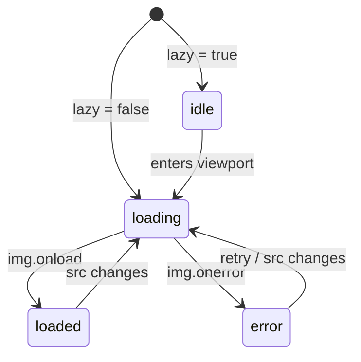

# Image

Headless image component with state-driven placeholder and error fallback. Tracks the loading lifecycle and exposes `retry()`, with optional IntersectionObserver-driven lazy loading.

<DocsPageFeatures :frontmatter />

## Usage

`Image.Root` owns the loading state machine via `useImage`. `Image.Img` renders the image element and reports load and error events to the context. `Image.Placeholder` is shown while idle or loading; `Image.Fallback` is shown on error.

::: example
/components/image/basic
:::

## Anatomy

```vue Anatomy playground collapse
<script setup lang="ts">
  import { Image } from '@vuetify/v0'
</script>

<template>
  <Image.Root>
    <Image.Img />

    <Image.Placeholder />

    <Image.Fallback />
  </Image.Root>
</template>
```

## Architecture

`Image.Root` calls `useImage` to manage status, and optionally wires up `useIntersectionObserver` when the `lazy` prop is set. Children consume the root context via `useImageRoot`.



### Lazy loading strategies

The component supports two distinct lazy loading mechanisms — pick the one that matches your requirements.

| Strategy | How | When to use |
| - | - | - |
| Native | `loading="lazy"` on `Image.Img` | Most below-the-fold images. Zero JS, browser-managed. |
| Observer | `lazy` prop on `Image.Root` | When you need precise control over when the source is set — e.g. blur-up transitions, prefetch, or custom intersection thresholds. |

You can combine both: use the observer for state control and `loading="lazy"` as a fallback for browsers without IntersectionObserver support.

## Examples

::: example
/components/image/BlurUpImage.vue 1
/components/image/observer.vue 2

### Blur-up LQIP with observer loading

Wrap `Image.Root` in a reusable component that drives a fade-in transition from a low-quality placeholder (LQIP) to the full-resolution image. The `lazy` prop on `Image.Root` defers the real source until the container intersects the viewport; the `status` slot prop drives opacity classes for a smooth blur-to-sharp transition.

| File | Role |
|------|------|
| `BlurUpImage.vue` | Reusable component with LQIP placeholder and fade-in transition |
| `observer.vue` | Entry point rendering a scrollable list of blur-up images |

:::

::: example
/components/image/PictureImage.vue 1
/components/image/picture.vue 2

### Picture element with format negotiation

Use `renderless` mode on both `Image.Root` and `Image.Img` to drop their wrapper elements and compose them directly inside a native `<picture>` element. The browser picks the first supported `<source>`; `Image.Img` remains the fallback. All loading state is tracked by the surrounding `Image.Root` so `Image.Placeholder` and `Image.Fallback` behave the same as in the compound form.

| File | Role |
|------|------|
| `PictureImage.vue` | Reusable wrapper that emits a `<picture>` with typed `<source>` children |
| `picture.vue` | Entry point passing WebP and fallback sources |

:::

## Recipes

### Hero image with high priority

Set `loading="eager"` and `fetchpriority="high"` on hero images to optimize LCP. Always include `width` and `height` to prevent layout shift.

```vue
<Image.Root src="/hero.jpg">
  <Image.Img
    alt="Hero"
    width="1600"
    height="900"
    loading="eager"
    fetchpriority="high"
  />
  <Image.Placeholder>
    
  </Image.Placeholder>
</Image.Root>
```

### Retry on error

The `retry()` function is available from both `Image.Root` and `Image.Fallback` slot props.

```vue
<Image.Root src="/photo.jpg">
  <Image.Img alt="Photo" />
  <Image.Placeholder>Loading...</Image.Placeholder>
  <Image.Fallback v-slot="{ retry }">
    <button @click="retry">Retry</button>
  </Image.Fallback>
</Image.Root>
```

## Styling

Every Image sub-component exposes `data-state` reflecting the current status (`idle`, `loading`, `loaded`, or `error`). Prefer styling against these data attributes with CSS over threading slot props — the transitions stay CSS-only and the template stays declarative.

```vue
<Image.Img
  alt="Photo"
  class="opacity-0 transition-opacity data-[state=loaded]:opacity-100"
/>
```

```css
/* Or with plain CSS */
[data-state='loaded'] { opacity: 1; }
[data-state='loading'] { animation: pulse 1s infinite; }
[data-state='error'] { border-color: red; }
```

Slot props (`status`, `isLoaded`, etc.) remain available for the rare cases where logic has to branch in the template, but reach for CSS + data attributes first.

## Accessibility

| Element | ARIA / behavior |
| - | - |
| `Image.Img` | `role="img"`, accepts `alt` for accessible name |
| `Image.Placeholder` | `aria-hidden="true"` — placeholder is decorative |
| `Image.Fallback` | `role="img"` — provide alternate text inside the slot |

Always pass `width` and `height` props on `Image.Img` to reserve layout space and prevent Cumulative Layout Shift while the image loads.

## FAQ

::: faq

??? When should I use Avatar vs Image?

`Avatar` is for identity / profile UIs with priority-based multi-source fallback (e.g. high-res then low-res then initials). `Image` is for general content images with state-driven placeholder and fallback for a single source.

??? Should I use the `lazy` prop or the `loading="lazy"` attribute?

Use native `loading="lazy"` for most cases — it's declarative, zero-JS, and browser-managed. Use the `lazy` prop on `Image.Root` only when you need to control exactly when the source is set, such as for blur-up transitions, prefetching, or custom intersection thresholds.

??? How do I prevent layout shift?

Always set `width` and `height` on `Image.Img`. The browser uses these to reserve space before the image loads, eliminating Cumulative Layout Shift.

??? Can I use a `<picture>` element with multiple `<source>` formats?

Yes — set `renderless` on both `Image.Root` and `Image.Img`, then compose them inside a native `<picture>` element. See the picture example.

??? How do I fade in once the image loads?

Style against the `data-state` attribute that every Image sub-component exposes. Using data attributes keeps the transition CSS-only — no slot-prop threading required.

```vue
<Image.Img
  alt="Photo"
  class="opacity-0 transition-opacity duration-500 data-[state=loaded]:opacity-100"
/>
```

The `data-state` attribute holds the current status (`idle`, `loading`, `loaded`, or `error`). The blur-up example uses this pattern.

??? Why isn't `src` on `Image.Img`?

`src` lives on `Image.Root` because it owns the state machine — the source is what the state is about. `Image.Img` accepts the rendering attributes (`alt`, `width`, `height`, `srcset`, `sizes`, etc.) that belong to the rendered element.

:::

<DocsApi />
