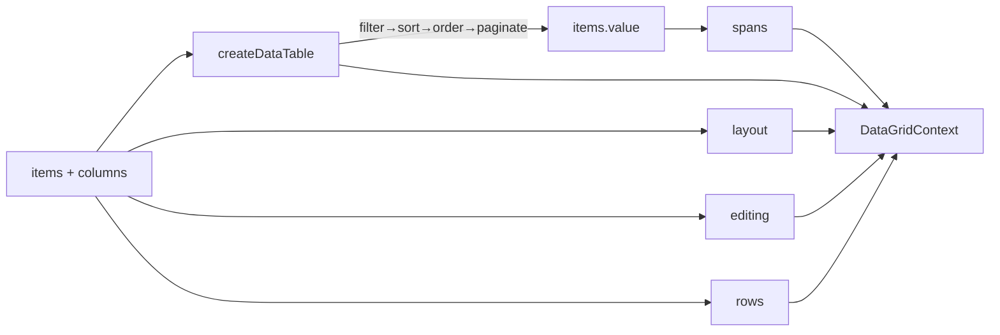
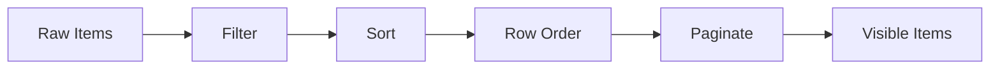

# createDataGrid

Headless data grid built on `createDataTable`. Adds column layout (sizing, pinning, resizing, reordering), cell editing, row ordering, and row spanning.

<DocsPageFeatures :frontmatter />

## Usage

Pass `items` and `columns` to inherit the full `createDataTable` API plus grid extensions.

```ts collapse
import { createDataGrid } from '@vuetify/v0'

const grid = createDataGrid({
  items: users,
  columns: [
    { key: 'name', title: 'Name', sortable: true, filterable: true, size: 30 },
    { key: 'email', title: 'Email', filterable: true, size: 40, editable: true },
    { key: 'age', title: 'Age', sortable: true, size: 30, sort: (a, b) => Number(a) - Number(b) },
  ],
})

// Inherited from createDataTable
grid.search('alice')
grid.sort.toggle('age')
grid.pagination.next()

// Grid extensions
grid.layout.pin('name', 'left')
grid.layout.resize('email', 5)        // +5% width, neighbor absorbs the inverse
grid.layout.reorder(0, 2)             // move first column to index 2

grid.editing.edit(1, 'email')
grid.editing.commit('alice@new.com')  // fires onEdit callback

grid.rows.move(0, 3)                  // manual drag-style row reorder
```

::: example
/composables/create-data-grid/basic/BasicGrid.vue
/composables/create-data-grid/basic/columns.ts
/composables/create-data-grid/basic/data.ts

### Basic Data Grid

A sortable, filterable, paginated grid with click-to-edit cells and column pinning.

:::

## Architecture

`createDataGrid` is an aggregation orchestrator. It calls `createDataTable` with the supplied options and grafts column layout, cell editing, row ordering, and row spanning onto the returned context.



## Adapters

Adapters control the data pipeline. Each grid adapter mirrors the corresponding `createDataTable` adapter and inserts row ordering between sort and pagination.

| Adapter | Pipeline | Use Case |
| - | - | - |
| [ClientGridAdapter](#clientgridadapter-default) | filter → sort → order → paginate | Default. All processing client-side |
| [ServerGridAdapter](#servergridadapter) | pass-through | API-driven. Server handles filter/sort/paginate |
| [VirtualGridAdapter](#virtualgridadapter) | filter → sort → order → (no paginate) | Large datasets paired with `createVirtual` |

### ClientGridAdapter (default)

Inserted automatically by `createDataGrid`. Reads the row ordering ref so manual reorders survive sort/pagination updates.



```ts
import { createDataGrid, ClientGridAdapter } from '@vuetify/v0'

// Equivalent to the default — only pass it if you need to customize
const grid = createDataGrid({
  items,
  columns,
  // adapter is constructed internally with the grid's own row order
})
```

### ServerGridAdapter

Pass-through adapter for API-driven grids. The server handles all filtering, sorting, and pagination — the client only renders what it receives. Row ordering is *not* applied client-side; emit your own callback to persist order changes server-side.

| Option | Type | Required | Description |
| - | - | :-: | - |
| `total` | `MaybeRefOrGetter<number>` | Yes | Total item count on the server |
| `loading` | `MaybeRefOrGetter<boolean>` | No | Loading state from your fetch layer |
| `error` | `MaybeRefOrGetter<Error \| null>` | No | Error state from your fetch layer |

```ts
import { createDataGrid, ServerGridAdapter } from '@vuetify/v0'

const grid = createDataGrid({
  items: serverItems,
  columns,
  adapter: new ServerGridAdapter({ total, loading, error }),
})

watch(
  [grid.query, grid.sort.columns, grid.pagination.page],
  () => fetchPage(),
)
```

### VirtualGridAdapter

Client-side filtering, sorting, and ordering — but no pagination slicing. Pair `grid.items` with `createVirtual` at the rendering layer for large datasets.

```ts
import { createDataGrid, VirtualGridAdapter, createVirtual } from '@vuetify/v0'

const grid = createDataGrid({
  items: largeDataset,
  columns,
  adapter: new VirtualGridAdapter(rowOrder, 'id'),
})

const virtual = createVirtual(grid.items, { itemHeight: 36 })
```

## Features

### Column Layout

Sizes are percentages (0–100) so the layout interoperates with the `Splitter` component. Unsized columns split the remainder evenly.

```ts
const grid = createDataGrid({
  items,
  columns: [
    { key: 'name',  size: 30, pinned: 'left' },
    { key: 'email', size: 40, resizable: true },
    { key: 'age',   size: 30, minSize: 10, maxSize: 50 },
  ],
})

grid.layout.columns.value          // resolved columns in display order
grid.layout.pinned.value           // { left, scrollable, right }
grid.layout.pin('age', 'right')
grid.layout.resize('name', 5)      // delta — neighbor absorbs the inverse
grid.layout.reorder(0, 2)          // move first column to index 2
grid.layout.distribute([25, 50, 25])
grid.layout.reset()                // restore initial sizes/order/pins
```

### Cell Editing

`createDataGrid` does not mutate source data — `commit` fires `onEdit` and the consumer applies the change.

```ts
const grid = createDataGrid({
  items,
  columns: [
    {
      key: 'email',
      editable: true,
      validate: (v) => (typeof v === 'string' && v.includes('@')) || 'Invalid email',
    },
  ],
  editing: {
    onEdit: (rowId, columnKey, value, item) => {
      api.patch(`/users/${rowId}`, { [columnKey]: value })
    },
  },
})

grid.editing.edit(1, 'email')        // active.value = { row: 1, column: 'email' }
grid.editing.commit('a@b.com')       // fires validate, then onEdit, then clears active
grid.editing.cancel()                // clears active without committing
grid.editing.error.value             // last validation error or null
```

`editable` may be a predicate (`(item) => boolean`) for per-row control.

### Row Ordering

The default `ClientGridAdapter` applies row order between sort and pagination. Manual order is reset automatically when the sort changes — pass `preserveRowOrder: true` to keep it.

```ts
grid.rows.order.value     // current order (empty until manipulated)
grid.rows.move(0, 3)      // move first item to index 3
grid.rows.reset()         // clear manual order
```

### Row Spanning

Provide `rowSpanning(item, column)` to compute per-cell row span. The composable derives a `Map<rowId, Map<columnKey, SpanEntry>>` you can read while rendering. Spans never cross page boundaries.

```ts
const grid = createDataGrid({
  items,
  columns,
  rowSpanning: (item, column) => column === 'department' ? item.deptSize : 1,
})

const spans = grid.spans.value
spans.get(1)?.get('department')   // { rowSpan: 3, hidden: false }
spans.get(2)?.get('department')   // { rowSpan: 1, hidden: true }
```

### Nested Headers

`columns` accepts a recursive `children` tree. The data pipeline still operates on leaves, and `headers.value` exposes a 2D grid with `colspan`/`rowspan` for rendering `<thead>`.

```ts
const grid = createDataGrid({
  items,
  columns: [
    { key: 'name', title: 'Name' },
    {
      key: 'contact',
      title: 'Contact',
      children: [
        { key: 'email', title: 'Email' },
        { key: 'phone', title: 'Phone' },
      ],
    },
  ],
})

grid.headers.value      // [[Name, Contact], [Email, Phone]] with colspan/rowspan
grid.leaves             // [name, email, phone] — drives sort/filter/pagination
```

## Reactivity

`DataGridContext` extends `DataTableContext` — every property documented under [createDataTable's reactivity table](/composables/data/create-data-table#reactivity) is inherited. The grid adds:

| Property | Reactive | Notes |
| - | :-: | - |
| `layout.columns` | <AppSuccessIcon /> | Resolved columns in display order |
| `layout.pinned` | <AppSuccessIcon /> | `{ left, scrollable, right }` regions |
| `editing.active` | <AppSuccessIcon /> | `{ row, column }` or `null` |
| `editing.error` | <AppSuccessIcon /> | Last validation message or `null` |
| `editing.dirty` | <AppSuccessIcon /> | Per-row, per-cell uncommitted edits |
| `rows.order` | <AppSuccessIcon /> | Manual row order (empty by default) |
| `spans` | <AppSuccessIcon /> | Computed row span map for the current page |

<DocsApi />
