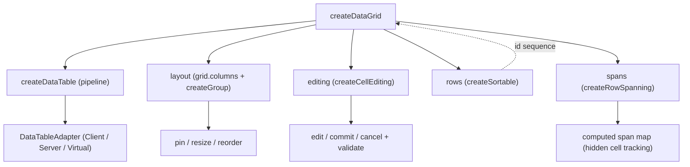
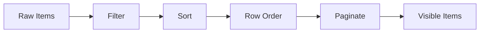

# createDataGrid

A headless data grid with column layout, cell editing, row ordering, and row spanning.

<DocsPageFeatures :frontmatter />

## Usage

Construct a grid, onboard columns through `grid.columns` with `size` percentages, then register rows to get column layout, search, sort, and pagination. Columns are onboarded — not passed as a factory option — so the surface matches [createDataTable](/composables/data/create-data-table) and columns can be added or removed at any time.

```ts collapse
import { createDataGrid } from '@vuetify/v0'

const grid = createDataGrid()

// Onboard columns through the inherited column registry
grid.columns.onboard([
  { id: 'name', title: 'Project', sortable: true, filterable: true, size: 22 },
  { id: 'status', title: 'Status', sortable: true, size: 12 },
  { id: 'assignee', title: 'Assignee', sortable: true, size: 16 },
  { id: 'progress', title: 'Progress', sortable: true, size: 14 },
  { id: 'budget', title: 'Budget', sortable: true, size: 10 },
])

// Register rows through the inherited registry surface
grid.onboard(projects.map(value => ({ id: value.id, value })))

// Inherited from createDataTable
grid.search('alice')
grid.sort.toggle('name')
grid.pagination.next()

// Grid-specific: column layout
grid.layout.columns.value    // ResolvedColumn[] with size, offset, pinned
grid.layout.pin('name', 'left')
grid.layout.resize('name', 5) // grow by 5%, neighbor shrinks
grid.layout.reorder(0, 2)     // move column 0 to position 2
grid.layout.hide('budget')    // exclude from the render set
grid.layout.reset()            // restore initial layout
```

## Architecture

`createDataGrid` composes [createDataTable](/composables/data/create-data-table) — which owns the data pipeline (filter, sort, paginate) — with four grid modules: column layout, cell editing, row ordering ([createSortable](/composables/data/create-sortable)), and row spanning. Columns and rows are both onboarded through registries (`grid.columns.onboard(...)`, `grid.onboard(...)`) rather than passed as options, the same shape as createDataTable. Per-column config (`size`, `pinned`, `editable`, `validate`, `span`) rides on each column ticket, so layout, editing, and spanning read it straight off `grid.columns` and pick up columns onboarded at any time.



| Module | Built on | Purpose |
| - | - | - |
| `table` (spread) | `createDataTable` | Search, sort, filter, paginate, total — all v-modeled through |
| `layout` | `grid.columns` + `createGroup` | Reads column order and config from the column registry; layers tri-region pinning, percentage sizing, delta-based resize, and visibility (`show` / `hide` / `toggle` / `allColumns`) on top |
| `editing` | internal factory | Click-to-edit lifecycle, per-column validation, dirty tracking |
| `rows` | `createSortable` | Post-sort row reordering, layered in the grid's `items` projection over the sorted rows before pagination — not inside the adapter |
| `spans` | computed map | Row span resolution and hidden-cell tracking |

## Reactivity

| Property | Reactive | Notes |
| - | :-: | - |
| `items` | <AppSuccessIcon /> | Final visible items (filter + sort + row order + paginate) |
| `allItems` | <AppSuccessIcon /> | Raw unprocessed items (projected from registered tickets) |
| `filteredItems` | <AppSuccessIcon /> | Items after filtering |
| `sortedItems` | <AppSuccessIcon /> | Items after filter + sort |
| `layout.columns` | <AppSuccessIcon /> | Resolved columns with size/offset (render set — visible only) |
| `layout.allColumns` | <AppSuccessIcon /> | Every column incl. hidden, each with a `visible` flag |
| `layout.pinned` | <AppSuccessIcon /> | Pin region breakdown |
| `editing.active` | <AppSuccessIcon /> | Currently edited cell |
| `editing.error` | <AppSuccessIcon /> | Validation error string |
| `editing.dirty` | <AppSuccessIcon /> | Uncommitted edits map |
| `rows.order` | <AppSuccessIcon /> | Current row ordering |
| `spans` | <AppSuccessIcon /> | Row span map |
| `headers` | <AppSuccessIcon /> | 2D header grid |
| `sort.columns` | <AppSuccessIcon /> | Current sort entries |
| `pagination.page` | <AppSuccessIcon /> | Current page |
| `total` | <AppSuccessIcon /> | Total row count |

## Adapters

The grid uses the standard data table adapters — row ordering is layered above the pipeline, not inside it, so any [DataTableAdapter](/composables/data/create-data-table#adapters) works without modification.

| Adapter | Pipeline | Use Case |
| - | - | - |
| `ClientDataTableAdapter` (default) | filter → sort → paginate | All processing client-side |
| [ServerGridAdapter](#servergridadapter) | pass-through | API-driven. Server handles everything |
| `VirtualDataTableAdapter` | filter → sort → (no paginate) | Large lists with createVirtual |



```ts
import { createDataGrid } from '@vuetify/v0'

const grid = createDataGrid()
// ClientDataTableAdapter is the default — no adapter option required

grid.columns.onboard(columns)
grid.onboard(employees.map(value => ({ id: value.id, value })))

// Row ordering — id-based
grid.rows.move(employees[0].id, 3)  // move that row to position 3
grid.rows.reset()                    // clear custom ordering
```

### ServerGridAdapter

Pass-through adapter for API-driven grids — the server owns sort, filter, and pagination. Re-exports the data table's `ServerDataTableAdapter`.

Onboard only the rows the server returns for the current page, and set `total` to the full server-side count. The grid renders that page on every page — onboard page 2's rows, advance `pagination.page`, and the grid surfaces them. Because the page window can sit past the locally-held rows, the grid orders the onboarded page in place rather than re-slicing it into emptiness.

```ts
import { createDataGrid, ServerGridAdapter } from '@vuetify/v0'

const grid = createDataGrid({
  adapter: new ServerGridAdapter({ total: totalCount, loading: isLoading }),
})

grid.columns.onboard(columns)

// On every page change, clear and onboard the rows the server returned for
// that page; keep `total` at the full server count. `grid.clear()` wipes
// the row registry — onboarded columns are untouched.
grid.clear()
grid.onboard(serverPage.map(value => ({ id: value.id, value })))
```

### Virtual scrolling

For large datasets, use the standard `VirtualDataTableAdapter`. Row ordering still applies; pagination slicing is skipped.

```ts
import { createDataGrid, VirtualDataTableAdapter } from '@vuetify/v0'

const grid = createDataGrid({
  adapter: new VirtualDataTableAdapter(),
})

grid.columns.onboard(columns)
grid.onboard(largeDataset.map(value => ({ id: value.id, value })))
```

## Examples

::: example
/composables/create-data-grid/pinned/PinnedGrid.vue
/composables/create-data-grid/pinned/columns.ts
/composables/create-data-grid/pinned/data.ts

### Column Pinning & Resizing

A financial data grid with 10 columns that requires horizontal scrolling. Ticker is pinned left, sector pinned right — the center columns scroll independently with drag-to-resize handles.

**File breakdown:**

| File | Role |
|------|------|
| `PinnedGrid.vue` | Financial spreadsheet with sticky pinned columns, resize handles, and formatted numbers |
| `columns.ts` | 10 columns with ticker pinned left, sector pinned right |
| `data.ts` | 12 stocks across Tech, Healthcare, Finance, Energy, and Consumer sectors |

**Key patterns:**

- `layout.pinned` splits columns into `left`, `scrollable`, and `right` regions with independent offsets
- `layout.resize(id, delta)` adjusts a column and its neighbor to maintain total width
- `layout.pin(id, position)` moves columns between regions dynamically
- `layout.reset()` restores initial sizes, order, and pins

:::

::: example
/composables/create-data-grid/editing/EditableGrid.vue
/composables/create-data-grid/editing/columns.ts
/composables/create-data-grid/editing/data.ts

### Cell Editing

An inventory management grid where editing is the primary workflow. Product name, price, and quantity are editable; invalid values show inline errors and block commit. Every committed edit pushes a `{ from, to }` entry onto a [createTimeline](/composables/registration/create-timeline), which powers the Undo / Redo buttons and the history log.

**File breakdown:**

| File | Role |
|------|------|
| `EditableGrid.vue` | Click-to-edit cells with primary tint on the active cell, Enter / Escape / Ctrl+Z / Ctrl+Y keyboard handling, and timeline-backed history log |
| `columns.ts` | Columns with `editable: true` and `validate` functions for name, price, and quantity |
| `data.ts` | 8 products across electronics, accessories, and peripherals |

**Key patterns:**

- `editing.edit(row, column)` activates a cell for editing — the cell paints `bg-primary/10` so the edit target is unmistakable
- `editing.commit(value)` validates first — only `true` from the validator allows the edit through
- `editing.error` persists until the value passes validation or the user cancels
- `onEdit` callback fires after a successful commit; the example pushes `{ row, column, from, to }` to a `createTimeline({ size: 50 })`
- `timeline.undo()` / `timeline.redo()` walk the history; the example applies the recovered `from` (undo) or `to` (redo) to the row in place

:::

::: example
/composables/create-data-grid/spanning/SpanningGrid.vue
/composables/create-data-grid/spanning/columns.ts
/composables/create-data-grid/spanning/data.ts

### Row Spanning

A portfolio holdings grid with two levels of row spanning — `account` spans every holding under an account, and `assetClass` spans every holding within an account-and-class pair. Spanned cells double as aggregation rows by showing the account or asset-class subtotal alongside the label.

**File breakdown:**

| File | Role |
|------|------|
| `SpanningGrid.vue` | Multi-level row spans, account / asset-class subtotals inside spanned cells, change-direction arrows |
| `columns.ts` | 6 columns: account, asset class, ticker, holding, value, change |
| `data.ts` | 11 holdings across 3 accounts (Wealth, Retirement, Trust) and 4 asset classes (Equities, Bonds, Real Estate, Cash) |

**Key patterns:**

- One `rowSpanning(item, column)` callback resolves both span levels by checking whether the next consecutive row shares the same `account` (and, for `assetClass`, the same account-and-class pair)
- `spans.value.get(rowId).get(columnId)` returns `{ rowSpan, hidden }` — render `<td>` only when `!hidden`, and set `:rowspan` from `rowSpan`
- Spanned cells display aggregate information (account total, asset-class subtotal) so the spanned row carries domain meaning beyond visual grouping
- Cells with `hidden: true` are skipped in rendering — the cell above covers them
- Spans are clamped to remaining visible rows and never cross page boundaries

:::

## Recipes

### Column Layout

Columns are onboarded through `grid.columns`, sized as percentages (0–100), and can be pinned, resized, reordered, and hidden.

```ts collapse
const grid = createDataGrid()

grid.columns.onboard([
  { id: 'name', size: 30, pinned: 'left', minSize: 15, maxSize: 50 },
  { id: 'email', size: 40 },
  { id: 'status', size: 30, pinned: 'right' },
])

grid.onboard(rows.map(value => ({ id: value.id, value })))

// Pin regions
grid.layout.pinned.value      // { left: [...], scrollable: [...], right: [...] }

// Resize — delta-based, neighbor absorbs inverse
grid.layout.resize('name', 5)  // name grows 5%, email shrinks 5%

// Reorder by display index
grid.layout.reorder(0, 2)

// Replace all sizes at once
grid.layout.distribute([40, 35, 25])

// Restore initial state
grid.layout.reset()
```

### Column Visibility

Hide and show columns without redistributing the remaining widths — headless, so the consumer rebalances via `distribute()` or CSS. `allColumns` surfaces every column (including hidden ones) each carrying a `visible` flag, which is exactly the shape a column chooser needs.

```ts collapse
const grid = createDataGrid()

grid.columns.onboard(columns)
grid.onboard(rows.map(value => ({ id: value.id, value })))

grid.layout.hide('email')          // exclude from the render set
grid.layout.show('email')          // restore it
grid.layout.toggle('email') // flip current visibility

grid.layout.columns.value     // render set — visible columns only
grid.layout.allColumns.value  // every column, each with a `visible` flag
```

### Cell Editing

Click-to-edit with validation. Does not mutate source data — commit fires a callback.

```ts collapse
const grid = createDataGrid({
  editing: {
    onEdit: (row, column, value, item) => {
      console.log(`Updated ${column} on row ${row} to ${value}`)
    },
  },
})

grid.columns.onboard([
  {
    id: 'email',
    editable: true,
    validate: (value, item) => {
      if (typeof value !== 'string' || !value.includes('@')) return 'Invalid email'
      return true
    },
  },
])

grid.onboard(rows.map(value => ({ id: value.id, value })))

grid.editing.edit(1, 'email')     // Activate cell
grid.editing.commit('new@email')  // Validate and save
grid.editing.cancel()             // Discard
grid.editing.active.value         // { row: 1, column: 'email' } | null
grid.editing.error.value          // 'Invalid email' | null
grid.editing.dirty                // Map of uncommitted edits (ShallowReactive, no .value)
```

### Row Ordering

Post-sort row ordering for drag-and-drop reordering. Backed by [createSortable](/composables/data/create-sortable), keyed by row id — index-based addressing was dropped because it drifts under reactive churn.

```ts collapse
const grid = createDataGrid()

grid.columns.onboard(columns)
grid.onboard(rows.map(value => ({ id: value.id, value })))

grid.rows.move(rowId, 3)       // Move the row with this id to position 3
grid.rows.order.value          // Current id sequence
grid.rows.reset()              // Clear custom ordering

// Ordering resets on sort change by default
// Set preserveRowOrder: true to keep ordering across sorts
```

### Row Spanning

Merge cells vertically using a spanning function.

```ts collapse
const grid = createDataGrid({
  rowSpanning: (item, column) => {
    if (column === 'department') return 3  // span 3 rows
    return 1
  },
})

grid.columns.onboard(columns)
grid.onboard(rows.map(value => ({ id: value.id, value })))

// Span map: item ID → column id → { rowSpan, hidden }
grid.spans.value.get(1)?.get('department')
// { rowSpan: 3, hidden: false }  — render with rowspan="3"

grid.spans.value.get(2)?.get('department')
// { rowSpan: 1, hidden: true }   — skip rendering (covered by row above)
```

### Nested Columns

Column definitions support nesting for grouped headers. Layout and data pipeline use leaf columns only.

```ts collapse
const grid = createDataGrid()

grid.columns.onboard([
  { id: 'name', title: 'Name', size: 30 },
  {
    id: 'contact',
    title: 'Contact',
    children: [
      { id: 'email', title: 'Email', size: 40 },
      { id: 'phone', title: 'Phone', size: 30 },
    ],
  },
])

grid.onboard(rows.map(value => ({ id: value.id, value })))

// headers: 2D array with colspan/rowspan for <thead> rendering
grid.headers.value
// [[{ id: 'name', rowspan: 2 }, { id: 'contact', colspan: 2 }],
//  [{ id: 'email' }, { id: 'phone' }]]
```

<DocsApi />
