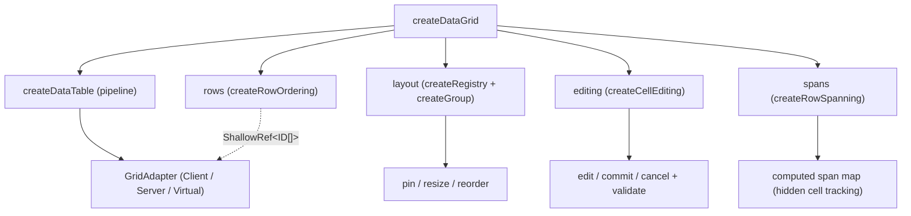
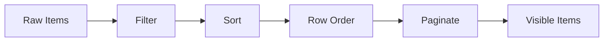

# createDataGrid

A data grid composable that layers column layout, cell editing, row ordering, and row spanning on top of the [createDataTable](/composables/data/create-data-table) pipeline.

<DocsPageFeatures :frontmatter />

## Usage

Pass `items` and `columns` with `size` percentages to get a grid with column layout management, search, sort, and pagination.

```ts collapse
import { createDataGrid } from '@vuetify/v0'

const grid = createDataGrid({
  items: projects,
  columns: [
    { key: 'name', title: 'Project', sortable: true, filterable: true, size: 22 },
    { key: 'status', title: 'Status', sortable: true, size: 12 },
    { key: 'assignee', title: 'Assignee', sortable: true, size: 16 },
    { key: 'progress', title: 'Progress', sortable: true, size: 14 },
    { key: 'budget', title: 'Budget', sortable: true, size: 10 },
  ],
})

// Inherited from createDataTable
grid.search('alice')
grid.sort.toggle('name')
grid.pagination.next()

// Grid-specific: column layout
grid.layout.columns.value    // ResolvedColumn[] with size, offset, pinned
grid.layout.pin('name', 'left')
grid.layout.resize('name', 5) // grow by 5%, neighbor shrinks
grid.layout.reorder(0, 2)     // move column 0 to position 2
grid.layout.reset()            // restore initial layout
```

::: example
/composables/create-data-grid/basic/BasicGrid.vue
/composables/create-data-grid/basic/columns.ts
/composables/create-data-grid/basic/data.ts
:::

## Architecture

`createDataGrid` is a composition of [createDataTable](/composables/data/create-data-table) plus four grid-specific modules. The table owns the data pipeline (filter, sort, paginate); the grid layers column layout, cell editing, row ordering, and row spanning on top. Row ordering is inserted between sort and pagination via a grid adapter so reorders survive sort changes when `preserveRowOrder` is set.



| Module | Built on | Purpose |
| - | - | - |
| `table` (spread) | `createDataTable` | Search, sort, filter, paginate, total — all v-modeled through |
| `layout` | `createRegistry` + `createGroup` | Column ordering, tri-region pinning, percentage sizing, delta-based resize |
| `editing` | internal factory | Click-to-edit lifecycle, per-column validation, dirty tracking |
| `rows` | `shallowRef<ID[]>` | Post-sort row reordering, inserted by the grid adapter pre-pagination |
| `spans` | computed map | Row span resolution and hidden-cell tracking |

## Adapters

Grid adapters extend the data table adapters with row ordering inserted between sort and pagination.

| Adapter | Pipeline | Use Case |
| - | - | - |
| [ClientGridAdapter](#clientgridadapter-default) | filter → sort → order → paginate | Default. All processing client-side |
| [ServerGridAdapter](#servergridadapter) | pass-through | API-driven. Server handles everything |
| [VirtualGridAdapter](#virtualgridadapter) | filter → sort → order → (no paginate) | Large lists with createVirtual |

### ClientGridAdapter (default)

Extends the client adapter with row ordering applied post-sort, pre-pagination.



```ts
import { createDataGrid } from '@vuetify/v0'

const grid = createDataGrid({
  items: employees,
  columns,
  // ClientGridAdapter is the default — not required
})

// Row ordering
grid.rows.move(0, 3)  // move row 0 to position 3
grid.rows.reset()      // clear custom ordering
```

### ServerGridAdapter

Pass-through adapter for API-driven grids. Re-exports the data table's `ServerAdapter`.

```ts
import { createDataGrid, ServerGridAdapter } from '@vuetify/v0'

const grid = createDataGrid({
  items: serverItems,
  columns,
  adapter: new ServerGridAdapter({ total: totalCount, loading: isLoading }),
})
```

### VirtualGridAdapter

Client-side filter/sort/order without pagination slicing. All items are passed to `createVirtual`.

```ts
import { createDataGrid, VirtualGridAdapter } from '@vuetify/v0'

const grid = createDataGrid({
  items: largeDataset,
  columns,
  adapter: new VirtualGridAdapter(grid.rows.order, 'id'),
})
```

## Recipes

### Column Layout

Columns are sized as percentages (0–100) and can be pinned, resized, and reordered.

```ts
const grid = createDataGrid({
  items,
  columns: [
    { key: 'name', size: 30, pinned: 'left', minSize: 15, maxSize: 50 },
    { key: 'email', size: 40 },
    { key: 'status', size: 30, pinned: 'right' },
  ],
})

// Pin regions
grid.layout.pinned.value      // { left: [...], scrollable: [...], right: [...] }

// Resize — delta-based, neighbor absorbs inverse
grid.layout.resize('name', 5)  // name grows 5%, email shrinks 5%

// Reorder by display index
grid.layout.reorder(0, 2)

// Replace all sizes at once
grid.layout.distribute([40, 35, 25])

// Restore initial state
grid.layout.reset()
```

### Cell Editing

Click-to-edit with validation. Does not mutate source data — commit fires a callback.

```ts
const grid = createDataGrid({
  items,
  columns: [
    {
      key: 'email',
      editable: true,
      validate: (value, item) => {
        if (typeof value !== 'string' || !value.includes('@')) return 'Invalid email'
        return true
      },
    },
  ],
  editing: {
    onEdit: (row, column, value, item) => {
      console.log(`Updated ${column} on row ${row} to ${value}`)
    },
  },
})

grid.editing.edit(1, 'email')     // Activate cell
grid.editing.commit('new@email')  // Validate and save
grid.editing.cancel()             // Discard
grid.editing.active.value         // { row: 1, column: 'email' } | null
grid.editing.error.value          // 'Invalid email' | null
grid.editing.dirty.value          // Map of uncommitted edits
```

### Row Ordering

Post-sort row ordering for drag-and-drop reordering.

```ts
const grid = createDataGrid({ items, columns })

grid.rows.move(0, 3)           // Move row from index 0 to 3
grid.rows.order.value          // Current ID-based order
grid.rows.reset()              // Clear custom ordering

// Ordering resets on sort change by default
// Set preserveRowOrder: true to keep ordering across sorts
```

### Row Spanning

Merge cells vertically using a spanning function.

```ts
const grid = createDataGrid({
  items,
  columns,
  rowSpanning: (item, column) => {
    if (column === 'department') return 3  // span 3 rows
    return 1
  },
})

// Span map: item ID → column key → { rowSpan, hidden }
grid.spans.value.get(1)?.get('department')
// { rowSpan: 3, hidden: false }  — render with rowspan="3"

grid.spans.value.get(2)?.get('department')
// { rowSpan: 1, hidden: true }   — skip rendering (covered by row above)
```

### Nested Columns

Column definitions support nesting for grouped headers. Layout and data pipeline use leaf columns only.

```ts
const grid = createDataGrid({
  items,
  columns: [
    { key: 'name', title: 'Name', size: 30 },
    {
      key: 'contact',
      title: 'Contact',
      children: [
        { key: 'email', title: 'Email', size: 40 },
        { key: 'phone', title: 'Phone', size: 30 },
      ],
    },
  ],
})

// headers: 2D array with colspan/rowspan for <thead> rendering
grid.headers.value
// [[{ key: 'name', rowspan: 2 }, { key: 'contact', colspan: 2 }],
//  [{ key: 'email' }, { key: 'phone' }]]
```

## Reactivity

| Property | Reactive | Notes |
| - | :-: | - |
| `items` | <AppSuccessIcon /> | Final visible items (paginated) |
| `allItems` | <AppSuccessIcon /> | Raw unprocessed items |
| `filteredItems` | <AppSuccessIcon /> | Items after filtering |
| `sortedItems` | <AppSuccessIcon /> | Items after filter + sort + order |
| `layout.columns` | <AppSuccessIcon /> | Resolved columns with size/offset |
| `layout.pinned` | <AppSuccessIcon /> | Pin region breakdown |
| `editing.active` | <AppSuccessIcon /> | Currently edited cell |
| `editing.error` | <AppSuccessIcon /> | Validation error string |
| `editing.dirty` | <AppSuccessIcon /> | Uncommitted edits map |
| `rows.order` | <AppSuccessIcon /> | Current row ordering |
| `spans` | <AppSuccessIcon /> | Row span map |
| `headers` | <AppSuccessIcon /> | 2D header grid |
| `sort.columns` | <AppSuccessIcon /> | Current sort entries |
| `pagination.page` | <AppSuccessIcon /> | Current page |
| `total` | <AppSuccessIcon /> | Total row count |

## Examples

::: example
/composables/create-data-grid/pinned/PinnedGrid.vue
/composables/create-data-grid/pinned/columns.ts
/composables/create-data-grid/pinned/data.ts

### Column Pinning & Resizing

A financial data grid with 10 columns that requires horizontal scrolling. Ticker is pinned left, sector pinned right — the center columns scroll independently with drag-to-resize handles.

**File breakdown:**

| File | Role |
|------|------|
| `PinnedGrid.vue` | Financial spreadsheet with sticky pinned columns, resize handles, and formatted numbers |
| `columns.ts` | 10 columns with ticker pinned left, sector pinned right |
| `data.ts` | 12 stocks across Tech, Healthcare, Finance, Energy, and Consumer sectors |

**Key patterns:**

- `layout.pinned` splits columns into `left`, `scrollable`, and `right` regions with independent offsets
- `layout.resize(key, delta)` adjusts a column and its neighbor to maintain total width
- `layout.pin(key, position)` moves columns between regions dynamically
- `layout.reset()` restores initial sizes, order, and pins

:::

::: example
/composables/create-data-grid/editing/EditableGrid.vue
/composables/create-data-grid/editing/columns.ts
/composables/create-data-grid/editing/data.ts

### Cell Editing

An inventory management grid where editing is the primary workflow. Product name, price, and quantity are editable — invalid values show inline errors and block commit.

**File breakdown:**

| File | Role |
|------|------|
| `EditableGrid.vue` | Click-to-edit cells with focus ring, Enter/Escape keyboard handling, and edit history log |
| `columns.ts` | Columns with `editable: true` and `validate` functions for name, price, and quantity |
| `data.ts` | 8 products across electronics, accessories, and peripherals |

**Key patterns:**

- `editing.edit(row, column)` activates a cell for editing
- `editing.commit(value)` validates first — only `true` from the validator allows the edit through
- `editing.error` persists until the value passes validation or the user cancels
- `onEdit` callback receives the full item for context-aware updates

:::

::: example
/composables/create-data-grid/spanning/SpanningGrid.vue
/composables/create-data-grid/spanning/columns.ts
/composables/create-data-grid/spanning/data.ts

### Row Spanning

A team schedule grid where department cells span all members in that department. Day columns show availability status with color-coded indicators.

**File breakdown:**

| File | Role |
|------|------|
| `SpanningGrid.vue` | Schedule grid with department spanning and color-coded day cells |
| `columns.ts` | Department, member, and Mon–Fri day columns |
| `data.ts` | 10 team members across 3 departments with weekly availability |

**Key patterns:**

- `rowSpanning(item, column)` returns the number of rows a cell should span
- `spans.value` provides a Map of `rowID → column → { rowSpan, hidden }`
- Cells with `hidden: true` are skipped in rendering — the cell above covers them
- Spans are clamped to remaining visible rows and never cross page boundaries

:::

<DocsApi />
