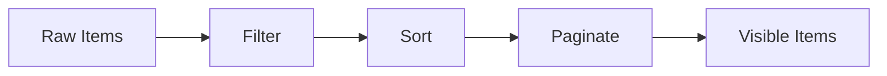
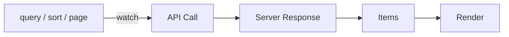
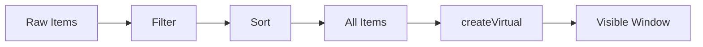

# createDataTable

A composable data table that composes v0 primitives into a complete data pipeline with sorting, filtering, pagination, selection, expansion, and grouping.

<DocsPageFeatures :frontmatter />

## Usage

Pass `items` and `columns` to get a fully reactive data table with search, sort, and pagination ready to use.

```ts collapse
import { createDataTable } from '@vuetify/v0'

const table = createDataTable({
  items: users,
  columns: [
    { key: 'name', title: 'Name', sortable: true, filterable: true },
    { key: 'email', title: 'Email', sortable: true, filterable: true },
    { key: 'role', title: 'Role', sortable: true },
  ],
})

// Search
table.search('john')
console.log(table.query.value) // 'john'

// Sort — toggle cycles: none → asc → desc → none
table.sort.toggle('name')

// Paginate
table.pagination.next()

// Select rows
table.selection.toggle('user-1')
```

::: example
/composables/create-data-table/basic/BasicTable.vue
/composables/create-data-table/basic/columns.ts
/composables/create-data-table/basic/data.ts
:::

## Adapters

Adapters control the data pipeline strategy. Pass one via the `adapter` option.

| Adapter | Pipeline | Use Case |
| - | - | - |
| [ClientAdapter](#clientadapter-default) | filter → sort → paginate | Default. All processing client-side |
| [ServerAdapter](#serveradapter) | pass-through | API-driven. Server handles filter/sort/paginate |
| [VirtualAdapter](#virtualadapter) | filter → sort → (no paginate) | Large lists rendered with createVirtual |

### ClientAdapter (default)

All processing happens client-side. No constructor options — just use `createDataTable` without an `adapter` option.



**Behavior:**
- Resets to page 1 on filter or sort changes
- `total` reflects the sorted item count
- No `loading` or `error` state (synchronous pipeline)

```ts
import { createDataTable } from '@vuetify/v0'
import { ClientAdapter } from '@vuetify/v0/data-table'

const table = createDataTable({
  items: users,
  columns,
  adapter: new ClientAdapter(), // default — not required
})
```

### ServerAdapter

Pass-through adapter for API-driven tables. The server handles all filtering, sorting, and pagination — the client only renders what it receives.



**Constructor options:**

| Option | Type | Required | Description |
| - | - | :-: | - |
| `total` | `MaybeRefOrGetter<number>` | Yes | Total item count on the server (drives pagination) |
| `loading` | `MaybeRefOrGetter<boolean>` | No | Loading state (e.g., from `useFetch`) |
| `error` | `MaybeRefOrGetter<Error \| null>` | No | Error state from API calls |

**Behavior:**
- Resets to page 1 on filter or sort changes
- `allItems`, `filteredItems`, `sortedItems`, and `items` all point to the same source (no client-side processing)
- Exposes `loading` and `error` via `table.loading` and `table.error`

```ts
import { createDataTable } from '@vuetify/v0'
import { ServerAdapter } from '@vuetify/v0/data-table'

const table = createDataTable({
  items: serverItems,
  columns,
  adapter: new ServerAdapter({
    total: totalCount,
    loading: isLoading,
    error: fetchError,
  }),
})

// Watch query/sort/page to trigger API calls
watch(
  [table.query, table.sort.columns, table.pagination.page],
  () => fetchData()
)
```

### VirtualAdapter

Client-side filtering and sorting without pagination slicing. All sorted items are returned for use with `createVirtual` at the rendering layer.



**Behavior:**
- No constructor options — instantiate with `new VirtualAdapter()`
- Resets on filter or sort changes
- No `loading` or `error` state

```ts
import { createDataTable, createVirtual } from '@vuetify/v0'
import { VirtualAdapter } from '@vuetify/v0/data-table'

const table = createDataTable({
  items: largeDataset,
  columns,
  adapter: new VirtualAdapter(),
})

// Wrap table.items with createVirtual for rendering
const virtual = createVirtual(table.items, { itemHeight: 40 })
```

## Features

### Sorting

Toggle sort cycles through directions. Configure with `mandate` and `firstSortOrder`.

```ts
const table = createDataTable({
  items,
  columns: [
    { key: 'name', sortable: true },
    { key: 'age', sortable: true, sort: (a, b) => Number(a) - Number(b) },
  ],
  mandate: true,             // asc → desc → asc (never clears)
  firstSortOrder: 'desc',   // First click sorts descending
  sortMultiple: true,        // Enable multi-column sort
})

table.sort.toggle('name')
table.sort.direction('name')     // 'asc' | 'desc' | 'none'
table.sort.priority('name')      // 0-based index, or -1
table.sort.columns.value         // [{ key: 'name', direction: 'asc' }]
table.sort.order                 // ['name'] — multi-sort priority array
table.sort.reset()               // Clear all sort state
```

### Filtering

Search filters across all `filterable` columns. Use per-column `filter` for custom logic.

```ts
const table = createDataTable({
  items,
  columns: [
    { key: 'name', filterable: true },
    { key: 'status', filterable: true, filter: (value, query) => {
      return String(value).toLowerCase() === query.toLowerCase()
    }},
  ],
})

table.search('active')
```

### Selection

Control row selection with the `selectStrategy` option.

| Strategy | Behavior |
| - | - |
| `'single'` | Only one row selected at a time |
| `'page'` | `selectAll`/`toggleAll` operate on visible page (default) |
| `'all'` | `selectAll`/`toggleAll` operate on all filtered items |

```ts
const table = createDataTable({
  items,
  columns,
  selectStrategy: 'page',
  itemSelectable: 'canSelect',  // Disable selection for rows where canSelect is falsy
})

table.selection.toggle('row-1')
table.selection.isSelected('row-1')     // true
table.selection.isSelectable('row-1')   // true (based on itemSelectable)
table.selection.toggleAll()
table.selection.isAllSelected.value     // true
table.selection.isMixed.value           // false
```

### Expansion

Expand rows to reveal detail content.

```ts
const table = createDataTable({
  items,
  columns,
  expandMultiple: false,  // Only one row expanded at a time
})

table.expansion.toggle('row-1')
table.expansion.isExpanded('row-1')  // true
table.expansion.expandAll()
table.expansion.collapseAll()
```

### Grouping

Group rows by a column value.

```ts
const table = createDataTable({
  items,
  columns,
  groupBy: 'department',
  enroll: true,  // Auto-open all groups
})

table.grouping.groups.value  // [{ key: 'Engineering', value: 'Engineering', items: [...] }]
table.grouping.toggle('Engineering')
table.grouping.isOpen('Engineering')
table.grouping.openAll()
table.grouping.closeAll()
```

## Reactivity

| Property | Reactive | Notes |
| - | :-: | - |
| `items` | <AppSuccessIcon /> | Computed — final visible items |
| `allItems` | <AppSuccessIcon /> | Computed — raw unprocessed items |
| `filteredItems` | <AppSuccessIcon /> | Computed — items after filtering |
| `sortedItems` | <AppSuccessIcon /> | Computed — items after filter + sort |
| `query` | <AppSuccessIcon /> | ShallowRef — current search query (readonly) |
| `sort.columns` | <AppSuccessIcon /> | Computed — current sort entries |
| `pagination.page` | <AppSuccessIcon /> | ShallowRef — current page |
| `pagination.items` | <AppSuccessIcon /> | Computed — visible page buttons |
| `selection.isAllSelected` | <AppSuccessIcon /> | Computed — all in scope selected |
| `selection.isMixed` | <AppSuccessIcon /> | Computed — some but not all selected |
| `grouping.groups` | <AppSuccessIcon /> | Computed — grouped items |
| `total` | <AppSuccessIcon /> | Computed — total row count |
| `loading` | <AppSuccessIcon /> | Computed — adapter loading state |
| `error` | <AppSuccessIcon /> | Computed — adapter error state |

## Examples

::: example
/composables/create-data-table/server/ServerTable.vue
/composables/create-data-table/server/columns.ts
/composables/create-data-table/server/api.ts

### Server Adapter

A data table backed by a simulated API. The `ServerAdapter` delegates all filtering, sorting, and pagination to the server — the client only renders what it receives.

**File breakdown:**

| File | Role |
|------|------|
| `ServerTable.vue` | Table with loading state, search, sort, and pagination |
| `columns.ts` | Column definitions |
| `api.ts` | Simulated server with `fetchUsers()` that filters/sorts/paginates a dataset |

**Key patterns:**

- `ServerAdapter` receives `total` and `loading` refs so the table knows the full dataset size without holding it client-side
- A `watch` on `[table.query, table.sort.columns, table.pagination.page]` triggers `fetchUsers()` whenever the user interacts
- The simulated API applies search, sort, and pagination server-side, returning only the current page of results

:::

::: example
/composables/create-data-table/features/FeaturesTable.vue
/composables/create-data-table/features/columns.ts
/composables/create-data-table/features/data.ts

### Grouping, Selection & Custom Sort

A grouped table with row selection, custom numeric sort, and salary range filtering. Rows with `active: false` cannot be selected.

**File breakdown:**

| File | Role |
|------|------|
| `FeaturesTable.vue` | Grouped table with checkboxes, collapsible groups, and status badges |
| `columns.ts` | Columns with custom `sort` (numeric) and `filter` (range queries like `>100000`) |
| `data.ts` | Employee dataset with departments, salaries, and active status |

**Key patterns:**

- `groupBy: 'department'` groups rows automatically — `enroll: true` opens all groups on creation
- `table.grouping.isOpen(key)` checks visibility, `toggle(key)` flips it
- `itemSelectable: 'active'` disables checkboxes for inactive employees
- `mandate: true` ensures a sort column is always active (never clears to unsorted)

:::

::: example
/composables/create-data-table/virtual/VirtualTable.vue
/composables/create-data-table/virtual/columns.ts
/composables/create-data-table/virtual/data.ts

### Virtual Scrolling

A table with 1,000 rows rendered through `createVirtual`. The `VirtualAdapter` skips pagination — all filtered/sorted items are passed directly to the virtual scroller.

**File breakdown:**

| File | Role |
|------|------|
| `VirtualTable.vue` | Virtual-scrolled table with sticky header and sort controls |
| `columns.ts` | Column definitions with custom numeric sort for the score column |
| `data.ts` | Generator that creates 1,000 sample user records |

**Key patterns:**

- `VirtualAdapter` performs client-side filter and sort but returns all items (no pagination slicing)
- `createVirtual(table.items, { itemHeight: 40 })` handles virtualization at the rendering layer
- The sticky `<thead>` stays visible while scrolling through virtual rows
- Stats show rendered vs. filtered vs. total counts to demonstrate the virtual window

:::

<DocsApi />
