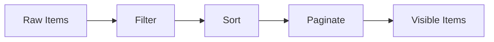
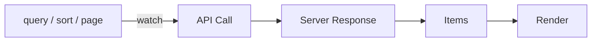
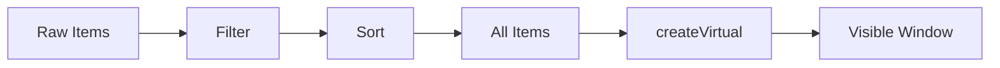
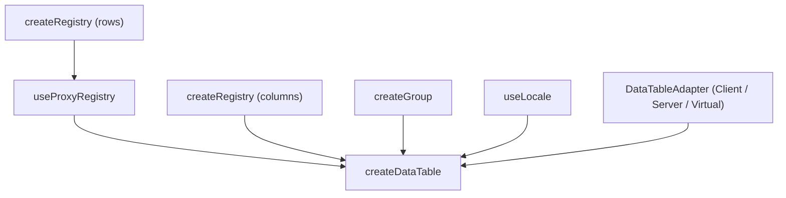

# createDataTable

Composable data table built on v0 primitives. Composes sorting, filtering, pagination, selection, and expansion into a single pipeline.

<DocsPageFeatures :frontmatter />

## Usage

Construct the table, then register columns via `table.columns.onboard` and rows via `table.onboard`. Each row becomes a ticket keyed by the `id` you supply — that id is what `selection.toggle`, `expansion.toggle`, and `unregister` accept. Columns are keyed by their own `id` field; that is what `sort.toggle` and the filter pipeline match against.

```ts collapse
import { createDataTable } from '@vuetify/v0'

const table = createDataTable<User>()

table.columns.onboard([
  { id: 'name', title: 'Name', sortable: true, filterable: true },
  { id: 'email', title: 'Email', sortable: true, filterable: true },
  { id: 'role', title: 'Role', sortable: true },
])

table.onboard(users.map(value => ({ id: value.id, value })))

// Search
table.search('john')
console.log(table.query.value) // 'john'

// Sort — toggle cycles: none → asc → desc → none
table.sort.toggle('name')

// Paginate
table.pagination.next()

// Select rows
table.selection.toggle('user-1')

// Add / remove / update rows after setup
const ticket = table.register({ id: 'user-99', value: user })
ticket.unregister()           // remove via returned ticket
table.unregister('user-1')    // remove by id
table.upsert('user-2', { value: updated })  // replace a row's value
table.clear()                 // wipe all rows

// Add / remove columns after setup
table.columns.register({ id: 'actions', title: '' })
table.columns.unregister('actions')
table.columns.clear()
```

## Adapters

Adapters control the data pipeline strategy. Pass one via the `adapter` option.

| Adapter | Pipeline | Use Case |
| - | - | - |
| [ClientDataTableAdapter](#clientdatatableadapter-default) | filter → sort → paginate | Default. All processing client-side |
| [ServerDataTableAdapter](#serverdatatableadapter) | pass-through | API-driven. Server handles filter/sort/paginate |
| [VirtualDataTableAdapter](#virtualdatatableadapter) | filter → sort → (no paginate) | Large lists rendered with createVirtual |

### ClientDataTableAdapter (default)

All processing happens client-side. No constructor options — just use `createDataTable` without an `adapter` option.


```mermaid
graph LR
  A[Raw Items] --> B[Filter] --> C[Sort] --> D[Paginate] --> E[Visible Items]
```

**Behavior:**
- Resets to page 1 on filter or sort changes
- `total` reflects the sorted item count
- No `loading` or `error` state (synchronous pipeline)

```ts
import { createDataTable } from '@vuetify/v0'
import { ClientDataTableAdapter } from '@vuetify/v0/data-table/adapters/client'

const table = createDataTable<User>({
  adapter: new ClientDataTableAdapter(), // default — not required
})

table.columns.onboard(columns)
table.onboard(users.map(value => ({ id: value.id, value })))
```

### ServerDataTableAdapter

Pass-through adapter for API-driven tables. The server handles all filtering, sorting, and pagination — the client only renders what it receives.


```mermaid
graph LR
  A[Server Response] --> B[Items] --> C[Render]
  D[query / sort / page] -->|watch| E[API Call] --> A
```

**Constructor options:**

| Option | Type | Required | Description |
| - | - | :-: | - |
| `total` | `MaybeRefOrGetter<number>` | Yes | Total item count on the server (drives pagination) |
| `loading` | `MaybeRefOrGetter<boolean>` | No | Loading state (e.g., from `useFetch`) |
| `error` | `MaybeRefOrGetter<Error \| null>` | No | Error state from API calls |

**Behavior:**
- Resets to page 1 on filter or sort changes
- `allItems`, `filteredItems`, `sortedItems`, and `items` all point to the same source (no client-side processing)
- Exposes `loading` and `error` via `table.loading` and `table.error`

Server-backed tables don't hold a long-lived `items` ref — instead, the fetch handler calls `table.clear()` and `table.onboard(...)` whenever a new page of results comes back. The registry becomes the single source of truth for what the table renders, and the adapter's `total` / `loading` / `error` refs drive pagination and UI state.

```ts
import { createDataTable } from '@vuetify/v0'
import { ServerDataTableAdapter } from '@vuetify/v0/data-table/adapters/server'

const total = shallowRef(0)
const loading = shallowRef(false)
const error = shallowRef<Error | null>(null)

const table = createDataTable<User>({
  adapter: new ServerDataTableAdapter({ total, loading, error }),
})

table.columns.onboard(columns)

async function load () {
  loading.value = true
  const result = await fetchPage(/* query, sorts, page */)
  total.value = result.total
  table.clear()
  table.onboard(result.items.map(value => ({ id: value.id, value })))
  loading.value = false
}

// Watch query/sort/page to trigger API calls
watch(
  [table.query, table.sort.columns, table.pagination.page],
  () => load(),
  { immediate: true },
)
```

### VirtualDataTableAdapter

Client-side filtering and sorting without pagination slicing. All sorted items are returned for use with `createVirtual` at the rendering layer.


```mermaid
graph LR
  A[Raw Items] --> B[Filter] --> C[Sort] --> D[All Items] --> E[createVirtual] --> F[Visible Window]
```

**Behavior:**
- No constructor options — instantiate with `new VirtualDataTableAdapter()`
- Resets on filter or sort changes
- No `loading` or `error` state

```ts
import { createDataTable, createVirtual } from '@vuetify/v0'
import { VirtualDataTableAdapter } from '@vuetify/v0/data-table/adapters/virtual'

const table = createDataTable<User>({
  adapter: new VirtualDataTableAdapter(),
})

table.columns.onboard(columns)
table.onboard(rows.map(value => ({ id: value.id, value })))

// Wrap table.items with createVirtual for rendering
const virtual = createVirtual(table.items, { itemHeight: 40 })
```

> [!TIP]
> Rows **and** columns are registered through the registry surface, not passed as factory options. Call `onboard` for bulk registration or `register` for one entry at a time — for rows the ticket id IS the row identifier, so selection, expansion, and grouping all key off it; for columns the `id` field is what `sort.toggle`, the filter pipeline, and the adapter all key off.
>
> ```ts
> // Columns (live under table.columns)
> table.columns.onboard([
>   { id: 'name', title: 'Name', sortable: true },
>   { id: 'email', title: 'Email', filterable: true },
> ])
>
> // Rows (top-level — bulk)
> table.onboard(rows.map(value => ({ id: value.id, value })))
>
> // Rows — one at a time
> table.register({ id, value })
> ```

## Architecture

`createDataTable` composes independent primitives rather than extending a selection chain. Rows live in a non-reactive `createRegistry` surfaced reactively through `useProxyRegistry`, while columns live in a second, reactive registry. Sort state rides `createGroup`'s tri-state (selected = ascending, mixed = descending, unselected = none), `useLocale` supplies the collation locale, and the `DataTableAdapter` runs the filter → sort → paginate pipeline — the client adapter in memory, the server and virtual adapters against a fetcher.


```mermaid "createDataTable Architecture"
flowchart TD
  Rows["createRegistry (rows)"]
  Proxy["useProxyRegistry"]
  Columns["createRegistry (columns)"]
  Group["createGroup"]
  Locale["useLocale"]
  Adapter["DataTableAdapter (Client / Server / Virtual)"]
  CDT["createDataTable"]:::primary

  Rows --> Proxy
  Proxy --> CDT
  Columns --> CDT
  Group --> CDT
  Locale --> CDT
  Adapter --> CDT
```

## Reactivity

| Property / Method | Reactive | Notes |
| - | :-: | - |
| `items` | <AppSuccessIcon /> | Computed — final visible items (projected from registry tickets) |
| `allItems` | <AppSuccessIcon /> | Computed — every registered row, unfiltered/unsorted |
| `filteredItems` | <AppSuccessIcon /> | Computed — items after filtering |
| `sortedItems` | <AppSuccessIcon /> | Computed — items after filter + sort |
| `columns` | <AppSuccessIcon /> | RegistryContext — reactive column registry (`columns.values()` drives `leaves` and `headers`) |
| `leaves` | <AppSuccessIcon /> | Computed — leaf columns (no children) used by the data pipeline |
| `headers` | <AppSuccessIcon /> | Computed — 2D header grid with colspan/rowspan for rendering thead |
| `query` | <AppSuccessIcon /> | ShallowRef — current search query (readonly) |
| `sort.columns` | <AppSuccessIcon /> | Computed — current sort entries |
| `pagination.page` | <AppSuccessIcon /> | ShallowRef — current page |
| `pagination.items` | <AppSuccessIcon /> | Computed — visible page buttons |
| `selection.selectedIds` | <AppSuccessIcon /> | `shallowReactive(Set)` — currently selected row IDs |
| `selection.isAllSelected` | <AppSuccessIcon /> | Computed — all in scope selected |
| `selection.isMixed` | <AppSuccessIcon /> | Computed — some but not all selected |
| `expansion.expandedIds` | <AppSuccessIcon /> | `shallowReactive(Set)` — currently expanded row IDs |
| `grouping.groups` | <AppSuccessIcon /> | Computed — grouped items |
| `total` | <AppSuccessIcon /> | Computed — total row count |
| `loading` | <AppSuccessIcon /> | Computed — adapter loading state |
| `error` | <AppSuccessIcon /> | Computed — adapter error state |
| `register(input)` | — | Method — adds a single row ticket, mutates the row registry (downstream refs recompute) |
| `onboard(inputs)` | — | Method — bulk register rows |
| `unregister(id)` | — | Method — removes a row ticket by id |
| `upsert(id, patch)` | — | Method — replaces a row's value; the pipeline re-runs. The sanctioned row-update path — mutating `ticket.value` in place does not re-run the pipeline |
| `clear()` | — | Method — wipes every row ticket (useful before re-fetching server data) |
| `columns.register(input)` | — | Method — adds a single column ticket (reactively updates `leaves`, `headers`, sort group, filter pipeline) |
| `columns.onboard(inputs)` | — | Method — bulk register columns |
| `columns.unregister(id)` | — | Method — removes a column by id; drops it from sort state |
| `columns.clear()` | — | Method — wipes every column |

The row registry itself is non-reactive for performance — registering ten thousand rows allocates no per-row proxies. Mutations propagate to the pipeline through registry events, so always iterate rows via `items` / `allItems` (or the other pipeline refs) in templates and computeds, never via raw `table.values()`, and update a row via `table.upsert(id, { value })` rather than mutating the row object in place. The column registry stays fully reactive.

## Examples

::: gn-example
/composables/create-data-table/basic/BasicTable.vue
/composables/create-data-table/basic/columns.ts
/composables/create-data-table/basic/data.ts

### Basic Data Table

A three-column table of 8 users — name, email, role — with a live search input, sortable column headers, and prev/next pagination at 5 rows per page.

`columns.ts` marks all three columns `sortable: true` and the name and email columns `filterable: true`. The table is created with `{ pagination: { itemsPerPage: 5 } }`, then rows are onboarded in one `table.onboard(users.map(...))` call. From that point, the template reads `table.items.value` directly — the pipeline (filter → sort → paginate) runs automatically on every `table.search()` or `table.sort.toggle()` call.

The sort header uses a local `arrow()` helper that reads `table.sort.direction(id)` to pick `↑`, `↓`, or an empty string. No external sort-state variable is needed; the table owns it. The pagination row reads `table.pagination.isFirst.value` and `table.pagination.isLast.value` to disable the boundary buttons, and reads `table.pagination.page.value` and `table.pagination.pages` for the `n / total` counter.

| File | Role |
|------|------|
| `BasicTable.vue` | Table with search input, sortable headers, and pagination |
| `columns.ts` | Column definitions — sortable and filterable flags per column |
| `data.ts` | 8-user dataset with id, name, email, and role |

:::

::: gn-example
/composables/create-data-table/server/ServerTable.vue
/composables/create-data-table/server/columns.ts
/composables/create-data-table/server/api.ts

### Server Adapter

A data table backed by a simulated API. The `ServerDataTableAdapter` delegates all filtering, sorting, and pagination to the server — the client only renders what it receives.

| File | Role |
|------|------|
| `ServerTable.vue` | Table with loading state, search, sort, and pagination |
| `columns.ts` | Column definitions |
| `api.ts` | Simulated server with `fetchPage()` that filters/sorts/paginates a dataset |

The key difference from the client-side adapter is that the client never holds the full dataset. Instead, `total` and `loading` refs are passed to `ServerDataTableAdapter` so the table knows the full dataset size for pagination without materializing it locally. A `watch` on `[table.query, table.sort.columns, table.pagination.page]` fires `fetchPage()` whenever the user interacts — the handler calls `table.clear()` then `table.onboard(page.items)` to swap in the new result set. The simulated `api.ts` applies search, sort, and pagination server-side, returning only the current page.

:::

::: gn-example
/composables/create-data-table/features/FeaturesTable.vue
/composables/create-data-table/features/columns.ts
/composables/create-data-table/features/data.ts

### Grouping, Selection & Custom Sort

A grouped table with row selection, custom numeric sort, and salary range filtering. Rows with `active: false` cannot be selected.

| File | Role |
|------|------|
| `FeaturesTable.vue` | Grouped table with checkboxes, collapsible groups, and status badges |
| `columns.ts` | Columns with custom `sort` (numeric) and `filter` (range queries like `>100000`) |
| `data.ts` | Employee dataset with departments, salaries, and active status |

`groupBy: 'department'` groups rows automatically — `openAll: true` opens all groups on creation. `table.grouping.isOpen(key)` checks visibility and `toggle(key)` flips it, so collapsible group rows render with no extra state variable. `itemSelectable: 'active'` disables checkboxes for inactive employees — the field name is a key into the row's value object and the table reads it directly. `mandate: true` ensures a sort column is always active (the sort never clears to unsorted on repeated clicks). The salary column's custom `filter` function parses range operators (`>100000`, `<80000`) so the search box doubles as a range query field.

:::

::: gn-example
/composables/create-data-table/virtual/VirtualTable.vue
/composables/create-data-table/virtual/columns.ts
/composables/create-data-table/virtual/data.ts

### Virtual Scrolling

A table with 1,000 rows rendered through `createVirtual`. The `VirtualDataTableAdapter` skips pagination — all filtered/sorted items are passed directly to the virtual scroller.

| File | Role |
|------|------|
| `VirtualTable.vue` | Virtual-scrolled table with sticky header and sort controls |
| `columns.ts` | Column definitions with custom numeric sort for the score column |
| `data.ts` | Generator that creates 1,000 sample user records |

`VirtualDataTableAdapter` performs client-side filter and sort but skips pagination slicing — `table.items` holds all sorted rows. `createVirtual(table.items, { itemHeight: 40 })` then virtualizes at the rendering layer: only the rows in the current viewport window are mounted. The sticky `<thead>` stays visible while scrolling through virtual rows. The stats line shows rendered vs. filtered vs. total counts so the windowing effect is visible. For larger datasets at variable row heights, see `resize(index, height)` in [createVirtual](/composables/data/create-virtual).

:::

## Recipes

### Sorting

Toggle sort cycles through directions. Configure with `mandate` and `firstSortOrder`.

```ts
const table = createDataTable<User>({
  mandate: true,             // asc → desc → asc (never clears)
  firstSortOrder: 'desc',   // First click sorts descending
  sortMultiple: true,        // Enable multi-column sort
})

table.columns.onboard([
  { id: 'name', sortable: true },
  { id: 'age', sortable: true, sort: (a, b) => Number(a) - Number(b) },
])

table.onboard(items.map(value => ({ id: value.id, value })))

table.sort.toggle('name')
table.sort.direction('name')     // 'asc' | 'desc' | 'none'
table.sort.priority('name')      // 0-based index, or -1
table.sort.columns.value         // [{ key: 'name', direction: 'asc' }]
table.sort.order                 // ['name'] — multi-sort priority array
table.sort.reset()               // Clear all sort state
```

### Filtering

Search filters across all `filterable` columns. Use per-column `filter` for custom logic.

```ts
const table = createDataTable<User>()

table.columns.onboard([
  { id: 'name', filterable: true },
  { id: 'status', filterable: true, filter: (value, query) => {
    return String(value).toLowerCase() === query.toLowerCase()
  } },
])

table.onboard(items.map(value => ({ id: value.id, value })))

table.search('active')
```

### Selection

Control row selection with the `selectStrategy` option.

| Strategy | Behavior |
| - | - |
| `'single'` | Only one row selected at a time |
| `'page'` | `selectAll`/`toggleAll` operate on visible page (default) |
| `'all'` | `selectAll`/`toggleAll` operate on all filtered items |

```ts
const table = createDataTable<User>({
  selectStrategy: 'page',
  itemSelectable: 'canSelect',  // Disable selection for rows where canSelect is falsy
})

table.columns.onboard(columns)
table.onboard(items.map(value => ({ id: value.id, value })))

table.selection.toggle('row-1')
table.selection.isSelected('row-1')     // true
table.selection.isSelectable('row-1')   // true (based on itemSelectable)
table.selection.toggleAll()
table.selection.isAllSelected.value     // true
table.selection.isMixed.value           // false
```

### Expansion

Expand rows to reveal detail content.

```ts
const table = createDataTable<User>({
  expandMultiple: false,  // Only one row expanded at a time
})

table.columns.onboard(columns)
table.onboard(items.map(value => ({ id: value.id, value })))

table.expansion.toggle('row-1')
table.expansion.isExpanded('row-1')  // true
table.expansion.expandAll()
table.expansion.collapseAll()
```

### Dynamic columns

Columns are a registry, so they can be added, removed, or replaced at any point — not just at construction. `leaves`, `headers`, the sort group, and the filter pipeline all react to column changes. Use this for user-toggled visibility, plugin-injected columns, or columns that arrive asynchronously with their schema.

```ts
const table = createDataTable<User>()

// Initial columns
table.columns.onboard([
  { id: 'name', title: 'Name', sortable: true },
  { id: 'email', title: 'Email' },
])

// Later: add a column at runtime
table.columns.register({ id: 'actions', title: '' })

// Remove a column — drops it from headers, leaves, and sort state
table.columns.unregister('email')

// Replace the column set entirely
table.columns.clear()
table.columns.onboard(nextColumns)
```

### Grouping

Group rows by a column value.

```ts
const table = createDataTable<Employee>({
  groupBy: 'department',
  openAll: true,  // Auto-open all groups
})

table.columns.onboard(columns)
table.onboard(items.map(value => ({ id: value.id, value })))

table.grouping.groups.value  // [{ key: 'Engineering', value: 'Engineering', items: [...] }]
table.grouping.toggle('Engineering')
table.grouping.isOpen('Engineering')
table.grouping.openAll()
table.grouping.closeAll()
```

## FAQ

::: faq

??? Which adapter should I use?

The default `ClientDataTableAdapter` runs filter, sort, and paginate client-side. Switch to `ServerDataTableAdapter` when your API owns those operations, or `VirtualDataTableAdapter` to skip pagination and feed all sorted rows to [createVirtual](/composables/data/create-virtual).

??? Why doesn't mutating a row object in place update the table?

The row registry is non-reactive so registering thousands of rows allocates no per-row proxies. Update a row with `table.upsert(id, { value })`, which re-runs the pipeline — mutating `ticket.value` directly does not.

??? Can I add or remove columns after the table is created?

Yes. Columns are a registry — call `table.columns.register(...)`, `unregister(id)`, or `clear()` at any time, and `leaves`, `headers`, sort state, and the filter pipeline all react.

??? What's the difference between the `page` and `all` select strategies?

With `selectStrategy: 'page'` (default) `selectAll` / `toggleAll` act on the visible page; `'all'` acts on every filtered item; `'single'` allows one row at a time. Pair it with `itemSelectable` to disable selection for rows where a named field is falsy.

??? How do I enable multi-column sorting?

Pass `sortMultiple: true`. `sort.toggle(id)` then stacks columns by priority — read `sort.order` for the priority array and `sort.columns` for the active `{ key, direction }` entries.

??? How do I group rows by a column?

Pass `groupBy: 'department'` (add `openAll: true` to expand every group on creation). Read `grouping.groups` for the grouped items, and call `grouping.toggle(key)` / `grouping.isOpen(key)` to drive collapsible group rows.

:::

<DocsApi />
