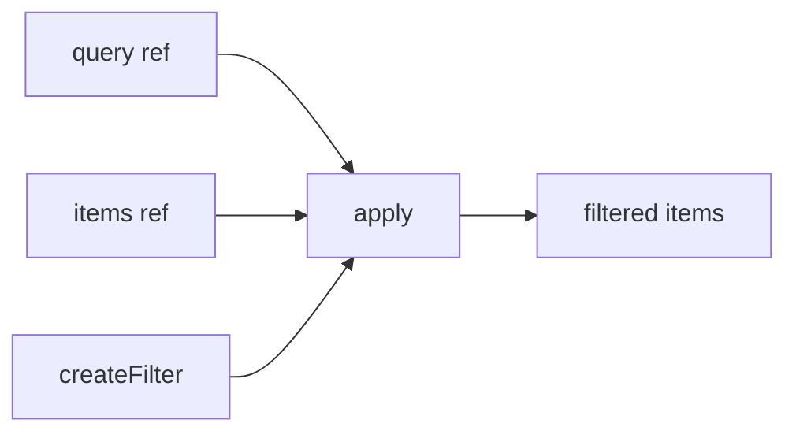

# createFilter

A composable for filtering arrays of items based on search queries, supporting both primitive values and complex objects with customizable filtering logic.

<DocsPageFeatures :frontmatter />

## Usage

The `createFilter` composable provides reactive array filtering with multiple modes for different search behaviors. It works with both primitive values and complex objects, and supports filtering by specific keys.

```ts collapse
import { ref, shallowRef } from 'vue'
import { createFilter } from '@vuetify/v0'

const query = shallowRef('doe')
const items = ref([
  { name: 'John Doe', age: 30, city: 'New York' },
  { name: 'Jane Doe', age: 25, city: 'Los Angeles' },
  { name: 'Peter Jones', age: 40, city: 'Chicago' },
])

const filter = createFilter({ keys: ['name'] })
const { items: filtered } = filter.apply(query, items)

console.log(filtered.value)
// [
//   { name: 'John Doe', age: 30, city: 'New York' },
//   { name: 'Jane Doe', age: 25, city: 'Los Angeles' }
// ]
```

## Architecture

`createFilter` provides pure filtering logic with context support:



## Reactivity

| Property/Method | Reactive | Notes |
| - | :-: | - |
| `query` | <AppSuccessIcon /> | ShallowRef, updated on each `apply()` |
| `items` (from apply) | <AppSuccessIcon /> | Computed, filters reactively |

> [!TIP] Reactive filtering
> Both the query and items passed to `apply()` can be reactive. The filtered result automatically updates when either changes.

<DocsApi />

## Examples

::: example
/composables/create-filter/live-search
:::
