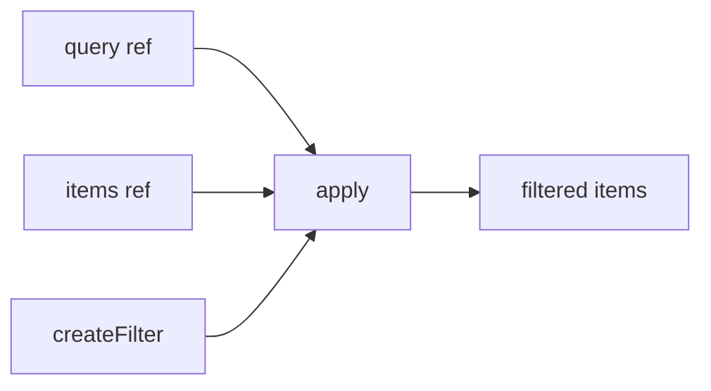

# createFilter

A composable for filtering arrays of items based on search queries, supporting both primitive values and complex objects with customizable filtering logic.

<DocsPageFeatures :frontmatter />

## Usage

The `createFilter` composable provides reactive array filtering with multiple modes for different search behaviors. It works with both primitive values and complex objects, and supports filtering by specific keys.

```ts collapse
import { ref, shallowRef } from 'vue'
import { createFilter } from '@vuetify/v0'

const query = shallowRef('doe')
const items = ref([
  { name: 'John Doe', age: 30, city: 'New York' },
  { name: 'Jane Doe', age: 25, city: 'Los Angeles' },
  { name: 'Peter Jones', age: 40, city: 'Chicago' },
])

const filter = createFilter({ keys: ['name'] })
const { items: filtered } = filter.apply(query, items)

console.log(filtered.value)
// [
//   { name: 'John Doe', age: 30, city: 'New York' },
//   { name: 'Jane Doe', age: 25, city: 'Los Angeles' }
// ]
```

## Context / DI

Use `createFilterContext` when you need to share a filter instance across a component tree:

```ts
import { createFilterContext } from '@vuetify/v0'

export const [useSearchFilter, provideSearchFilter, searchFilter] =
  createFilterContext({
    namespace: 'app:search',
    mode: 'union',
    keys: ['title', 'description'],
  })

// In parent component
provideSearchFilter()

// In child component
const filter = useSearchFilter()
const { items: filtered } = filter.apply(query, products)
```

Returns the standard trinity `[useSearchFilter, provideSearchFilter, searchFilter]`. The third element gives standalone access without injection — useful for testing and server-side use.

## Architecture

`createFilter` provides pure filtering logic with context support:


```mermaid "Filter Flow"
flowchart LR
  query[query ref] --> apply
  items[items ref] --> apply
  filter[createFilter]:::primary --> apply
  apply --> computed[filtered items]
```

## Options

| Option | Type | Default | Notes |
| - | - | - | - |
| `mode` | `'some' \| 'every' \| 'union' \| 'intersection'` | `'some'` | Multi-query matching strategy. See Filter Modes below |
| `keys` | `string[]` | — | Object keys to filter on. When omitted, all values are checked |
| `customFilter` | `(query, item) => boolean` | — | Bypass built-in logic entirely with a custom predicate |

```ts
// Filter only by name + email, using intersection mode
const filter = createFilter({
  keys: ['name', 'email'],
  mode: 'intersection',
})

// Custom filter (overrides keys and mode)
const filter = createFilter({
  customFilter: (query, item) =>
    String(item.name).toLowerCase().startsWith(String(query).toLowerCase()),
})
```

### Filter Modes

When the query is an array, each mode controls how multiple queries are matched against item values:

| Mode | Behavior | Passes when |
| - | - | - |
| `some` (default) | Iterates all queries and all values | **Any** query matches **any** value |
| `every` | Iterates all queries and all values | **All** queries match **all** values |
| `union` | Joins values, checks each query | **Any** query matches the joined string |
| `intersection` | Joins values, checks each query | **All** queries match the joined string |

> [!TIP] some vs union
> `some` and `union` both pass when any query matches, but `some` checks each value independently while `union` joins all values into a single string. The difference matters when a match spans multiple fields.

## Reactivity

| Property/Method | Reactive | Notes |
| - | :-: | - |
| `query` | <AppSuccessIcon /> | ShallowRef, updated on each `apply()` |
| `items` (from apply) | <AppSuccessIcon /> | Computed, filters reactively |

> [!TIP] Reactive filtering
> Both the query and items passed to `apply()` can be reactive. The filtered result automatically updates when either changes.

## Examples

::: gn-example
/composables/create-filter/useProductFilter.ts 1
/composables/create-filter/ProductBrowser.vue 2
/composables/create-filter/product-browser.vue 3

### Faceted Product Search

A product catalog filtered by two independent facets at once: a free-text search box and a set of category chips. The composable owns a dozen products plus the live query, match-mode, and selected-category state, then chains two `createFilter` instances so the visible list — and the match count beside it — stay in sync without a single hand-written watcher.

The text facet shows the `mode` option doing real work. Two filters are built over `keys: ['name', 'description']`, one in `union` mode and one in `intersection` mode, and a `toRef` picks whichever matches the active toggle. Splitting the query on whitespace turns multi-word input into an array, so "Any word" (`union`) matches products containing any term while "All words" (`intersection`) requires every term to appear somewhere across the searched fields. The category facet is a third `createFilter` in `union` mode, applied to the *output* of the text filter — `apply` accepts a getter, so feeding one filter's `items` into the next composes the two passes into a single reactive computed.

Reach for this pattern whenever you have a fixed in-memory dataset and want instant, multi-criteria filtering with no backend round-trip. Because every `apply` result is a `computed`, the count is just `results.length` and clearing all facets is a plain state reset. When the dataset outgrows memory, move filtering server-side with [createDataTable](/composables/data/create-data-table); to page or windowing the results, pair it with [createPagination](/composables/data/create-pagination) or [createVirtual](/composables/data/create-virtual).

| File | Role |
|------|------|
| `useProductFilter.ts` | Owns the product data, query/mode/category state, and chains the createFilter passes into a single results computed |
| `ProductBrowser.vue` | Renders the search box, mode toggle, category chips, count, and results list bound to the composable |
| `product-browser.vue` | Entry point — instantiates the composable and wires its state into the browser component |
:::

## FAQ

::: faq

??? What's the difference between `some` and `union` mode?

Both pass when any query matches, but `some` tests each field value independently while `union` joins all values into a single string first. The distinction matters when a match spans multiple fields.

??? How do I limit filtering to specific object fields?

Pass `keys: ['name', 'email']` in the options. When `keys` is omitted, every value on the item is checked.

??? When should I use createFilter vs createDataTable?

createFilter is pure in-memory filtering logic — reach for it for instant client-side search. When the dataset outgrows memory, or you also need sorting, pagination, and server support, move to [createDataTable](/composables/data/create-data-table).

:::

<DocsApi />
