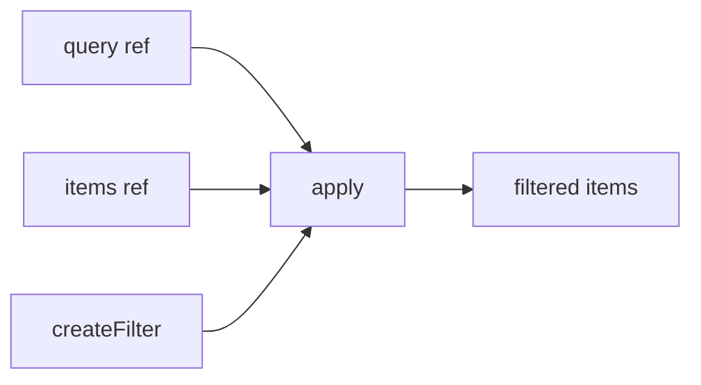

# createFilter

A composable for filtering arrays of items based on search queries, supporting both primitive values and complex objects with customizable filtering logic.

<DocsPageFeatures :frontmatter />

## Usage

The `createFilter` composable provides reactive array filtering with multiple modes for different search behaviors. It works with both primitive values and complex objects, and supports filtering by specific keys.

```ts collapse
import { ref, shallowRef } from 'vue'
import { createFilter } from '@vuetify/v0'

const query = shallowRef('doe')
const items = ref([
  { name: 'John Doe', age: 30, city: 'New York' },
  { name: 'Jane Doe', age: 25, city: 'Los Angeles' },
  { name: 'Peter Jones', age: 40, city: 'Chicago' },
])

const filter = createFilter({ keys: ['name'] })
const { items: filtered } = filter.apply(query, items)

console.log(filtered.value)
// [
//   { name: 'John Doe', age: 30, city: 'New York' },
//   { name: 'Jane Doe', age: 25, city: 'Los Angeles' }
// ]
```

## Context / DI

Use `createFilterContext` when you need to share a filter instance across a component tree:

```ts
import { createFilterContext } from '@vuetify/v0'

export const [useSearchFilter, provideSearchFilter, searchFilter] =
  createFilterContext({
    namespace: 'app:search',
    mode: 'union',
    keys: ['title', 'description'],
  })

// In parent component
provideSearchFilter()

// In child component
const filter = useSearchFilter()
const { items: filtered } = filter.apply(query, products)
```

Returns the standard trinity `[useSearchFilter, provideSearchFilter, searchFilter]`. The third element gives standalone access without injection — useful for testing and server-side use.

## Architecture

`createFilter` provides pure filtering logic with context support:


```mermaid "Filter Flow"
flowchart LR
  query[query ref] --> apply
  items[items ref] --> apply
  filter[createFilter]:::primary --> apply
  apply --> computed[filtered items]
```

## Reactivity

| Property/Method | Reactive | Notes |
| - | :-: | - |
| `query` | <AppSuccessIcon /> | ShallowRef, updated on each `apply()` |
| `items` (from apply) | <AppSuccessIcon /> | Computed, filters reactively |

> [!TIP] Reactive filtering
> Both the query and items passed to `apply()` can be reactive. The filtered result automatically updates when either changes.

## Filter Modes

When the query is an array, each mode controls how multiple queries are matched against item values:

| Mode | Behavior | Passes when |
| - | - | - |
| `some` (default) | Iterates all queries and all values | **Any** query matches **any** value |
| `every` | Iterates all queries and all values | **All** queries match **all** values |
| `union` | Joins values, checks each query | **Any** query matches the joined string |
| `intersection` | Joins values, checks each query | **All** queries match the joined string |

> [!TIP] some vs union
> `some` and `union` both pass when any query matches, but `some` checks each value independently while `union` joins all values into a single string. The difference matters when a match spans multiple fields.

## Examples

::: example
/composables/create-filter/live-search

### Live Search with Highlighting

Filter a list of cities by typing a name or country. Matching text is highlighted in the results.

:::

<DocsApi />
