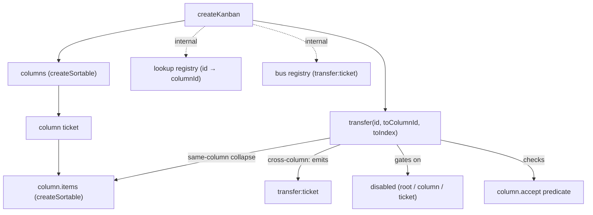

# createKanban

Headless data-flow management for two-level sortable boards. Owns one column registry plus a per-column item registry, plus a single `transfer` primitive for moving items across columns.

<DocsPageFeatures :frontmatter />

## Usage

`createKanban` composes `createSortable` twice — once for the column order and once per column for item order — and links them through a cross-column transfer primitive. Drag-and-drop wiring, keyboard navigation, and rendering are consumer concerns.

```ts collapse
import { createKanban } from '@vuetify/v0'

import type { KanbanColumnTicketInput, SortableTicketInput } from '@vuetify/v0'

interface CardInput extends SortableTicketInput {
  value: { title: string }
}

interface ColumnInput extends KanbanColumnTicketInput<CardInput> {
  value: { title: string }
}

const kanban = createKanban<CardInput, ColumnInput>()

const todo = kanban.columns.register({ value: { title: 'Todo' } })
const done = kanban.columns.register({
  value: { title: 'Done' },
  accept: (ticket, from, toIndex) => done.items.size < 5,
})

const a = todo.items.register({ value: { title: 'Write spec' } })
todo.items.register({ value: { title: 'Ship docs' } })

// Cross-column transfer: move item a to done column at index 0
kanban.transfer(a.id, done.id, 0)

// Subscribe to cross-column transfer events
kanban.on('transfer:ticket', ({ ticket, from, to, fromIndex, toIndex }) => {
  console.log(ticket.value.title, from, '→', to, '@', toIndex)
})
```

## Architecture

`createKanban` orchestrates two tiers of `createSortable`. Column order and item order are independent sortables; `transfer` is the only cross-column primitive. An internal `lookup` registry maps each item id to its owning column id so `transfer` can resolve the source column without the caller providing it.



The composable adds the following on top of two `createSortable` instances:

| Addition | Purpose |
|---|---|
| `columns` | A `createSortable` that owns the column order. Each registered ticket carries a `items` field — its own inner `createSortable`. |
| `column.items` | Per-column `createSortable`, created when the column is registered. Unregistered when the column unregisters. |
| `transfer(id, toColumnId, toIndex)` | Cross-column move. Same-column calls collapse to `column.items.move` — no `transfer:ticket` event fires. |
| `on` / `off` | Subscribe to the `transfer:ticket` event or to standard registry events on `columns`. |
| `lookup` (internal) | `createRegistry` mapping item id → column id. Maintained by per-column items-bus subscriptions. |
| `bus` (internal) | `createRegistry` used as an event bus for `transfer:ticket`. |

## Reactivity

| Property / Method | Reactive | Notes |
| - | :-: | - |
| `kanban.columns` | <AppSuccessIcon /> | Full `createSortable` — register, move, swap, reorder, on, off |
| `column.items` | <AppSuccessIcon /> | Each column has its own `createSortable`; wrap with `useProxyRegistry` for reactive iteration |
| Option: `disabled` | <AppSuccessIcon /> | `MaybeRefOrGetter<boolean>` — constructor option; gates all cross-column transfers when truthy |
| `column.disabled` (per-column-ticket option) | <AppSuccessIcon /> | `MaybeRefOrGetter<boolean>` — gates `column.items` mutations and transfers in/out of that column |
| `ticket.disabled` (per-item-ticket option) | <AppSuccessIcon /> | `MaybeRefOrGetter<boolean>` — prevents that specific item from being transferred or moved |
| `column.accept` (per-column-ticket option) | - | Synchronous predicate `(ticket, from, toIndex) => boolean`. Called before each cross-column transfer into this column. Async predicates log a warning and are treated as reject. |
| `transfer:ticket` event | <AppSuccessIcon /> | Fires after a successful cross-column move. Payload: `{ ticket, from, to, fromIndex, toIndex }`. Does not fire for same-column moves. |
| `move:ticket` on `kanban.columns` | <AppSuccessIcon /> | Fires when a column is reordered via `kanban.columns.move`, `swap`, or `reorder`. |
| `move:ticket` on `column.items` | <AppSuccessIcon /> | Fires when an item is reordered within a column. Not fired for cross-column transfers — those emit `transfer:ticket` instead. |

## Examples

::: example
/composables/create-kanban/headless-board/types.ts 1
/composables/create-kanban/headless-board/useKanbanView.ts 2
/composables/create-kanban/headless-board/app.vue 3

### Headless board

A complete kanban board driven entirely by `kanban.transfer(id, toColumnId, toIndex)` — no drag-and-drop, no keyboard navigation. The board is the registry; the UI is a reactive projection of it. Any input modality (button click, keyboard shortcut, pointer event, scheduled job) drives it through the same call.

Three files make up the example. `types.ts` declares the domain: a `Card` extends `SortableTicketInput` with `{ title, assignee }`, a `Column` extends `KanbanColumnTicketInput<Card>` with `{ title, tone }`. Splitting types out is a small thing that pays off the moment a second component on the page needs to reference them.

`useKanbanView.ts` is the reusable bit. `useProxyRegistry` registers an `onScopeDispose` callback, so it must be called inside a setup scope — a `v-for` template can't call it directly. The helper wraps the two-level reactive iteration pattern every kanban consumer reaches for: a column proxy plus a `Map<ID, ProxyRegistryContext<Card>>` for per-column items, kept in sync with column register/unregister events. Drop the file into your own app verbatim; nothing in it is kanban-specific beyond the `Card`/`Column` types it references.

`app.vue` is the demo entry. It seeds three columns, two cards in Todo, one in Doing, then wires `← →` buttons that drive `kanban.transfer`. A subscriber on the kanban-level `transfer:ticket` event renders a status line under the board — a sanity-check that moves are flowing through the proper channel rather than mutating refs out-of-band.

The grid layout auto-fits each column to a 200px minimum and wraps onto a new row when the container narrows, so the same example works on phone, tablet, and desktop without media queries.

| File | Role |
|------|------|
| `types.ts` | Domain ticket types — `Card` (assignee-bearing) and `Column` (tone-bearing) |
| `useKanbanView.ts` | Reactive view helper — column proxy + per-column item proxies, sync-maintained |
| `app.vue` | Demo entry — seeds the board, wires button-driven transfers, displays `transfer:ticket` events |

:::

## Recipes

### Disabling moves

Disable flags are layered: root, column, and item. Each gate is checked independently.

**Root gate** — freezes the entire board. All cross-column transfers no-op. Each column's inner sortable also respects the root gate, so intra-column reorders are frozen too.

```ts
const kanban = createKanban({ disabled: toRef(() => isReadOnly.value) })

// transfer and column.items.move both no-op while isReadOnly is true
kanban.transfer(id, toColumnId, 0)
```

**Column gate** — freezes one column. Transfers in or out of that column are silently rejected. Item reorders within the column are also frozen.

```ts
const archive = kanban.columns.register({
  value: { title: 'Archive' },
  disabled: true,
})

kanban.transfer(id, archive.id, 0)  // no-op — destination is disabled
kanban.transfer(archiveItemId, todo.id, 0)  // no-op — source is disabled
```

**Item gate** — prevents one item from being transferred. Other items in the same column are unaffected.

```ts
const pinned = todo.items.register({
  value: { title: 'Pinned task' },
  disabled: true,
})

kanban.transfer(pinned.id, done.id, 0)  // no-op — ticket is disabled
```

### Accept predicate (WIP-limit pattern)

Each column ticket can declare an `accept` function. It runs when an item is being transferred into that column from another column. Return `false` to silently reject.

The canonical use case is a WIP (work-in-progress) limit: block transfers into a column once it reaches a maximum item count.

```ts
const doing = kanban.columns.register({
  value: { title: 'Doing' },
  accept: (ticket, from, toIndex) => doing.items.size < 3,
})

// Transferring a fourth item into 'doing' silently no-ops
kanban.transfer(id, doing.id, 0)
```

`accept` receives the item ticket, the source column id, and the intended destination index. It is only called for cross-column transfers — same-column moves collapse to `column.items.move` and bypass `accept` entirely.

> [!WARNING]
> Async predicates (those that return a Promise or thenable) are not supported. They log a `warn` and are treated as a rejection.

### Subscribing to transfer events

`kanban.on('transfer:ticket', cb)` subscribes to every cross-column move. The callback receives a `KanbanTransferPayload` with five fields.

```ts
kanban.on('transfer:ticket', ({ ticket, from, to, fromIndex, toIndex }) => {
  // Persist the new board state to a backend
  persist({ itemId: ticket.id, fromColumn: from, toColumn: to, toIndex })
})
```

Same-column moves (intra-column reorder via `kanban.transfer` with `toColumnId === fromColumnId`) collapse to `column.items.move` and do not emit `transfer:ticket`. To observe intra-column reorders, subscribe to `column.items.on('move:ticket', ...)` instead.

Use `kanban.off('transfer:ticket', cb)` to remove a subscription with the same callback reference.

### Reactive iteration

`kanban.columns.values()` and `column.items.values()` return non-reactive snapshots — calling them inside a template directly won't update when the registry changes.

Wrap with `useProxyRegistry` to get a reactive `{ keys, values, entries, size }` snapshot:

```ts
import { useProxyRegistry } from '@vuetify/v0'

// Reactive column list — updates when columns are registered, unregistered, or reordered
const columns = useProxyRegistry(kanban.columns)

// Reactive item list for a specific column — updates on intra-column moves and cross-column transfers
const items = useProxyRegistry(todo.items)
```

In templates, iterate `columns.values` (not `columns.values()`) — the proxy exposes `values` as a reactive array, not a function.

```vue
<template>
  <div v-for="column in columns.values" :key="column.id">
    {{ column.value.title }}
  </div>
</template>
```

Note that `column.items` itself is not reactive at the column level. If a new column registers after the component mounts, the new column's `items` instance is attached to the new ticket — the existing `columns` proxy picks it up automatically via the registry event.

### Listening to column and item reorder

Cross-column moves fire `transfer:ticket` on the kanban bus. Intra-column moves fire `move:ticket` on the relevant sortable's own bus.

```ts
// Column reorder — fires when kanban.columns.move / swap / reorder is called
kanban.columns.on('move:ticket', ({ ticket, from, to }) => {
  console.log('column moved:', ticket.id, from, '→', to)
})

// Item reorder within a column — fires when column.items.move / swap / reorder is called
todo.items.on('move:ticket', ({ ticket, from, to }) => {
  console.log('item moved within todo:', ticket.id, from, '→', to)
})
```

Cross-column transfers do NOT fire `move:ticket` on either column's items bus. They fire `transfer:ticket` on the kanban bus after the batch closes. If you need to observe every positional change regardless of whether it crossed a column boundary, subscribe to both event types.

<DocsApi />
