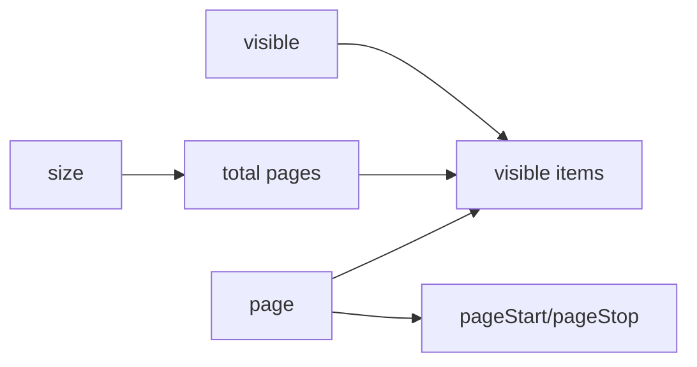

# createPagination

A lightweight composable for managing pagination state with navigation methods and computed visible page items.

<DocsPageFeatures :frontmatter />

## Usage

The `createPagination` composable provides reactive pagination state management with navigation methods and automatic computation of visible page items with ellipsis support.

```ts
import { ref } from 'vue'
import { createPagination } from '@vuetify/v0'

const pagination = createPagination({
  size: 200, // Total items
  itemsPerPage: 10,
  visible: 5,
})

console.log(pagination.pages) // 20 (200 items / 10 per page)
console.log(pagination.items.value)
// [
//   { type: 'page', value: 1 },
//   { type: 'page', value: 2 },
//   { type: 'page', value: 3 },
//   { type: 'ellipsis', value: '…' },
//   { type: 'page', value: 20 }
// ]
```

## Architecture

`createPagination` computes page state and navigation:



## Reactivity

| Property/Method | Reactive | Notes |
| - | :-: | - |
| `page` | <AppSuccessIcon /> | ShallowRef, supports v-model binding |
| `items` | <AppSuccessIcon /> | Computed, visible page buttons with ellipsis |
| `pageStart` | <AppSuccessIcon /> | Computed, start index for current page |
| `pageStop` | <AppSuccessIcon /> | Computed, end index for current page |
| `isFirst` | <AppSuccessIcon /> | Computed, true when on first page |
| `isLast` | <AppSuccessIcon /> | Computed, true when on last page |

> [!TIP] v-model support
> Pass a ref as the `page` option to enable two-way binding with your component's page state.

<DocsApi />
