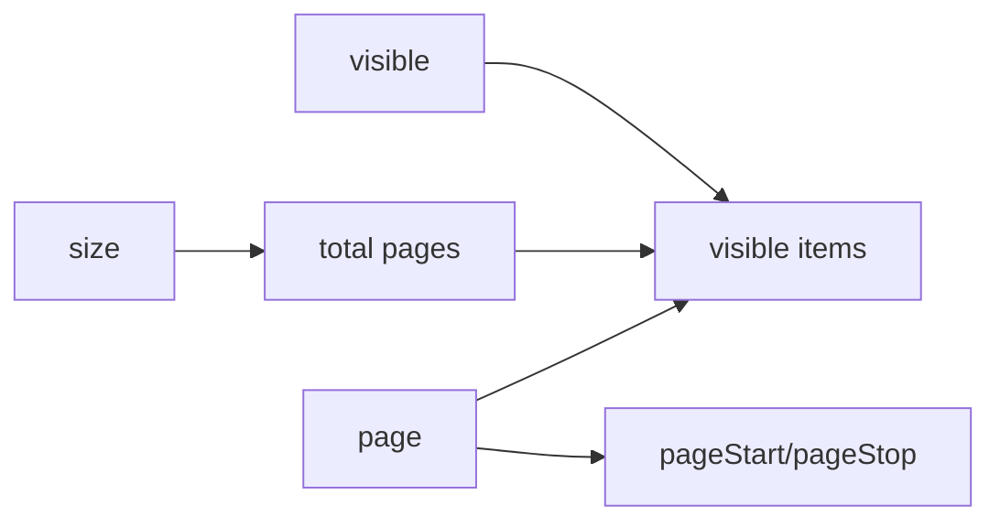

# createPagination

A lightweight composable for managing pagination state with navigation methods and computed visible page items.

<DocsPageFeatures :frontmatter />

## Usage

The `createPagination` composable provides reactive pagination state management with navigation methods and automatic computation of visible page items with ellipsis support.

```ts collapse no-filename
import { ref } from 'vue'
import { createPagination } from '@vuetify/v0'

const pagination = createPagination({
  size: 200, // Total items
  itemsPerPage: 10,
  visible: 5,
})

console.log(pagination.pages) // 20 (200 items / 10 per page)
console.log(pagination.items.value)
// [
//   { type: 'page', value: 1 },
//   { type: 'page', value: 2 },
//   { type: 'page', value: 3 },
//   { type: 'ellipsis', value: '…' },
//   { type: 'page', value: 20 }
// ]
```

## Context / DI

Use `createPaginationContext` to share a pagination instance across a component tree:

```ts
import { createPaginationContext } from '@vuetify/v0'

export const [usePagination, providePagination, pagination] =
  createPaginationContext({ size: 100, itemsPerPage: 10 })

// In parent component
providePagination()

// In child component
const pagination = usePagination()
pagination.next()
```

## Architecture

`createPagination` computes page state and navigation:


```mermaid "Pagination Flow"
flowchart LR
  size --> pages[total pages]
  page --> items[visible items]
  pages --> items
  visible --> items
  page --> pageStart/pageStop
```

## Reactivity

| Property/Method | Reactive | Notes |
| - | :-: | - |
| `page` | <AppSuccessIcon /> | WritableComputedRef, auto-clamps when total pages shrinks |
| `pages` | <AppSuccessIcon /> | Total page count, computed from `size / itemsPerPage` |
| `items` | <AppSuccessIcon /> | Computed array of `PaginationTicket` — each is `{ type: 'page', value: number }` or `{ type: 'ellipsis', value: string }` |
| `pageStart` | <AppSuccessIcon /> | Computed, start index for current page |
| `pageStop` | <AppSuccessIcon /> | Computed, end index for current page |
| `isFirst` | <AppSuccessIcon /> | Computed, true when on first page |
| `isLast` | <AppSuccessIcon /> | Computed, true when on last page |
| `itemsPerPage` | <AppErrorIcon /> | Getter — current items per page (reflects option) |
| `size` | <AppErrorIcon /> | Getter — total item count (reflects option) |
| `ellipsis` | <AppErrorIcon /> | Getter — the ellipsis string or `false` when disabled |
| `select(page)` | - | Navigate to a specific page number |
| `next()` | - | Go to next page (no-op if already last) |
| `prev()` | - | Go to previous page (no-op if already first) |
| `first()` | - | Jump to page 1 |
| `last()` | - | Jump to final page |

> [!TIP] v-model support
> Pass a ref as the `page` option to enable two-way binding with your component's page state.

## Examples

::: gn-example
/composables/create-pagination/paginated-list

### Paginated List

A 47-item list split into pages of 6, with First / Prev / numbered pages / Next / Last controls and a live status line showing the current range.

The pagination is created once with `{ size: 47, itemsPerPage: 6 }`. The visible slice is a `computed` that reads `pageStart.value` and `pageStop.value` and calls `Array.slice` — no adapter, no data table, just the two index getters. This is the canonical pattern for paginating a plain array: `createPagination` owns the math, your `computed` owns the slice.

The page-button strip iterates `pagination.items.value`, which returns `PaginationTicket[]` — each is either `{ type: 'page', value: number }` or `{ type: 'ellipsis', value: '…' }`. The template branches on `item.type` and calls `pagination.select(item.value)` on click. First / Prev / Next / Last buttons bind their `disabled` prop to `isFirst.value` or `isLast.value` and call the matching navigation method directly.

Reach for this standalone composable when you already have a full in-memory array and only need page navigation — no sorting or filtering required. For a full data pipeline with sorting, filtering, and server-side support, see [createDataTable](/composables/data/create-data-table). For the pre-built `Pagination` component that wraps this composable, see [Pagination](/components/semantic/pagination).

:::

<DocsApi />
