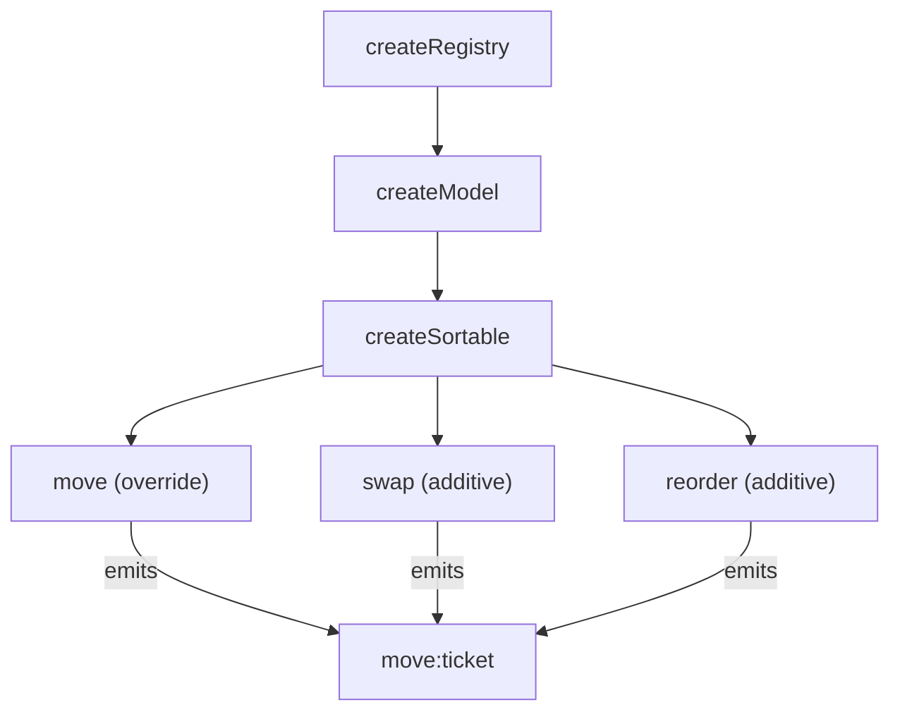

# createSortable

Headless ordered-list primitive that owns a registry of value-bearing tickets and exposes `move`, `swap`, and `reorder` mutations. Pure logic — no DnD, no keyboard, no DOM — so consumers can drive it from any input modality.

<DocsPageFeatures :frontmatter />

## Usage

`createSortable` extends `createModel` with mutation primitives over the canonical order. Drag-and-drop wiring composes with [useDragDrop](/composables/system/use-drag-drop); keyboard reorder composes with [useVirtualFocus](/composables/system/use-virtual-focus). Consumers can drive sortable from buttons, gestures, server reconciliation, or undo/redo by calling its mutation methods.

```ts
import { createSortable } from '@vuetify/v0'

import type { SortableTicketInput } from '@vuetify/v0'

interface Task {
  id: number
  label: string
}

interface TaskTicket extends SortableTicketInput {
  value: Task
}

const sortable = createSortable<TaskTicket>()

const [a, b, c] = sortable.onboard([
  { value: { id: 1, label: 'Cut alpha' } },
  { value: { id: 2, label: 'Ship docs' } },
  { value: { id: 3, label: 'Tweet' } },
])

sortable.move(a.id, 2)
sortable.swap(a.id, b.id)
sortable.reorder([b.id, a.id, c.id])
```

## Architecture

`createSortable` extends `createModel`, which extends `createRegistry`. The full inherited surface (`register`, `onboard`, `unregister`, `lookup`, `browse`, `seek`, `keys`, `values`, `entries`, `clear`, `on`, `off`, `emit`, `batch`, `disabled`, `isSelected`) is available unchanged.



The composable adds three things on top of `createModel`:

| Addition | Layer | Purpose |
|---|---|---|
| `move` override | sortable | Wraps `registry.move` to emit `move:ticket` with `{ ticket, from, to }` |
| `swap(a, b)` | sortable | Two batched `move` calls; emits two `move:ticket` events |
| `reorder(ids)` | sortable | Strict permutation set; throws on length mismatch or unknown id |

> [!TIP]
> The composable bakes `events: true` into the underlying registry by default, so `move:ticket` works out of the box and `useProxyRegistry` snapshots track moves without extra configuration.

## Disabling reorder

`disabled` works at two scopes:

- **Root** (`createSortable({ disabled: true })`) — no-ops `move`, `swap`, `reorder`. Useful for whole-list states like "sprint locked" or "view-only mode."
- **Per-ticket** (`register({ value, disabled: true })`) — no-ops `move(id, ...)` for that ticket and any `swap` that involves it. `reorder` **does NOT** honor per-ticket `disabled` — it's a bulk operation declaring the canonical order, and applying that order may relocate disabled tickets. If you want disabled tickets pinned during a `reorder`, exclude their ids from the array.

Registration is NEVER gated. `register`, `onboard`, and `unregister` work regardless of `disabled` state.

```ts
const sortable = createSortable<Todo>({
  disabled: toRef(() => isReadOnlyMode.value),
})

sortable.move(id, 0)   // no-op when disabled.value === true
```

`createSortable` overrides the inherited `createModel` semantics for `disabled`. In `createModel`, `disabled` is a UI hint; in sortable, the dominant verb is movement, so `disabled` gates movement directly.

## Examples

### Button-driven reorder

The simplest case — register items, expose up/down buttons, call `move(id, ticket.index ± 1)`. No DnD, no event subscriptions, no helper composable. This is the API surface area you actually need 80% of the time.

::: example
/composables/create-sortable/basic
:::

### Drag-and-drop reorder

The natural use case. Pair `createSortable` with `useDragDrop`: each item registers as a draggable, the list registers as a drop zone, and the zone's `onDrop` callback maps the drop position to a `sortable.move` call.

::: example
/composables/create-sortable/dnd/data.ts
/composables/create-sortable/dnd/DraggableItem.vue
/composables/create-sortable/dnd/DnDSortable.vue

### DnD-driven sortable

`createSortable` owns the order; `useDragDrop` owns the input modality. The integration is one zone callback — `(drag, position) => sortable.move(drag.value, position.index ?? 0)`.

:::

## Recipes

### Server-reconciled order

`reorder` accepts a strict permutation of currently-registered ids. Use it to apply an authoritative order from the backend without diffing positions yourself.

```ts
const sortable = createSortable<Todo>()
const order = await fetchOrder()       // ID[] from backend
sortable.reorder(order)
```

### Reactive snapshot for templates

`useProxyRegistry` returns a reactive `{ keys, values, entries, size }` snapshot driven by registry events. Because `createSortable` bakes in `events: true`, you do not pass it explicitly.

```ts
const sortable = createSortable<Todo>()
const proxy = useProxyRegistry(sortable)

// proxy.keys, proxy.values, proxy.entries, proxy.size all track moves
```

### Pair with useDragDrop

Wire `useDragDrop`'s `onDrop` callback to `sortable.move` to translate pointer or keyboard drags into reorder mutations. The headless contract keeps the two primitives independent — sortable owns order, drag-drop owns input.

```ts
const sortable = createSortable<Todo>()
const dnd = useDragDrop()

dnd.zones.register({
  el: containerEl,
  accept: ['todo'],
  onDrop: (drag, position) => {
    if (drag.type === 'todo') sortable.move(drag.id, position.index ?? 0)
  },
})
```

A first-class `useSortableDnD` adapter is on the roadmap; until then, wire `useDragDrop`'s callbacks to `sortable.move` directly.

<DocsApi />
