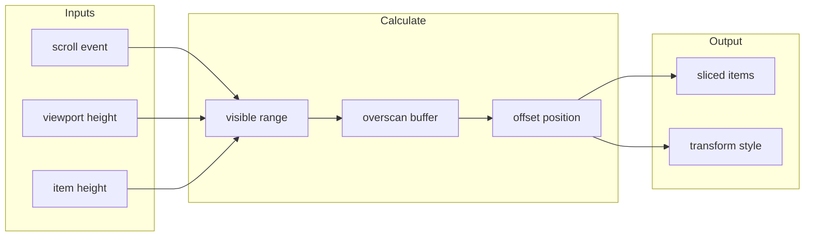

# createVirtual

Virtual scrolling composable for efficiently rendering large lists by only rendering visible items.

<DocsPageFeatures :frontmatter />

## Usage

The `createVirtual` composable efficiently renders large lists by only mounting visible items plus a small overscan buffer. Pass an array of items and configure the item height to get back sliced items, scroll handlers, and positioning values.

::: example
/composables/create-virtual/basic
:::

## Architecture

The rendering pipeline transforms scroll events into visible item ranges:

## Reactivity

| Property/Method | Reactive | Notes |
| - | :-: | - |
| `element` | <AppSuccessIcon /> | Ref, assign scroll container |
| `items` | <AppSuccessIcon /> | Computed, visible items with index |
| `offset` | <AppSuccessIcon /> | ShallowRef, readonly (top spacer height) |
| `size` | <AppSuccessIcon /> | ShallowRef, readonly (bottom spacer height) |
| `state` | <AppSuccessIcon /> | ShallowRef (`'loading'` \| `'empty'` \| `'error'` \| `'ok'`) |

> [!TIP] Source items
> The `items` ref passed to `createVirtual()` is watched for changes. When items change, the virtual scroller updates automatically.

<DocsApi />
