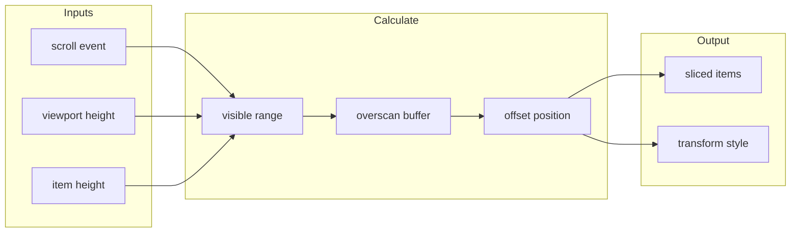

# createVirtual

Virtual scrolling composable for efficiently rendering large lists by only rendering visible items.

<DocsPageFeatures :frontmatter />

## Usage

The `createVirtual` composable efficiently renders large lists by only mounting visible items plus a small overscan buffer. Pass an array of items and configure the item height to get back sliced items, scroll handlers, and positioning values.

```vue collapse no-filename
<script setup lang="ts">
  import { createVirtual } from '@vuetify/v0'
  import { shallowRef } from 'vue'

  const items = shallowRef(
    Array.from({ length: 10_000 }, (_, i) => `Item ${i + 1}`)
  )

  const { element, items: visible, offset, size, scroll, scrollTo } = createVirtual(items, {
    itemHeight: 40,
  })
</script>

<template>
  <div ref="element" class="h-[300px] overflow-y-auto" @scroll="scroll">
    <div :style="{ height: `${offset}px` }" />
    <div v-for="item in visible" :key="item.index">
      {{ item.raw }}
    </div>
    <div :style="{ height: `${size}px` }" />
  </div>
</template>
```

## Context / DI

Use `createVirtualContext` to share a virtual scroll instance across a component tree:

```ts
import { createVirtualContext } from '@vuetify/v0'
import { shallowRef } from 'vue'

const items = shallowRef([...])

export const [useVirtual, provideVirtual, virtual] =
  createVirtualContext(items, {
    namespace: 'my:virtual',
    itemHeight: 40,
  })

// In parent component
provideVirtual()

// In child component
const { items: visible, offset, size, scroll } = useVirtual()
```

## Architecture

The rendering pipeline transforms scroll events into visible item ranges:


```mermaid "Virtual Rendering Pipeline"
flowchart LR
  subgraph Inputs
    A[scroll event]
    B[viewport height]
    C[item height]
  end

  subgraph Calculate
    D[visible range]
    E[overscan buffer]
    F[offset position]
  end

  subgraph Output
    G[sliced items]
    H[transform style]
  end

  A --> D
  B --> D
  C --> D
  D --> E
  E --> F
  F --> G
  F --> H
```

## Reactivity

| Property/Method | Reactive | Notes |
| - | :-: | - |
| `element` | <AppSuccessIcon /> | Ref, assign scroll container |
| `items` | <AppSuccessIcon /> | Computed, visible items with index |
| `offset` | <AppSuccessIcon /> | ShallowRef, readonly (top spacer height) |
| `size` | <AppSuccessIcon /> | ShallowRef, readonly (bottom spacer height) |
| `state` | <AppSuccessIcon /> | ShallowRef (`'loading'` \| `'empty'` \| `'error'` \| `'ok'`) |
| `scroll()` | <AppErrorIcon /> | Call on `@scroll`; schedules a visible-range update via rAF |
| `scrollend()` | <AppErrorIcon /> | Call on `@scrollend`; alias of `scroll()` |
| `scrollTo(index, options?)` | <AppErrorIcon /> | Scroll to item by index; accepts `behavior`, `block`, `offset` |
| `resize(index, height)` | <AppErrorIcon /> | Notify of a dynamic item height change; triggers offset rebuild |
| `reset()` | <AppErrorIcon /> | Reset state to `'ok'` and restore scroll anchor |

> [!TIP] Source items
> The `items` ref passed to `createVirtual()` is watched for changes. When items change, the virtual scroller updates automatically.

## Examples

::: gn-example
/composables/create-virtual/basic

### 10,000-Item Virtual List

A 10,000-item list that mounts only the rows visible in its 300 px scroll container at any given moment — typically under 15 nodes — regardless of how many items the source array holds.

`createVirtual(items, { itemHeight: 40 })` returns `element`, `items` (the visible slice), `offset` (top-spacer height), `size` (bottom-spacer height), `scroll`, and `scrollTo`. The template wires `ref="element"` to the scroll container, uses `@scroll="scroll"` to notify the composable on each scroll event, and sandwiches the rendered items between two spacer `<div>`s sized by `offset` and `size` — this is how the browser's native scrollbar stays proportional to the full list without rendering all rows.

The Jump to input calls `scrollTo(index)` by item number, which snaps the viewport to that row. The Add 100 button appends new items by replacing `items.value` with a new array; the virtual scroller picks up the change because it watches the source ref.

The stats line in the toolbar shows how many rows are currently rendered versus the total. On a typical desktop viewport the render count stays in the single digits no matter how many items are in the list.

Reach for `createVirtual` whenever rendering the full list would cause layout thrash or memory pressure — rule of thumb is 500+ items at fixed height, lower when items are complex. For variable-height items use `resize(index, height)` to notify the composable after each row measures itself. For filtering and sorting before virtualization see [createDataTable](/composables/data/create-data-table) with `VirtualDataTableAdapter`.

:::

<DocsApi />
