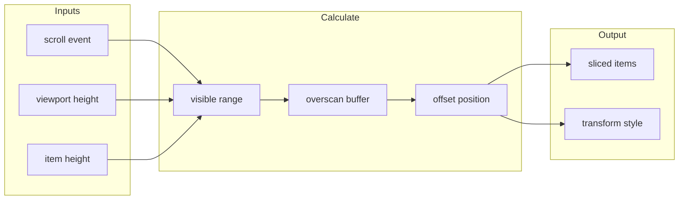

# createVirtual

Virtual scrolling composable for efficiently rendering large lists by only rendering visible items.

<DocsPageFeatures :frontmatter />

## Usage

The `createVirtual` composable efficiently renders large lists by only mounting visible items plus a small overscan buffer. Pass an array of items and configure the item height to get back sliced items, scroll handlers, and positioning values.

```vue collapse no-filename
<script setup lang="ts">
  import { createVirtual } from '@vuetify/v0'
  import { shallowRef } from 'vue'

  const items = shallowRef(
    Array.from({ length: 10_000 }, (_, i) => `Item ${i + 1}`)
  )

  const { element, items: visible, offset, size, scroll, scrollTo } = createVirtual(items, {
    itemHeight: 40,
  })
</script>

<template>
  <div ref="element" class="h-[300px] overflow-y-auto" @scroll="scroll">
    <div :style="{ height: `${offset}px` }" />
    <div v-for="item in visible" :key="item.index">
      {{ item.raw }}
    </div>
    <div :style="{ height: `${size}px` }" />
  </div>
</template>
```

## Context / DI

Use `createVirtualContext` to share a virtual scroll instance across a component tree:

```ts
import { createVirtualContext } from '@vuetify/v0'
import { shallowRef } from 'vue'

const items = shallowRef([...])

export const [useVirtual, provideVirtual, virtual] =
  createVirtualContext(items, {
    namespace: 'my:virtual',
    itemHeight: 40,
  })

// In parent component
provideVirtual()

// In child component
const { items: visible, offset, size, scroll } = useVirtual()
```

## Architecture

The rendering pipeline transforms scroll events into visible item ranges:


```mermaid "Virtual Rendering Pipeline"
flowchart LR
  subgraph Inputs
    A[scroll event]
    B[viewport height]
    C[item height]
  end

  subgraph Calculate
    D[visible range]
    E[overscan buffer]
    F[offset position]
  end

  subgraph Output
    G[sliced items]
    H[transform style]
  end

  A --> D
  B --> D
  C --> D
  D --> E
  E --> F
  F --> G
  F --> H
```

## Reactivity

| Property/Method | Reactive | Notes |
| - | :-: | - |
| `element` | <AppSuccessIcon /> | Ref, assign scroll container |
| `items` | <AppSuccessIcon /> | Computed, visible items with index |
| `offset` | <AppSuccessIcon /> | ShallowRef, readonly (top spacer height) |
| `size` | <AppSuccessIcon /> | ShallowRef, readonly (bottom spacer height) |
| `state` | <AppSuccessIcon /> | ShallowRef (`'loading'` \| `'empty'` \| `'error'` \| `'ok'`) |
| `scroll()` | <AppErrorIcon /> | Call on `@scroll`; schedules a visible-range update via rAF |
| `scrollend()` | <AppErrorIcon /> | Call on `@scrollend`; alias of `scroll()` |
| `scrollTo(index, options?)` | <AppErrorIcon /> | Scroll to item by index; accepts `behavior`, `block`, `offset` |
| `resize(index, height)` | <AppErrorIcon /> | Notify of a dynamic item height change; triggers offset rebuild |
| `reset()` | <AppErrorIcon /> | Reset state to `'ok'` and restore scroll anchor |

> [!TIP] Source items
> The `items` ref passed to `createVirtual()` is watched for changes. When items change, the virtual scroller updates automatically.

## Examples

::: gn-example
/composables/create-virtual/useDirectory.ts 1
/composables/create-virtual/VirtualDirectory.vue 2
/composables/create-virtual/directory.vue 3

### Virtualized Employee Directory

A 10,000-row employee directory that mounts only the rows visible inside its scroll container — typically under twenty nodes — no matter how large the source array grows. The toolbar reads out how many rows are rendered versus the total, so you can watch the render count stay in the low double digits while the dataset balloons.

`createVirtual(rows, { itemHeight: 44 })` returns `element`, `items` (the visible slice, each `{ raw, index }`), `offset` (top-spacer height), `size` (bottom-spacer height), `scroll`, and `scrollTo`. The view component binds `ref="element"` to the scroll container, calls `@scroll="scroll"` to schedule a visible-range recalculation, and sandwiches the rendered rows between two spacer elements sized by `offset` and `size` — that pair of spacers is what keeps the native scrollbar proportional to the full list without ever mounting every row. The jump control is a [NumberField](/components/forms/number-field) whose value drives `scrollTo(index, { behavior: 'smooth' })`, with the index bounded by the v0 `clamp` utility so it can never point past the data.

The example is split so each layer is reusable in isolation. `useDirectory.ts` is a DOM-free data source that owns the row array and a grow operation; `VirtualDirectory.vue` accepts any `rows` array and applies the windowing — `createVirtual` watches the reactive prop, so appending rows reflows the scroller automatically. Reach for `createVirtual` whenever rendering the whole list would cause layout thrash or memory pressure (rule of thumb: 500+ fixed-height rows, fewer when each row is complex). For variable-height rows call `resize(index, height)` after each row measures itself; to filter or sort before virtualizing, pair it with [createFilter](/composables/data/create-filter) or [createDataTable](/composables/data/create-data-table).

| File | Role |
|------|------|
| `useDirectory.ts` | DOM-free data source: owns the 10,000-row array and an append operation |
| `VirtualDirectory.vue` | Applies `createVirtual` to the rows prop; renders the windowed list, jump control, and rendered-vs-total stat |
| `directory.vue` | Entry: wires the data source to the view and adds the grow-dataset chrome |
:::

## FAQ

::: faq

??? What are the two spacer elements for?

`offset` sizes a top spacer and `size` sizes a bottom spacer. Together they keep the native scrollbar proportional to the full list while only the visible window of rows is actually mounted.

??? How do I support rows with different heights?

Configure a base `itemHeight`, then call `resize(index, height)` after each row measures itself. That notifies the scroller of the new height and triggers an offset rebuild.

??? How do I virtualize a filtered or sorted list?

createVirtual windows whatever array you pass, so filter or sort first and feed the result in — pair it with [createFilter](/composables/data/create-filter), or use [createDataTable](/composables/data/create-data-table)'s `VirtualDataTableAdapter` to hand `table.items` to the scroller. The source ref is watched, so the window reflows when the list changes.

??? How do I scroll to a specific item programmatically?

Call `scrollTo(index, options?)` — it accepts `behavior`, `block`, and `offset`, so `scrollTo(500, { behavior: 'smooth' })` brings item 500 into view. Bound the index with `clamp` so it can't point past the data.

:::

<DocsApi />
