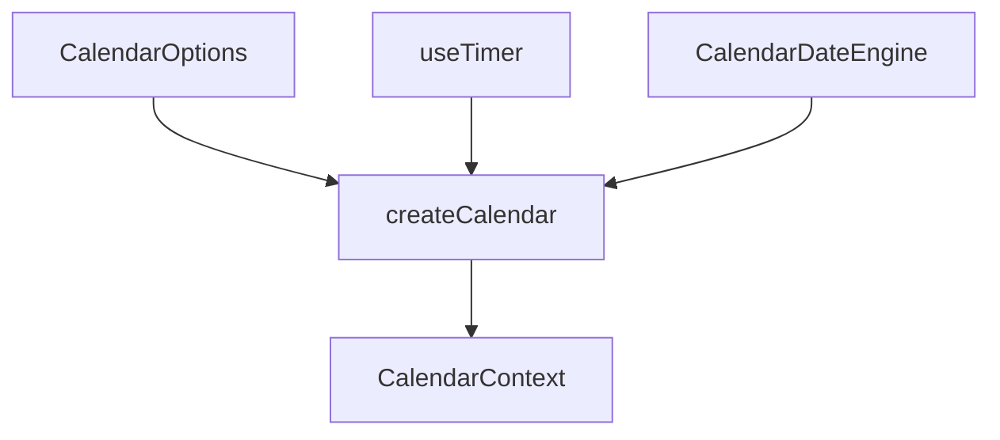

# createCalendar

Month calendar geometry and navigation with focus management, min/max bounds, and locale-aware week start. Selection-agnostic — compose with `createSingle` or `createSelection` for date pickers.

<DocsPageFeatures :frontmatter />

## Usage

```ts collapse
import { createCalendar } from '@vuetify/v0'

// Basic — uncontrolled
const calendar = createCalendar()
calendar.next()    // Page to next month
calendar.prev()    // Page to previous month
calendar.today()   // Jump to current month

// With bounds
const bounded = createCalendar({
  min: '2026-01-01',
  max: '2026-12-31',
  fixedWeeks: true,
})

// Navigate
bounded.goto('2026-06-15')  // Jump to specific date
bounded.move('day', 1)      // Move focus by day
bounded.move('week', -1)    // Move focus by week
bounded.move('month', 1)    // Move focus by month
bounded.move('year', -1)    // Move focus by year

// Read state
bounded.anchor.value    // '2026-06' - visible month
bounded.focused.value   // '2026-06-15' - focused date
bounded.label.value     // 'June 2026' - localized label
bounded.isFirst.value   // false - not at min wall
bounded.isLast.value    // false - not at max wall

// Month matrix
bounded.months.value[0].weeks  // 6 weeks × 7 cells
```

## Architecture

`createCalendar` provides calendar geometry without imposing selection semantics. The anchor (visible month) and focused date are kept in sync: paging snaps focus in-month, walking focus out of the visible month pages the anchor.



Key design decisions:

- **Selection-agnostic**: The composable has no `selected`, no `select()`. Compose with `createSingle` for single date selection, `createSelection` or `createGroup` for ranges.
- **Focus management**: `focused` tracks the roving tabindex for keyboard navigation. Walk it with `move()`, which pages the anchor automatically.
- **Min/max walls**: Both paging and focus respect bounds. `isFirst` and `isLast` flag when at the walls.
- **Midnight tick**: `today` rolls over automatically via `useTimer`, so a calendar left open overnight stays correct.

## Reactivity

| Property | Type | Reactive | Description |
|----------|------|----------|-------------|
| `anchor` | `Readonly<Ref<string>>` | Yes | `YYYY-MM` of visible month |
| `focused` | `Ref<string>` | Yes | `YYYY-MM-DD` the roving tabindex follows |
| `months` | `ComputedRef<CalendarMonth[]>` | Yes | Month matrix with weeks and cells |
| `weekdays` | `ComputedRef<CalendarWeekday[]>` | Yes | Weekday labels (long, short, narrow) |
| `label` | `ComputedRef<string>` | Yes | Localized "August 2026" |
| `isFirst` | `Readonly<Ref<boolean>>` | Yes | At the `min` wall |
| `isLast` | `Readonly<Ref<boolean>>` | Yes | At the `max` wall |
| `next()` | `() => void` | — | Page to next month |
| `prev()` | `() => void` | — | Page to previous month |
| `step(n)` | `(count: number) => void` | — | Page by N months |
| `first()` | `() => void` | — | Page to `min` month |
| `last()` | `() => void` | — | Page to `max` month |
| `goto(v)` | `(value: string) => void` | — | Jump to `YYYY-MM` or `YYYY-MM-DD` |
| `today()` | `() => void` | — | Page to current month, focus today |
| `move(u, n)` | `(unit: CalendarUnit, amount: number) => void` | — | Walk focus by day/week/month/year |

## CalendarCell

Each cell in the matrix describes a single day:

| Property | Type | Description |
|----------|------|-------------|
| `iso` | `string` | `YYYY-MM-DD` — identity and key |
| `day` | `number` | Day of month (1–31) |
| `disabled` | `boolean` | Outside bounds or blocked by predicate |
| `today` | `boolean` | Is today's date |
| `outside` | `boolean` | Outside the anchor month (spill) |

## Examples

::: gn-example
/composables/create-calendar/basic.vue

### Basic Calendar Grid

A minimal month grid built directly on `createCalendar`. The composable provides the `months` matrix (weeks × cells), `weekdays` for headers, and `label` for the month title. Navigation uses `prev()` and `next()`. Focus tracking is handled by `focused` — clicking a cell updates it, and the `data-focused` attribute marks the roving tabindex.

The example shows how the composable handles:
- **Outside days**: Cells from adjacent months have `outside: true` and render muted
- **Today**: The current date has `today: true` for highlight styling
- **Disabled**: Days outside `min`/`max` bounds have `disabled: true`
- **Focus**: `focused.value` tracks the keyboard focus target

Compose with `createSingle` for single date selection, or `createSelection` for date ranges. The composable owns geometry and navigation; selection semantics are layered on top.
:::

## Date Plugin Integration

By default, `createCalendar` uses a plain-Date engine with CLDR-derived week start. When `createDatePlugin` is installed, it delegates to the adapter for locale-aware formatting:

```ts
import { createApp } from 'vue'
import { createDatePlugin } from '@vuetify/v0'
import { V0DateAdapter } from '@vuetify/v0/date'

const app = createApp(App)
app.use(createDatePlugin({ adapter: new V0DateAdapter() }))

// Calendar now uses the adapter for formatting
const calendar = createCalendar()
calendar.label.value // Localized via adapter
```

## Controlled Month

Pass a reactive `month` to control the visible month externally:

```ts
const month = shallowRef('2026-08')
const calendar = createCalendar({ month })

month.value = '2026-12' // Calendar pages to December
calendar.anchor.value   // '2026-12'
```

Focus is carried across when the anchor changes, clamping to the target month's length (Jan 31 → Feb 28).

## Disabling Days

Disable specific days with a predicate:

```ts
// Disable weekends
const calendar = createCalendar({
  disabled: iso => {
    const day = new Date(iso).getDay()
    return day === 0 || day === 6
  }
})

// Disable entire calendar
const calendar = createCalendar({ disabled: true })

// Reactive disabled
const disabled = shallowRef(false)
const calendar = createCalendar({ disabled })
```

## FAQ

::: faq

??? Why no selection?

`createCalendar` is intentionally selection-agnostic. It provides the geometry and navigation that every calendar needs, but selection semantics vary: single date, date range, multiple dates, none at all. Compose with `createSingle` for single selection or `createSelection` for multi-select.

??? How does focus work?

`focused` holds the `YYYY-MM-DD` of the cell that should receive keyboard focus (the roving tabindex). `move()` walks it by day/week/month/year, and if the walk leaves the visible month, the anchor pages automatically. Your component should render `tabindex="0"` on the focused cell and `tabindex="-1"` on others.

??? Does the calendar work without the date plugin?

Yes. The composable includes a built-in plain-Date engine with CLDR-derived week start. The date plugin is optional — install it for adapter-backed arithmetic and formatting.

??? How does the midnight tick work?

The composable uses `useTimer` to refresh `now` at midnight (local time). This ensures the `today` flag rolls over on a calendar left open overnight, and repeated timers stay DST-safe.

:::

<DocsApi />
