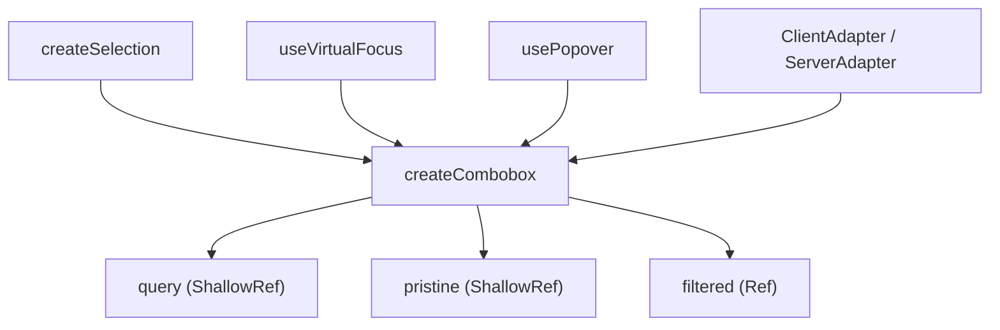

# createCombobox

An orchestrator composable that wires together selection, popover, virtual focus, and adapter-based filtering into a single coordinated combobox context. Most consumers will use the [Combobox](/components/forms/combobox) component directly — reach for `createCombobox` when building a custom combobox or integrating the logic into a design system.

<DocsPageFeatures :frontmatter />

## Usage

```ts collapse
import { createCombobox } from '@vuetify/v0'

const combobox = createCombobox({ strict: true })

// Register items with the underlying selection
combobox.selection.register({ id: 'apple', value: 'Apple' })
combobox.selection.register({ id: 'banana', value: 'Banana' })
combobox.selection.register({ id: 'cherry', value: 'Cherry' })

// Open the dropdown
combobox.open()

// Select an item — in single mode this updates the query and closes
combobox.select('banana')
// combobox.query.value === 'Banana'
// combobox.isOpen.value === false

// Filter is pristine after selection — all items still visible
// combobox.pristine.value === true

// Once user types, the filter activates
combobox.query.value = 'ch'
// combobox.pristine.value === false
// combobox.filtered.value === Set { 'cherry' }
```

## Architecture

`createCombobox` orchestrates four independent primitives without extending their chains — it composes them. The adapter translates queries into a filtered set; virtual focus uses that set to skip hidden items.



## Reactivity

| Property | Type | Reactive | Notes |
| - | - | :-: | - |
| `query` | `ShallowRef<string>` | <AppSuccessIcon /> | Current input text |
| `pristine` | `ShallowRef<boolean>` | <AppSuccessIcon /> | `true` after selection; `false` once user types |
| `filtered` | `Ref<Set<ID>>` | <AppSuccessIcon /> | IDs that pass the current filter |
| `isEmpty` | `Ref<boolean>` | <AppSuccessIcon /> | `true` when filtered set is empty |
| `isLoading` | `ShallowRef<boolean>` | <AppSuccessIcon /> | Forwarded from adapter |
| `isOpen` | `ShallowRef<boolean>` | <AppSuccessIcon /> | Popover open state |
| `selection` | `SelectionContext` | — | Full selection API |
| `popover` | `PopoverReturn` | — | Popover positioning API |
| `virtualFocus` | `VirtualFocusReturn` | — | Keyboard focus API |
| `inputEl` | `ShallowRef<HTMLElement \| null>` | <AppSuccessIcon /> | Reference to the `<input>` element |

## Options

```ts
interface ComboboxOptions {
  multiple?: MaybeRefOrGetter<boolean>   // Enable multi-select
  mandatory?: MaybeRefOrGetter<boolean>  // Prevent deselecting last item
  disabled?: MaybeRefOrGetter<boolean>   // Disable all interaction
  strict?: MaybeRefOrGetter<boolean>     // Revert query on close if no match
  adapter?: ComboboxAdapterInterface     // Filtering strategy (default: ClientAdapter)
  id?: string                            // Base ID for ARIA attributes
  name?: string                          // Hidden input name for form submission
  form?: string                          // Associated form ID
}
```

## Context Object

`createCombobox` returns a `ComboboxContext` with the following API surface:

| Member | Type | Description |
| - | - | - |
| `open()` | `() => void` | Opens the dropdown |
| `close()` | `() => void` | Closes; applies strict revert if needed |
| `toggle()` | `() => void` | Opens or closes |
| `select(id)` | `(id: ID) => void` | Selects an item by ID |
| `clear()` | `() => void` | Resets query and deselects all |
| `id` | `string` | Base ID used for ARIA relationships |
| `inputId` | `string` | `${id}-input` |
| `listboxId` | `string` | `${id}-listbox` |
| `multiple` | `boolean` | Resolved multiple flag |
| `strict` | `MaybeRefOrGetter<boolean>` | Strict option ref |
| `disabled` | `MaybeRefOrGetter<boolean>` | Disabled option ref |
| `name` | `string \| undefined` | Form field name |
| `form` | `string \| undefined` | Associated form ID |

## Adapters

Adapters implement `ComboboxAdapterInterface` and translate a reactive query into a filtered ID set.

### ClientAdapter

The default. Filters registered items locally using substring matching (case-insensitive). Pass custom `filter` options to override the matching logic:

```ts
import { ComboboxClientAdapter, createCombobox } from '@vuetify/v0'

const combobox = createCombobox({
  adapter: new ComboboxClientAdapter({
    filter: (query, value) => String(value).toLowerCase().startsWith(query.toLowerCase()),
  }),
})
```

### ServerAdapter

A pass-through adapter that shows all registered items and sets `isLoading` to `false`. Use this when filtering is performed server-side — watch `combobox.query` to drive your own fetch:

```ts
import { ComboboxServerAdapter, createCombobox, useCombobox } from '@vuetify/v0'
import { watch } from 'vue'

const combobox = createCombobox({ adapter: new ComboboxServerAdapter() })

// In a component that injects the context:
const { query } = useCombobox()

watch(query, async q => {
  const results = await fetch(`/api/search?q=${q}`).then(r => r.json())
  // Update items via combobox.selection.register / unregister
})
```

> [!TIP]
> See the [Combobox server example](/components/forms/combobox#server-side-filtering) for a complete integration.

## Strict Mode

When `strict: true`, closing the dropdown without an active selection reverts the query:

- If an item is selected, `query` resets to that item's label.
- If nothing is selected, `query` resets to `''`.

Non-strict mode (default) leaves whatever text the user typed in place.

> [!TIP]
> `aria-autocomplete="both"` is set automatically on the input when `strict` is enabled, per the WAI-ARIA combobox pattern.

## Pristine Flag

`pristine` tracks whether the query reflects the current selection or is a live filter:

- Starts as `true` (no user input yet).
- Becomes `false` when the user types — the adapter receives the raw query.
- Resets to `true` after a selection (`select(id)`), so reopening the dropdown always shows all items instead of the previous typed query.

```ts
// The adapter receives `search`, not `query` directly
const search = toRef(() => pristine.value ? '' : query.value)
const { filtered } = adapter.setup({ query: search, items })
```

## Multi-Select Behavior

In `multiple` mode, `select(id)` differs from single mode:

- Toggles the item (select → deselect on second click) via `selection.toggle()`.
- Clears the query so the user can search for the next item.
- Keeps the dropdown open.
- Highlights the clicked item via `virtualFocus.highlight(id)` so ArrowDown continues from that position.
- Refocuses the input so keyboard navigation continues immediately.

## Dependency Injection

Use `createComboboxContext` to get a DI-aware trinity for component-based setups:

```ts
import { createComboboxContext, useCombobox } from '@vuetify/v0'

// In a Root component
const [useMyCombobox, provideMyCombobox, context] = createComboboxContext({
  namespace: 'my-combobox',
  strict: true,
})
provideMyCombobox(context)

// In any child component
const combobox = useCombobox('my-combobox')
```

`useCombobox(namespace?)` injects the nearest combobox context (default namespace: `'v0:combobox'`).

<DocsApi />
