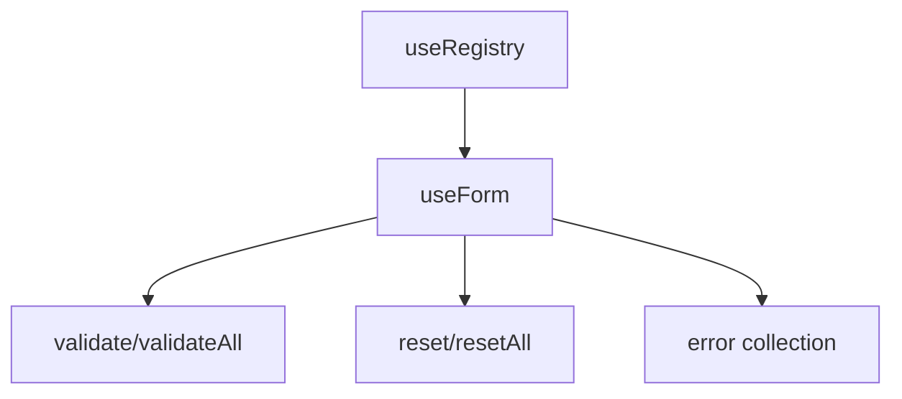

# createForm

A composable for building reactive forms with validation, field registration, and submission handling. Built on top of the registry system for managing form fields.

<DocsPageFeatures :frontmatter />

## Usage

The form composables provide a powerful interface for managing form state, validation, and submission. Built on the registry pattern, they handle form-specific requirements like validation rules, error states, and field lifecycle management.

### Creating a Form

Use `createForm` to create a new form instance:

```ts
import { createForm } from '@vuetify/v0'

const form = createForm()

const email = form.register({
  id: 'email',
  value: '',
  rules: [
    (value) => value.includes('@') || 'Must be a valid email',
    (value) => value.length > 0 || 'Required'
  ]
})

console.log(email.value) // ''
console.log(email.errors.value) // []
```

### Injecting a Form Context

Use `useForm` to inject an existing form context (typically provided by a parent component):

```ts
import { useForm } from '@vuetify/v0'

// Injects the form context provided by an ancestor
const form = useForm()
```

## Architecture

`useForm` extends `useRegistry` with validation capabilities:



<DocsApi />
