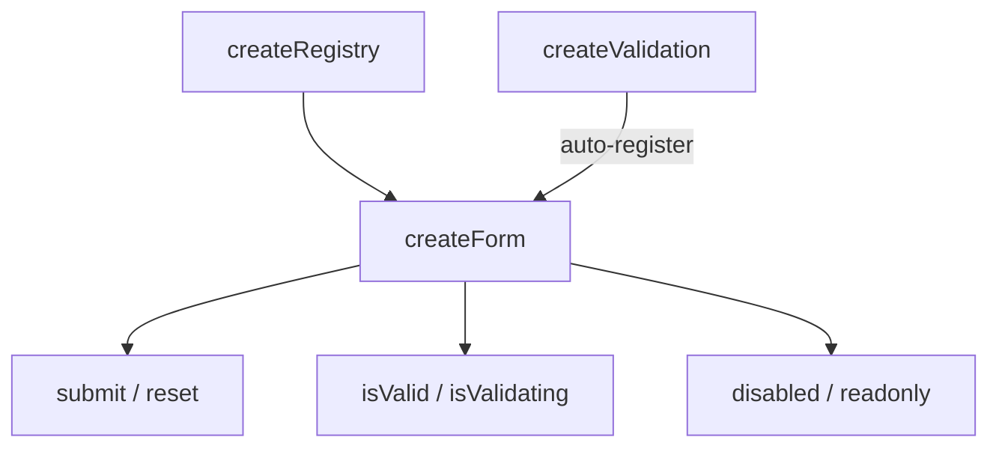

# createForm

Coordinates validation across multiple inputs. Provides `submit()`, `reset()`, and aggregate validity state.

<DocsPageFeatures :frontmatter />

## Usage

### Creating a Form

Create a form and register validation contexts. Each validation owns its rules for a single input:

```ts collapse no-filename
import { createForm, createValidation } from '@vuetify/v0'
import { shallowRef } from 'vue'

const form = createForm()
const email = shallowRef('')
const validation = createValidation({
  value: email,
  rules: ['required', 'email'],
})

form.register({ value: validation })

await form.submit()

console.log(validation.errors.value) // ['Required']

form.reset()
```

### Auto-Registration

When a `createValidation` instance is created inside a component that has a parent form context, it **auto-registers** with the form — no manual `form.register()` needed:

```vue
<script setup lang="ts">
  import { createValidation } from '@vuetify/v0'
  import { shallowRef } from 'vue'

  // Parent provides form context — this validation auto-registers
  const email = shallowRef('')
  const validation = createValidation({
    value: email,
    rules: ['required', 'email'],
  })
</script>
```

### Disabled and Readonly

The form exposes `disabled` and `readonly` as reactive refs. Components can read these to conditionally disable inputs:

```ts
const form = createForm({ disabled: true })

form.disabled.value = false // Toggle at runtime
```

### Injecting a Form Context

Use `useForm` to inject an existing form context provided by a parent component:

```ts
import { useForm } from '@vuetify/v0'

const form = useForm() // Returns undefined if no parent form
```

## Context / DI

Use `createFormContext` to share a form instance across a component tree:

```ts
import { createFormContext } from '@vuetify/v0'

export const [useContactForm, provideContactForm, contactForm] =
  createFormContext({ namespace: 'app:contact-form' })

// In parent component (e.g., ContactForm.vue)
provideContactForm()

// In any child component (e.g., submit button, field)
const form = useContactForm()
await form.submit()
```

Validations inside the component tree auto-register with the provided form — no manual `form.register()` needed.

## Architecture

`createForm` is a pure registry. Validations register with it for coordination:


```mermaid "Form Architecture"
flowchart TD
  createRegistry --> createForm
  createValidation -->|auto-register| createForm
  createForm --> submit[submit / reset]
  createForm --> aggregate[isValid / isValidating]
  createForm --> state[disabled / readonly]
```

## Options

| Option | Type | Default | Notes |
| - | - | - | - |
| `disabled` | `MaybeRefOrGetter<boolean>` | `false` | When truthy, child components should disable interaction. Read via `form.disabled` |
| `readonly` | `MaybeRefOrGetter<boolean>` | `false` | When truthy, child components should prevent editing. Read via `form.readonly` |

## Reactivity

Form-level state is fully reactive.

| Property/Method | Reactive | Notes |
| - | :-: | - |
| `isValid` | <AppSuccessIcon /> | Computed from all registered validations |
| `isValidating` | <AppSuccessIcon /> | Computed from all registered validations |
| `disabled` | <AppSuccessIcon /> | ShallowRef, read by components |
| `readonly` | <AppSuccessIcon /> | ShallowRef, read by components |

## Examples

::: gn-example
/composables/create-form/context.ts 1
/composables/create-form/ContactProvider.vue 2
/composables/create-form/ContactForm.vue 3
/composables/create-form/contact-form.vue 4

### Contact Form

A three-field contact form (name, email, message) wired entirely by hand — no [Form component](/components/forms/form), no [Input](/components/forms/input). A thin provider creates the form with `createForm()` and shares it through [createContext](/composables/foundation/create-context), so the form is owned at one boundary and consumed below. The consumer builds a `createValidation` per field, binds each to a value getter, and registers it with `form.register({ value })`. This is the raw coordination path: the form is a pure registry of validations, and the consumer drives it directly.

Submitting calls `form.submit()`, which runs every registered validation in parallel and resolves to a boolean the example uses to gate the success state. The aggregate `form.isValid` is tri-state — `null` before the first submit, `true` when all fields pass, `false` when any fails — read through a `toRef` derivation so the status bar tracks it reactively, while `form.isValidating` disables the submit button during async rules. `form.size` reports how many validations are registered.

Because `createForm` never holds field values itself, `form.reset()` only re-arms the validations to `null`; the consumer clears its own value object separately. That split is deliberate and is the main tradeoff of the composable path versus the component path. Reach for this when you need a custom field surface or non-standard layout; if you don't need raw access, the [Form component](/components/forms/form) wraps registration, submit, and reset behind a single compound API, and validations created inside its tree auto-register via the [createFormContext](/composables/forms/create-form#context--di) injection — no manual `form.register()` at all. See [createValidation](/composables/forms/create-validation) for per-field rule details.

| File | Role |
|------|------|
| `context.ts` | Creates the form context tuple and a `createContactForm` factory |
| `ContactProvider.vue` | Creates the form and provides it to the subtree |
| `ContactForm.vue` | Injects the form, registers a validation per field, renders inputs and aggregate state |
| `contact-form.vue` | Entry point wrapping the provider around the consumer |
:::

<DocsApi />
