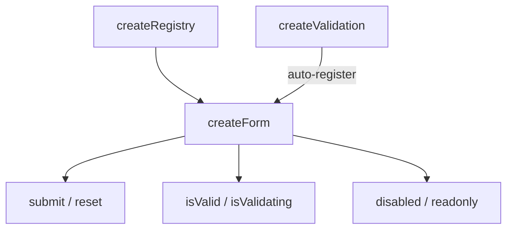

# createForm

Coordinates validation across multiple inputs. Provides `submit()`, `reset()`, and aggregate validity state.

<DocsPageFeatures :frontmatter />

## Usage

### Creating a Form

Create a form and register validation contexts. Each validation owns its rules for a single input:

```ts collapse no-filename
import { createForm, createValidation } from '@vuetify/v0'
import { shallowRef } from 'vue'

const form = createForm()
const email = shallowRef('')
const validation = createValidation({
  value: email,
  rules: ['required', 'email'],
})

form.register({ value: validation })

await form.submit()

console.log(validation.errors.value) // ['Required']

form.reset()
```

### Auto-Registration

When a `createValidation` instance is created inside a component that has a parent form context, it **auto-registers** with the form — no manual `form.register()` needed:

```vue
<script setup lang="ts">
  import { createValidation } from '@vuetify/v0'
  import { shallowRef } from 'vue'

  // Parent provides form context — this validation auto-registers
  const email = shallowRef('')
  const validation = createValidation({
    value: email,
    rules: ['required', 'email'],
  })
</script>
```

### Disabled and Readonly

The form exposes `disabled` and `readonly` as reactive refs. Components can read these to conditionally disable inputs:

```ts
const form = createForm({ disabled: true })

form.disabled.value = false // Toggle at runtime
```

### Injecting a Form Context

Use `useForm` to inject an existing form context provided by a parent component:

```ts
import { useForm } from '@vuetify/v0'

const form = useForm() // Returns undefined if no parent form
```

## Context / DI

Use `createFormContext` to share a form instance across a component tree:

```ts
import { createFormContext } from '@vuetify/v0'

export const [useContactForm, provideContactForm, contactForm] =
  createFormContext({ namespace: 'app:contact-form' })

// In parent component (e.g., ContactForm.vue)
provideContactForm()

// In any child component (e.g., submit button, field)
const form = useContactForm()
await form.submit()
```

Validations inside the component tree auto-register with the provided form — no manual `form.register()` needed.

## Architecture

`createForm` is a pure registry. Validations register with it for coordination:


```mermaid "Form Architecture"
flowchart TD
  createRegistry --> createForm
  createValidation -->|auto-register| createForm
  createForm --> submit[submit / reset]
  createForm --> aggregate[isValid / isValidating]
  createForm --> state[disabled / readonly]
```

## Reactivity

Form-level state is fully reactive.

| Property/Method | Reactive | Notes |
| - | :-: | - |
| `isValid` | <AppSuccessIcon /> | Computed from all registered validations |
| `isValidating` | <AppSuccessIcon /> | Computed from all registered validations |
| `disabled` | <AppSuccessIcon /> | ShallowRef, read by components |
| `readonly` | <AppSuccessIcon /> | ShallowRef, read by components |

## Examples

::: example
/composables/create-form/contact-form

### Contact Form

A contact form with field validation using `createValidation`, demonstrating `submit()`, `reset()`, and aggregate `isValid`/`isValidating` state.

:::

<DocsApi />
